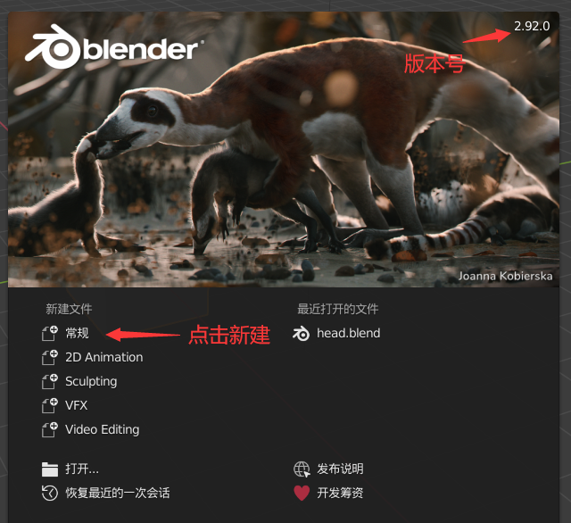

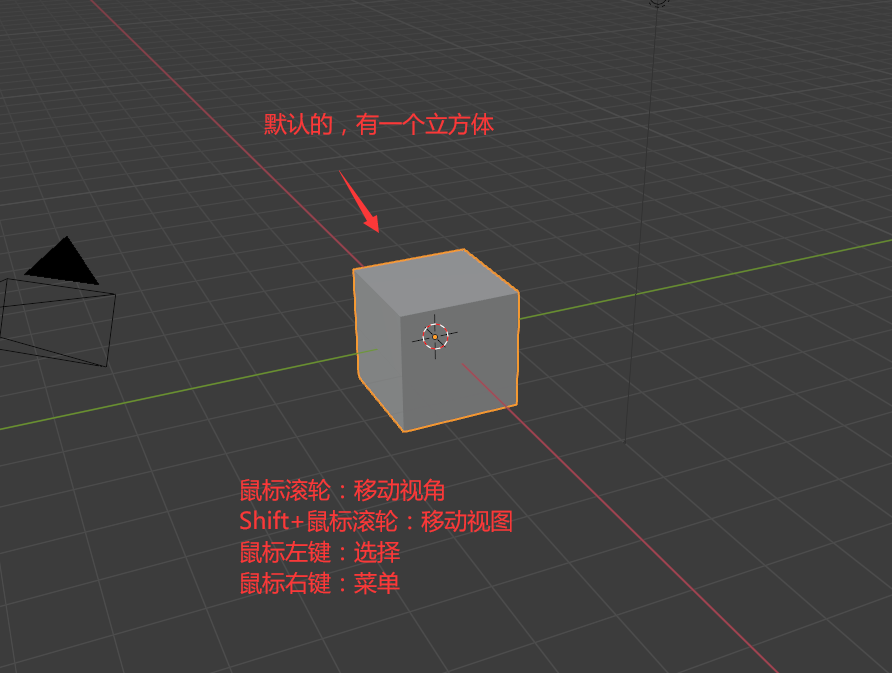

按住Alt键，可以每45度角，吸附

数字键12346789，都可以调节视角，5键设置透视

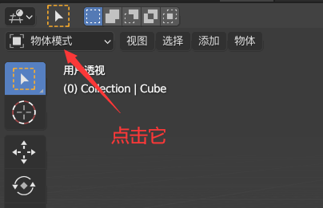

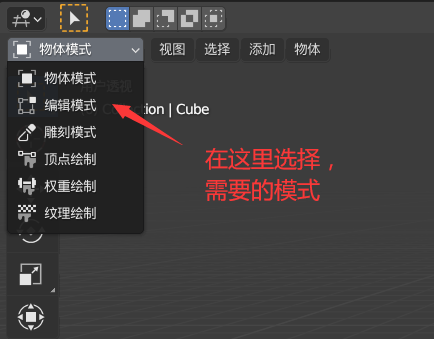

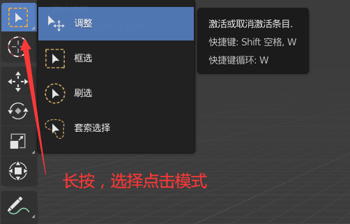

shift+鼠标左键：多选

b：框选

Ctrl+鼠标右键：套索

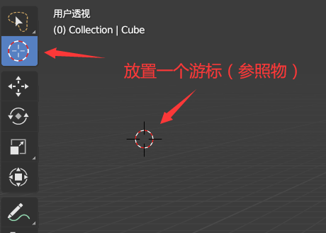

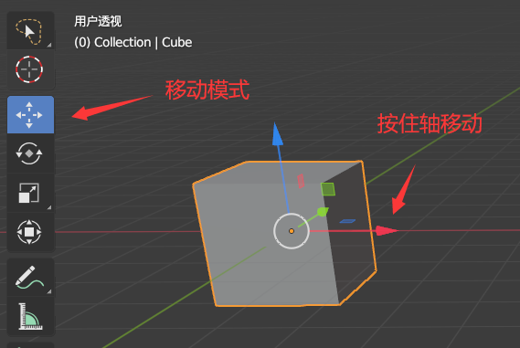

g：移动

再输入x，就是只移动x轴

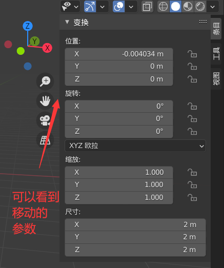

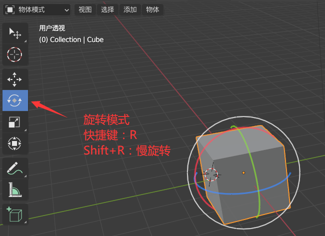

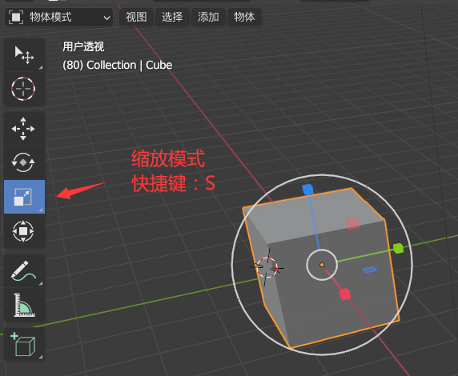

Alt+S：初始化缩放

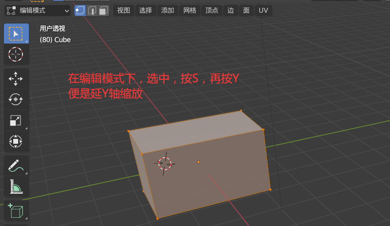

Shift+Z 透视线

Shift+A 创建方块（网格-立方体）

Ctrl+3 变成圆球（细化程度3）

1 正视图

Alt+Z 透视

X 删除（顶点）

3 右侧视图

Ctrl+R切割

E挤出

F填充

