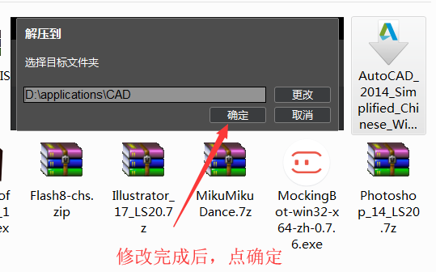
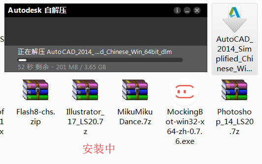
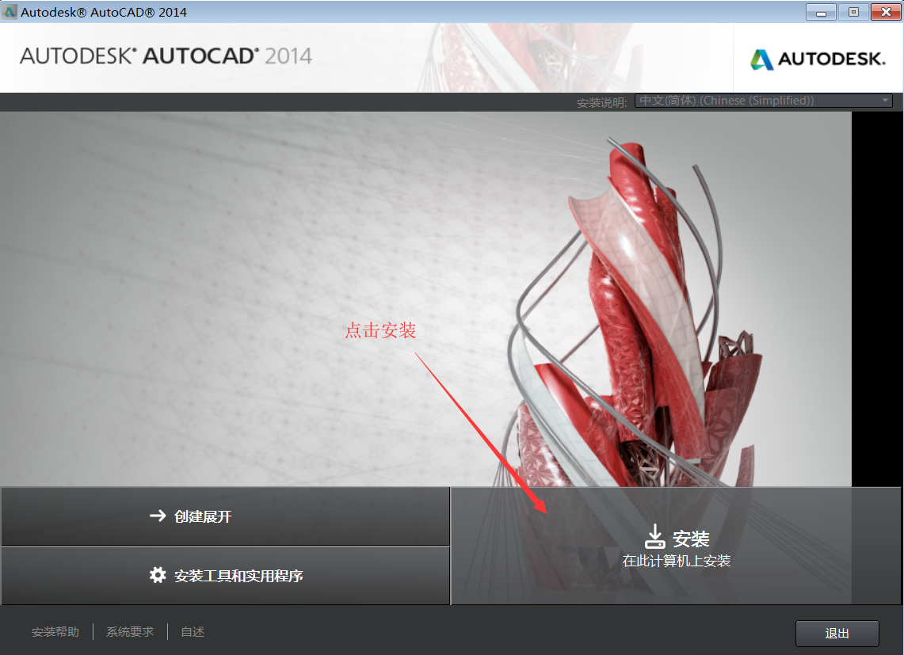
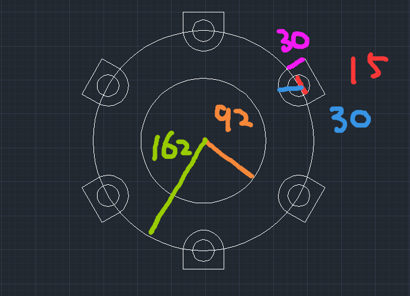
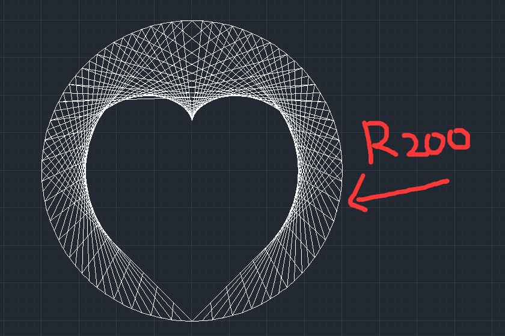
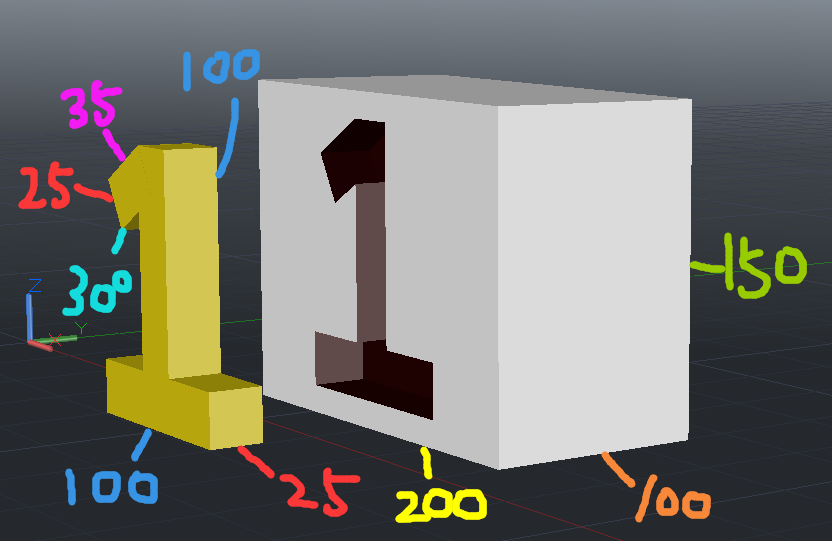
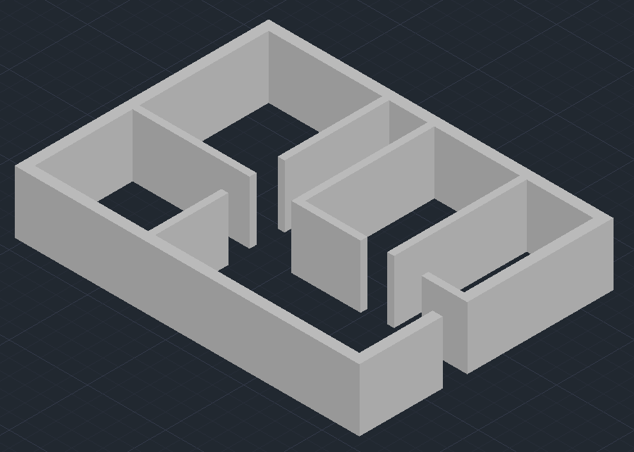

##CAD教学笔记
————张子涵（南平职业中专——计算机教师）
###一、CAD的介绍、安装与界面
####1. 介绍
所谓的CAD是指**计算机辅助设计**(Computer Aided Design)，通俗来说，就是使用计算机进行图形设计；而我们这门课所学的是AutoCAD。

AutoCAD（Autodesk Computer Aided Design）是Autodesk（欧特克）公司首次于1982年开发的自动计算机辅助设计软件。换句话说，它是一款用于绘制二、三维图形的软件。

**目前的就业情况**
（资料来源：boss直聘，2019-9-2）

####2. 安装

####3. 界面

###二、鼠标的使用与基本图形绘制（上）
####1.鼠标的使用
左键：绘制和选择
中键：缩放和移动视图
右键：菜单

####2.直线
命令：L/Line
Tab切换输入框
第一次坐标，第二次长度和角度
C闭合、U放弃
撤回：Ctrl+Z
不选中：Esc
删除：Delete
按文档流，顺为正框选，逆为反框选
注：选中后按Esc和Enter都能取消选择，区别是按Enter后可以重新绘制，而Esc是重新选择
**作业：**用直线工具画直角三角形、等腰三角形和等边三角形

####3.构造线
命令：XL/XLine
第一次坐标，第二次角度
H水平、V垂直、A角度、B二等分、O偏远
**作业：**用直线工具画五角星和六芒星（可利用构造线）

####4.多线段
命令：PL/PLine
A圆弧、H半宽、L长度（直线）、U放弃、W宽度
**作业：**用多段线工具画直箭头、拐弯箭头和闪电标志

###三、辅助命令与基本图形绘制（下）
####1.辅助命令
推断约束：Ctrl+Shift+I，会阻碍视图，一般不开

捕捉模式：F9，在使用绘图工具时鼠标吸附栅格点上

栅格显示：F7，顾名思义，不多解释
正交模式：F8，按住Shift可以模拟正交模式，正交可以暂时理解为垂直
极轴追踪：F10，隔若干度吸附一下

对象捕捉：F3，建议打开

三维对象捕捉：F4
对象捕捉追踪：F11，能够进行对象联动

允许/禁止动态UCS：F6，一般打开
动态输入：F12

####2.圆
命令：C/Circle
第一次圆心坐标，第二次半径
3p三点（内接三角形，不常用）、2p两点、t切点与半径
在第二次时，按d，改用直径
**作业：**用圆工具画一个勾玉（可利用复制、修剪等工具）

####3.圆弧
命令：ARC
三点的坐标（内接三角形）
c圆心（极坐标式画圆弧）
####4.矩形
####5.多边形（三边以上的正多边形）
命令：Polygon（以内接/外切圆的方式绘制）
E边（和画直线一样）

###五、移动、旋转、复制、镜像与修剪
####1.移动move
####2.旋转rotate
####3.复制copy
####4.镜像mirror
####5.修剪trim
###六、工作模式与辅助点线
####1.工作模式
**（1）草图与注释**
建议新人使用这个模式，该模式一般用于二维草图的绘制
**（2）经典AutoCAD**
传统模式，大多数人的选择，这个模式会把工具都列举在界面上（对新手不友好，眼花缭乱，建议用一些基础之后在使用）
**（3）三维基础**
暂时不接触
**（4）三维建模**
暂时不接触
####2.点
####3.线段设置

###七、文字与填充
####1.文字

####2.图案填充

####3.渐变色
lts

###八、点、云线与样条曲线

###九、图层管理

###十、块
块：用于快速绘制（把一个绘制好的常用图形保存，便于引用）

###十一、三维建模
拉伸：EXT
旋转：REV（按o沿一条线旋转）

###十二、布尔运算
差集：SU（选择第一个对象，减去选择的第二个对象）
并集：UNI
交集：INT

偏移：o
倒角：f

