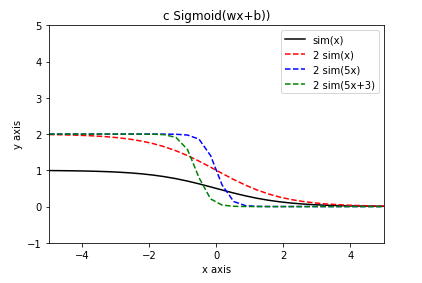

#### y = wx

Linear Model: 
$$
y = wx
$$
Loss Function: 
$$
L(w) = \frac{1}{n} \sum_{i=1}^{n} (y_i - \hat{y}_i)^2  = \frac{1}{n} \sum_{i=1}^{n} (y_i - wx_i)^2 
$$
Optimization: 
$$
w = w - \eta \frac{\partial{L}}{\partial{w}} 
$$
Derivative: 
$$
\frac{\partial{L}}{\partial{w}} = \frac{1}{n} \sum_{i=1}^{n} 2x_i^2w - 2x_iy_i
$$

Python代码：

```python
SAVE_NUM = 4 # 默认最多保留16位小数

# 线性模型
def linear_model (x, w):
  y_hat = []
  i = 0
  n = len (x)
  while i < n:
    y_i = w * x[i]
    y_i = round (y_i, SAVE_NUM)
    y_hat.append (y_i)
    i = i + 1
  print ('linear_model:', y_hat)
  return y_hat

# 损失函数
def loss_function (y, y_hat):
  i = 0
  s = 0
  n = len(y)
  while i < n:
    s += (y[i] - y_hat[i]) ** 2
    i = i + 1
  s = s / n
  s = round (s, SAVE_NUM)
  print ('loss_function:', s)
  return s

# 偏导数
def derivative (x, y, w): 
  i = 0
  s = 0
  n = len(y)
  while i < n:
    s += 2 * (x[i] ** 2) * w - (2 * x[i] * y[i])
    i = i + 1
  s = s / n
  s = round (s, SAVE_NUM)
  print ('derivative:', s)
  return s

# 优化
def optimization (eta, l):
  s = - eta * derivative (l['x'], l['y'], l['w'])
  # print ('optimization:', s)
  return s

# 学习（梯度下降法）
def learning (y, x, w, eta, n):
  i = 0
  while i < n:
    print('')
    if (i+1 == 1):
      print (f'----{i+1}st traning----')
    elif (i+1 == 2):
      print (f'----{i+1}nd traning----')
    elif (i+1 == 3):
      print (f'----{i+1}rd traning----')
    else:
      print (f'----{i+1}th traning----')
    y_hat = linear_model (x, w)
    loss_function(y, y_hat)
    l = {
      'x': x,
      'y': y,
      'w': w,
    }
    w_step = optimization(eta, l)
    # 偏导数为0，到底谷底
    if w_step == 0:
      break
    w = w + w_step
    i = i + 1
  return w

y = [2, 4, 6]
x = [1, 2, 3]
w = 0.8
eta = 0.1
w = learning (y, x, w, eta, 10)
print ('w:', round(w, SAVE_NUM))
```

输出结果：

>```
>----1st traning----
>linear_model: [0.8, 1.6, 2.4]
>loss_function: 6.72
>derivative: -11.2
>
>----2nd traning----
>linear_model: [1.92, 3.84, 5.76]
>loss_function: 0.0299
>derivative: -0.7467
>
>----3rd traning----
>linear_model: [1.9947, 3.9893, 5.984]
>loss_function: 0.0001
>derivative: -0.0497
>
>----4th traning----
>linear_model: [1.9996, 3.9993, 5.9989]
>loss_function: 0.0
>derivative: -0.0034
>
>----5th traning----
>linear_model: [2.0, 4.0, 5.9999]
>loss_function: 0.0
>derivative: -0.0002
>
>----6th traning----
>linear_model: [2.0, 4.0, 6.0]
>loss_function: 0.0
>derivative: -0.0
>w: 2.0
>```

Python代码：

```python
'''
Final: w is 2.0, Loss Function is 0
But if y is [3, 5, 7]
'''

y = [3, 5, 7]
x = [1, 2, 3]
w = 0.8
eta = 0.1
w = learning (y, x, w, eta, 10)
print ('w:', round(w, SAVE_NUM))
```

输出结果：

>```python
>----1st traning----
>linear_model: [0.8, 1.6, 2.4]
>loss_function: 12.52
>derivative: -15.2
>
>----2nd traning----
>linear_model: [2.32, 4.64, 6.96]
>loss_function: 0.1979
>derivative: -1.0133
>
>----3rd traning----
>linear_model: [2.4213, 4.8427, 7.264]
>loss_function: 0.1431
>derivative: -0.0676
>
>----4th traning----
>linear_model: [2.4281, 4.8562, 7.2843]
>loss_function: 0.1429
>derivative: -0.0045
>
>----5th traning----
>linear_model: [2.4285, 4.8571, 7.2856]
>loss_function: 0.1429
>derivative: -0.0003
>
>----6th traning----
>linear_model: [2.4286, 4.8571, 7.2857]
>loss_function: 0.1428
>derivative: -0.0
>w: 2.4286
>```

Final: w is 2.4286, Loss Function is 0.1428  
So maybe we should change the Linear Model  

#### y = wx+b

Linear Model:
$$
y = wx + b
$$
Loss Function: 
$$
L(w, b) = \frac{1}{n} \sum_{i=1}^{n} (y_i - \hat{y}_i)^2 = \frac{1}{n} \sum_{i=1}^{n} [y_i - (wx_i+b)]^2
$$
Optimization: 
$$
w = w - \eta \frac{\partial{L}}{\partial{w}}\quad b = b - \eta \frac{\partial{L}}{\partial{b}} 
$$
Derivative: 
$$
\frac{\partial{L}}{\partial{w}} = \frac{1}{n} \sum_{i=1}^{n} 2x_i^2w - 2x_iy_i\quad \frac{\partial{L}}{\partial{b}} = \frac{1}{n} \sum_{i=1}^{n}-2(y_i - wx_i - b)
$$
Python代码：

```python
SAVE_NUM = 4 # 默认最多保留16位小数

# 线性模型
def linear_model (x, w, b):
  y_hat = []
  i = 0
  n = len (x)
  while i < n:
    y_i = w * x[i] + b
    y_i = round (y_i, SAVE_NUM)
    y_hat.append (y_i)
    i = i + 1
  print ('linear_model:', y_hat)
  return y_hat

# 损失函数
def loss_function (y, y_hat):
  i = 0
  s = 0
  n = len(y)
  while i < n:
    s += (y[i] - y_hat[i]) ** 2
    i = i + 1
  s = s / n
  s = round (s, SAVE_NUM)
  print ('loss_function:', s)
  return s

# 偏导数
def derivative (x, y, w, b): 
  i = 0
  s_w = 0
  s_b = 0
  n = len(y)
  while i < n:
    s_w += 2 * (x[i] ** 2) * w - (2 * x[i] * y[i]) + (2 * x[i] * b)
    s_b += -2 * (y[i] - w * x[i] - b)
    i = i + 1
  s_w = s_w / n
  s_b = s_b / n
  s_w = round (s_w, SAVE_NUM)
  s_b = round (s_b, SAVE_NUM)
  return (s_w, s_b)

# 优化
def optimization (eta, l):
  (s_w, s_b) = derivative (l['x'], l['y'], l['w'], l['b'])
  s_w = - eta * s_w
  s_b = - eta * s_b
  return (s_w, s_b)

# 学习（梯度下降法）
def learning (y, x, w, b, eta, n):
  i = 0
  while i < n:
    print('')
    if (i+1 == 1):
      print (f'----{i+1}st traning----')
    elif (i+1 == 2):
      print (f'----{i+1}nd traning----')
    elif (i+1 == 3):
      print (f'----{i+1}rd traning----')
    else:
      print (f'----{i+1}th traning----')
    y_hat = linear_model (x, w, b)
    loss_function(y, y_hat)
    l = {
      'x': x,
      'y': y,
      'w': w,
      'b': b,
    }
    (w_step, b_step)= optimization(eta, l)
    # 偏导数为0，到底谷底
    if w_step == 0 and b_step == 0:
      break
    w = w + w_step
    b = b + b_step
    i = i + 1
  return (w, b)

y = [3, 5, 7]
x = [1, 2, 3]
w = 0.8
b = 0.7
eta = 0.1
(w, b) = learning (y, x, w, b, eta, 10)
print ('w:', round(w, SAVE_NUM))
print ('b:', round(b, SAVE_NUM))
```

输出结果：

> ```
> ----1st traning----
> linear_model: [1.5, 2.3, 3.1]
> loss_function: 8.25
> 
> ----2nd traning----
> linear_model: [3.28, 5.32, 7.36]
> loss_function: 0.1035
> 
> ----3rd traning----
> linear_model: [3.0827, 4.9893, 6.896]
> loss_function: 0.0059
> 
> ----4th traning----
> linear_model: [3.1015, 5.0249, 6.9483]
> loss_function: 0.0045
> 
> ----5th traning----
> linear_model: [3.0968, 5.0204, 6.9441]
> loss_function: 0.0043
> 
> ----6th traning----
> linear_model: [3.0947, 5.0204, 6.946]
> loss_function: 0.0041
> 
> ----7th traning----
> linear_model: [3.0924, 5.0198, 6.9473]
> loss_function: 0.0039
> 
> ----8th traning----
> linear_model: [3.0902, 5.0194, 6.9485]
> loss_function: 0.0037
> 
> ----9th traning----
> linear_model: [3.088, 5.0189, 6.9498]
> loss_function: 0.0035
> 
> ----10th traning----
> linear_model: [3.0859, 5.0184, 6.951]
> loss_function: 0.0034
> w: 1.9342
> b: 1.1497
> ```

Python代码：

```python
'''
Final: w is 1.9342 and b is 1.1497, Loss Function is 0.0034
But if y is [3, 5, 3]
'''
y = [3, 5, 3]
x = [1, 2, 3]
w = 0.8
b = 0.7
eta = 0.1
(w, b) = learning (y, x, w, b, eta, 10)
print ('w:', round(w, SAVE_NUM))
print ('b:', round(b, SAVE_NUM))
```

输出结果：

> ```
> ----1st traning----
> linear_model: [1.5, 2.3, 3.1]
> loss_function: 3.1833
> 
> ----2nd traning----
> linear_model: [2.2133, 3.4533, 4.6933]
> loss_function: 1.9595
> 
> ----3rd traning----
> linear_model: [2.176, 3.336, 4.496]
> loss_function: 1.8953
> 
> ----4th traning----
> linear_model: [2.2197, 3.3573, 4.4949]
> loss_function: 1.8474
> 
> ----5th traning----
> linear_model: [2.2537, 3.3633, 4.473]
> loss_function: 1.8018
> 
> ----6th traning----
> linear_model: [2.2877, 3.3708, 4.4538]
> loss_function: 1.7584
> 
> ----7th traning----
> linear_model: [2.3209, 3.3779, 4.4349]
> loss_function: 1.7171
> 
> ----8th traning----
> linear_model: [2.3532, 3.3848, 4.4164]
> loss_function: 1.6778
> 
> ----9th traning----
> linear_model: [2.3848, 3.3916, 4.3984]
> loss_function: 1.6403
> 
> ----10th traning----
> linear_model: [2.4156, 3.3982, 4.3808]
> loss_function: 1.6046
> w: 0.959
> b: 1.4867
> ```

Final: w is 0.959 and b is 1.4867, Loss Function is 1.6046  
So maybe the model is not linear  
We need the Sigmoid Function  

#### Sigmoid Function  

Sigmoid Function :  
$$
c \frac{1}{1+e^{wx+b}} \overset{\Delta}{=} c\ Sigmoid(wx+b)
$$

c is height. w is slope. b is bias in x-axis.

Python代码：

```python
#相当于命了个名
import numpy as np
# 一般只需要用到plt
import matplotlib as mpl
import matplotlib.pyplot as plt
# 定义[0, 10]共30个的等距点
x = np.linspace(-5, 5, 30)
sim_y = 1/(1+np.exp(x))
sim_y2 = 2/(1+np.exp(x))
sim_y3 = 2/(1+np.exp(5*x))
sim_y4 = 2/(1+np.exp(5*x+3))
#给线条加上标签（注意要legend），最后加上标题
plt.plot(x, sim_y, label='sim(x)', color='black')
plt.plot(x, sim_y2, label='2 sim(x)', linestyle='--', color='red')
plt.plot(x, sim_y3, label='2 sim(5x)', linestyle='--', color='blue')
plt.plot(x, sim_y4, label='2 sim(5x+3)', linestyle='--', color='green')
plt.ylim(-1, 5)
plt.xlim(-5, 5)
plt.xlabel('x axis')
plt.ylabel('y axis')
plt.legend()
plt.title('c Sigmoid(wx+b))')
plt.show()
```

输出结果：



#### TODO

Model: 
$$
y = b + \sum_{i=1}^{n} c_i Sigmoid (w_i x + b_i) = b + \sum_{i=1}^{n} \frac{c_i}{1+e^{w_i x+b_i}}
$$
Loss Function: 
$$
L(w, b, c) = \frac{1}{n} \sum_{i=1}^{n} (y_i - \hat{y}_i)^2 = \frac{1}{n} \sum_{i=1}^{n} [y_i - (b + \sum_{j=1}^{m} \frac{c_j}{1+e^{w_j x + b_j}})]^2 
$$
Optimization: 
$$
w = w - \eta \frac{\partial{L}}{\partial{w}}\quad b = b - \eta \frac{\partial{L}}{\partial{b}}\quad c = c - \eta \frac{\partial{L}}{\partial{c}}
$$
Derivative: 
$$
\frac{\partial{L}}{\partial{w_k}} = \frac{2}{n}\sum_{i=0}^{n}(y_i-b-\sum_{j=1}^{m}\frac{c_j}{1+e^{w_jx_i+b_j}})\cdot \frac{-c_kx_ie^{w_kx_i+b_k}}{1+2e^{w_kx_i+b_k}+e^{2w_kx_i+2b_k}} \\ 
\frac{\partial{L}}{\partial{b_k}} = \frac{2}{n}\sum_{i=0}^{n}(y_i-b-\sum_{j=1}^{m}\frac{c_j}{1+e^{w_jx_i+b_j}})\cdot \frac{-c_ke^{w_kx_i+b_k}}{1+2e^{w_kx_i+b_k}+e^{2w_kx_i+2b_k}} \\ 
\frac{\partial{L}}{\partial{c_k}} = \frac{2}{n}\sum_{i=0}^{n}(y_i-b-\sum_{j=1}^{m}\frac{c_j}{1+e^{w_jx_i+b_j}})\cdot \frac{1}{1+e^{w1x_i+b_1}} 
$$
Python代码

```python
SAVE_NUM = 4 # 默认最多保留16位小数

import math

# 用于模拟曲线的函数
def sigmoid_function (x, w, b, c):
  sim = 0
  i = 0
  n = len (w)
  while i < n:
    el = c[i] / (1 + math.exp(w[i] * x + b[i]))
    sim += el
    i = i + 1
  print ('sigmoid_function:', sim)
  return sim

# 非线性模型
def non_linear_model (x, B, w, b, c):
  y_hat = []
  i = 0
  n = len (x)
  while i < n:
    y_i = B + sigmoid_function (x[i], w, b, c)
    y_i = round (y_i, SAVE_NUM)
    y_hat.append (y_i)
    i = i + 1
  print ('linear_model:', y_hat)
  return y_hat

# 损失函数
def loss_function (y, y_hat):
  i = 0
  s = 0
  n = len(y)
  while i < n:
    s += (y[i] - y_hat[i]) ** 2
    i = i + 1
  s = s / n
  s = round (s, SAVE_NUM)
  print ('loss_function:', s)
  return s

# 偏导数
def derivative (x, y, B, w, b, c): 
  i = 0
  s_w = 0
  s_b = 0
  n = len(y)
  while i < n:
    s_w += 2 * (y[i] - B - sigmoid_function(x[i], w, b, c)) * (-c * x[i] * math.exp(w*x[i]+b)) / (1+2*math.exp(w*x[i]+b) + math.exp(2*w*x[i]+2*b))
    s_b += 2 * (y[i] - B - sigmoid_function(x[i], w, b, c)) * (-c * math.exp(w*x[i]+b)) / (1+2*math.exp(w*x[i]+b) + math.exp(2*w*x[i]+2*b))
    s_c += 2 * (y[i] - B - sigmoid_function(x[i], w, b, c))  / (1+math.exp(w*x[i]+b))
    i = i + 1
  s_w = s_w / n
  s_b = s_b / n
  s_c = s_c / n
  s_w = round (s_w, SAVE_NUM)
  s_b = round (s_b, SAVE_NUM)
  s_c = round (s_c, SAVE_NUM)
  return (s_w, s_b, s_c)

# 优化
def optimization (eta, l):
  (s_w, s_b, s_c) = derivative (l['x'], l['y'], l['w'], l['b'])
  s_w = - eta * s_w
  s_b = - eta * s_b
  s_c = - eta * s_c
  return (s_w, s_b, s_c)

```

