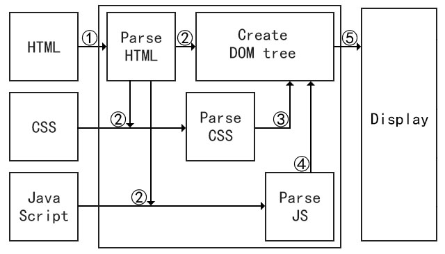

#JavaScript学习笔记
##一、JS介绍
###HTML、CSS和JavaScript
HTML是一种标记语言，决定着网页中的内容  
CSS是一种样式规则语言，决定着内容的长相  
JavaScript是一种脚本语言，决定着事件的行为  
```
<style>
	#box{
		width: 200px;
		height: 100px;
		background: #f00;
	}
</style>
<div id="box"></div>
<script>
	var box = document.getElementById('box');
	box.addEventListener('click', function(){
		box.style.background = '#00f';
	});
</script>
```
运行上述代码，点击红色的矩形，它会变成蓝色  
这是一个特别简单的案例，从中好好体会一下HTML、CSS和JavaScript各种发挥的作用

现在我们来看看，浏览器是怎么把我们写的代码变成花花绿绿的网页的？

如上图所示，浏览器就像一个"工厂"，把我们写的HTML、CSS和JavaScript当作原料，加工成用户所见的网页  
主要分为以下五步（**具有先后顺序**）:  
①加载HTML（内部的CSS和JS在此时也会被加载）  
②解析HTML（创建DOM树，加载CSS和JS）  
③解析CSS（并修改DOM树）  
④解析JS（可能修改DOM树）  
⑤将DOM树转化成用户所见的网页  
这么做的原因是：如果没有HTML，先有CSS，那CSS又能设置谁的样式呢，JavaScript同理
###什么是JavaScript
JavaScript是一门弱类型的脚本语言(解释性语言)，一般运行在浏览器上具有以下特点：  
①弱类型：允许数据类型隐式转换  
②解释性：解释一行，执行一行（区别于编译性）  
③头等函数：函数的权限很高，等同于变量，可做参数可做变量可被返回  
④基于原型：JS的面向对象是基于原型的，所以没有类的概念(在ES6中有扩充)  
⑤动态语言：声明变量时，无需指定数据类型  
⑥区分大小写  
⑦单引号=双引号  
⑧语句末尾可省略分号(不建议)  
⑨不仅支持面向对象，还支持函数式编程
##二、JS基础
###1.输出语句
```
console.log('Hello world');
```
###2.自定义输出语句
```
var log = console.log.bind(console);
```
###3.声明变量与作用域
```
var a; //声明一个函数级作用域的变量
let b; //声明一个块级作用域的变量
const c= 1: //定义一个块级作用域的常量
```
###4.数据类型
```
var a = 1.1; //Number
var b = "hello world"; //String
var c = true; //Boolean
var d = 'hello world'; //String;
var e = [1, 2, 3]; //Array(Object)
var f = {user: zzh, pass: '123'}; //Object
var g = null; //Null(Object)
var h; //Undefined
var i = Symbol(); //独一无二，ES6的
//因为用var定义
//所以在function内为局部变量
//在function外叫全局变量
```
###5.运算符
```
算术运算符：+ - * / % ++ --
关系运算符：== != > < >= <= ===/*全等*/ !==//不绝对等
逻辑运算符：&& || !
赋值运算符：= += -= *= /= %=
其他运算符：a>b?a:b/*Max*/ typeof//检查数据类型
```
###6.流程控制
```
//判断 a = ？——if版
var a = 1;
if(a === 1){
	log('a = 1');
}
else{
	log('a != 1');
}
//判断 a = ？——switch版
switch(a){
	case 1:
		log('a = 1');
	break;
	default:
		log('a != 1');
	break;
}
//计算1+2+...+100=？——for版
var i, sum = 0;
for(i=1; i<=100; i++){
	sum += i;
}
log(sum);
//计算1+2+...+100=？——while版
i = 1, sum = 0;
while(i<=100){
	sum += i;
	i++;
}
log(sum);
```
###7.数组
```
//定义一个数组
var arr = [1, 2, 3];
log(arr[1]); //2
//通过越界索引赋值会改变其大小
arr[3] = 4;
log(arr.length); //4
//对length赋一个新值会改变其大小
arr.length = 5;
log(arr[4]); //undefined
```
###8.字符串
```
//定义一个字符串
var str = 'abcd1234';
log('str的长度：', str.length); //8
log('第一个l出现的位置：', str.indexOf('d')); //3
log('第2个位置的字符是：', str.charAt(3)); //d
log('从1-3位置的字符是：', str.substr(1,3)); //bcd
/*-------------------
正则表达式(规则)
字符a: /a/
字符a或者A: /a/i
数字: /\d/
所有的数组: /\d/g
一口气显示: /\d+/g
符合abcd的任何一个: /[abcd]/
-------------------*/
log(str.search(/D/i)); //3
log(str.match(/\d+/g)); //["1234"]
log(str.replace(/[adbc]/g, '0')); //00001234
//字符串拼接
log('ES6之前' + str);
log(`ES6中${str}`);
```
##三、JS进阶
###1.函数
```
//定义一个函数
function fun(){}
//也可以这么定义
var fun = function(){}; //匿名函数
//箭头函数（只有一个参数()可省，只有一个return{}可省）
var f = (x) => {2*x}; //var f = x => 2*x;
log('f(x)=2x, f(3) =',f(3));
//递归（a的阶乘）
function factorial(a){
	if(a < 1){
		break;
	}
	return a*factorial(a-1);
}
//回调
function fun2(callback){
	callback();
}
fun2(function(){
	alert(1);
});
//重载
var fun3 = function(){
	switch(arguments.length){
		case 1:
			alert(1);
		break;
		case 2:
			alert(2);
		break;
		default:
			alert(-1);
		break;
	}
}
//闭包
var f1 = function(){
	var a = 1;
	return a;
}
function f2(){
	var b = f1();
	alert(b);
}
f2();
```
###2.DOM和BOM
```
<div>
	<ul id="box" class="box">
		<li>111</li>
		<li>222</li>
	</ul>
</div>
//获取DOM节点（四种方法）
var box = document.getElementById('box');
var box = document.getElementsByTagName('ul')[0];
var box = document.getElementsByClassName('box')[0];
var box = document.querySelector('#box');
//更改CSS（四种方法）
box.style.display = 'block';
box.style['display'] = 'block';
box.setAttribute('display', 'block');
box.getAttribute('display');
//写入数据
document.write('<h1>Hello World</h1>');
box.innerHTML('<h1>Hello World</h1>');
//获取子节点
log(box.childNodes); //子节点(包括文本节点)
for(var i=0; i<box.childNodes.length; i++){
	log(box.childNodes[i].nodeType); //1元素 3文本
}
log(box.children); //子节点(不包括文本节点)
//获取父节点
log(box.parentNode); //父节点
log(box.offsetParent); //用于定位的那个父节点
//元素操作
var para=document.createElement("p"); //创建节点
document.body.appendChild(box); //添加元素
document.body.removeChild(box); //删除元素
/*--------下面是BOM--------*/
//open是有返回值的，有第二个参数，默认为'_blank'
window.open('about:blank'); //打开新的空白页
window.close(); //关闭当前页面
log(window.navigator.userAgent) //浏览器信息
log(window.location); //URL信息
//跳转至百度
window.location.href = 'https://www.baidu.com';
//把Width换成Height就是高了
log(document.body.clientWidth); //可视区大小
log(document.body.offsetWidth); //包含滚动条的大小
log(document.body.scrollWidth); //元素的大小
```
###3.面向对象(重点)
JavaScript是基于原型的，而不像Java/C++之流是基于类的  
所以在JS中没有Class，至少ES6之前没有，在JS创建对象  
会直接实例化，不需要像Java那样，先声明Class再实例化  
对象(new)
####所谓基于原型
```
/*---------------------
在学习JS的面向对象之前，我们先要了解几个概念
这是因为JS是基于原型的，不同于Java那种基于类的
概念：函数、对象、原型链、__proto__和prototype
记住函数是函数，对象是对象，重点如下：
1.对象是由函数生成的，函数也是由函数生成的
2.对象有__proto__属性，函数有prototype属性
3.对象有__proto__指向(生成它的)函数的prototype
---------------------*/
//证明第一点（对象和函数都是由函数生成的）
var o = new Object(); //等价于o = {};
var f = new Function(); //等价于f = function(){};
log(typeof Object); //function
log(typeof Function); //function
log(typeof o); //object
log(typeof f); //function
//证明第二点（对象没有prototype属性）
log(o.__proto__); //{constructor: ƒ, hasOwnProperty: ƒ, …}
log(o.prototype); //undefined
log(f.__proto__); //ƒ(){[native code]}
log(f.prototype); //{constructor: ƒ, __proto__: Object}
//证明第三点（对象的__proto__指向函数的prototype）
log(o.__proto__ === Object.prototype); //true
log(f.__proto__ === Function.prototype); //true
/*----------------------
现在具体来看，这些概念分别是什么(函数和对象就不多言了)
1.__proto__是什么，上文已知它指向prototype
2.那prototype又是什么，下文主要讨论这个
----------------------*/
//1.__proto__和prototype都是对象
log(typeof o.__proto__); //object
log(typeof f.prototype); //object
//__proto__有一堆乱七八糟的东西
log(o.__proto__); //{constructor: ƒ, hasOwnProperty: ƒ, …}
//2.prototype中有constructor和__proto__
log(f.prototype); //{constructor: ƒ, __proto__: Object}
//其中constructor指向函数本身
var fun = function(){
	log('hello world');
}
log(fun.prototype.constructor); //ƒ(){log('hello world');}
log(fun); //ƒ(){log('hello world');}
//其中__proto__指向Object.prototype
log(fun.prototype.__proto__ === Object.prototype); //true
//特殊函数的特殊情况(有一堆乱七八糟的东西，就是没有__proto__)
log(Object.prototype); //constructor: ƒ, __defineGetter__: ƒ …}
log(Object.prototype.__proto__); //null(原型链的终点)
/*---------------------
上面说了这么多乱七八糟，那这些和原型链有什么关系呢
从上文可知：
__proto__指向函数的prototype
而prototype里有自己的__proto__
__proto__又指向另一个prototype
即，a.__proto__ -> A.prototype -> Object.__proto__
这个玩意，被称为原型链
---------------------*/
```
####抽象
```
/*-------------------------
总结先看：
JSON方法和new Object方法等价(不封装)
构成函数法和function方法等价(滥用内存)
ES6之前，最好的方法是function改进法
改进法是通过修改原型链，来避免内存浪费
-------------------------*/
//抽象-JSON，缺点是不封装
var o = {
	name: 'zhang san',
	say: function(){
		log('I am ' + this.name);
	},
}
o.say(); //I am zhang san
//抽象-New(直接实例化)，缺点是不封装
var o1 = new Object();
o1.name = 'Zhang san';
o1.say = function(){
	log('I am ' + o1.name);
};
o1.say(); //I am zhang san
//抽象-构造函数(工厂方式)，缺点是滥用内存
function creat(name){
	var o =  new Object();
	o.name = name;
	o.say = function(){
		log('I am ' + o.name);
	};
	return o;
}
var o2 = creat('Zhang san');
o2.say(); //I am zhang san
var o3 = creat('Zhang san');
//长得一样却不相等，所以占用不同内存
log(o2.say+'\n'+o3.say, o2.say === o3.say); //false
//抽象-function，缺点是滥用内存
function creat2(name){
	this.name = name;
	this.say = function(){
		log('I am ' + this.name);
	};
}
var c1 = new creat2('Zhang san');
c1.say(); //I am zhang san
var c2 = new creat2('Zhang san');
//也占用不同内存
log(c1.say+'\n'+c2.say, c1.say == c2.say); //false
//抽象-function(改进)，ES6之前都用这个
function Person(name){
	this.name = name;
}
Person.prototype.say = function(){
	log('I am ' + this.name);
};
var p1 = new Person();
p1.say(); //I am zhang san
var p2 = new Person('Zhang san');
//共用同一块内存
log(p1.say+'\n'+p2.say, p1.say == p2.say); //true
```
####在讲继承之前

###4.事件机制
####事件流：页面中接受事件的顺序
####事件捕获：从外层到内层
####事件冒泡：从内层到外层
####事件对象：type事件类型，target事件目标
###5.本地存储
```
//cookie其实就是document下的一个属性
//同一个域名共享一个cookie，(4-10k)*50，有过期时间
var setCookie = function(str, day){
	var ddl = new Date();
	ddl.setDate(ddl.getDate() + day);
	//添加一条cookie信息，用=即可，无需+=
	document.cookie = str + '; expires=' + ddl;
};
//cookit长这样：'name=zxc; pass=123'
//通过split来获取cookit
var getCookie = function(key){
	var arr = document.cookie.split('; ');
	for(var i=1; i<arr.length; i++){
		var item = arr[i].split('=');
		if(item[0] === name){
			return item[0];
		}
		else{
			return '';
		}
	}
};
//它两存储量较大，能到5M
//localStorage一直存在，sessionStorage浏览器关了就没了
localStorage.name = 'zxc';
sessionStorage.pass= '123';
```
###6.网络协议
###7.收发数据
###8.跨域请求
##三、JS高级
###1.Jquery
###2.模块化
####sea、require
CMD、AMD
define
use
####node.js
node_modules
require和exports
####ES6
export/import
babel
####WebPack
###3.数据交互
####htto协议
①无状态(健忘)  
②三次握手
③head32k，body1-2g
####form
####ajax(不能跨域)
####JSONP(不推荐)
####websocket(双工)
