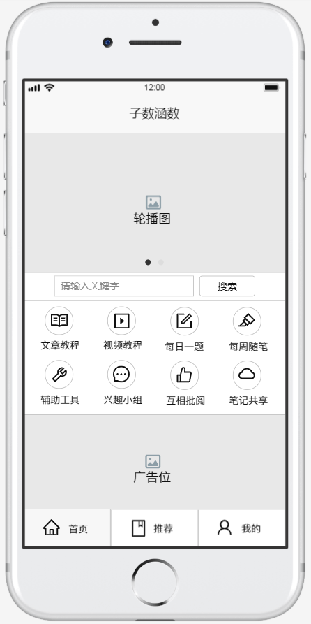
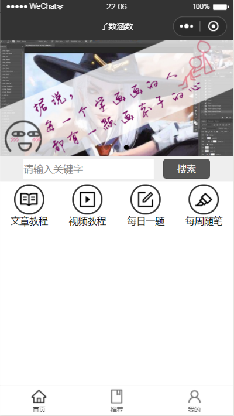

##小程序开发教程
#####by——张子涵
**前言**：这篇小程序开发教程，是我个人自制的一版文字教程，以我个人的项目（子数涵数）为例，该项目完全开源，可前往github上观看，该教程默认读者已经掌握基本的web开发知识（HTML、CSS、JavaScript和计算机网络等）
### 一、准备工作
#### 1.下载IDE
https://developers.weixin.qq.com/miniprogram/dev/devtools/download.html
在上述网址中，下载“微信Web开发者工具”，这是小程序专用的开发环境。
下载完成后，要安装，然后再打开安装好的程序，这些步骤就不再赘述。
#### 2.申请AppID
打开“微信Web开发者工具”，扫码登入微信账号，登入完成后，选择“小程序项目”，如下图：

然后就会发现。没有任何项目（如果你以前没在这台电脑上开发过小程序的话），所以点击那个小加号，如下图：

点开之后，需要我们填写一些该项目的基本信息，按需求填写即可，注意的是需要申请一个AppID，用于标识我们的小程序，也可以暂时不申请，先用测试号（注：没有AppID的话，一些微信API将无法被调用），如下图：

然后就开始注册吧，填写相关信息，注意一个邮箱只能申请一次，如下图：

登上邮箱后，稍等片刻，就会收到邮件，点开邮件里的链接，提示已经激活成功了，如下图：

登入刚刚注册的账号，进行信息登记，如下图：

然后点击图示区域，就可以查看AppID了，如下图：

#### 3.Hello World
有了AppID后，填写进“微信Web开发者工具”中，然后点击确定，生成一个空的小程序，如下图：

然后我们来创建一个app.json，如下图：

在app.json中输入一对花括号，如下图：

注：所谓的json，是一种由键值对构成的信息存储格式，大致长成这个样子
```
{
    name: "zzh",
    age: 20,
    habit: "sleep"
}
```
按编译器的提示，在花括号中pages的信息，如下图：

注：pages后跟的是一个数组，数组里存放该小程序的所有页面文件的位置（*.wxml就是小程序的页面文件）
最后，我们把视图区的内容改为Hello World，如下图：


注：rpx（responsive pixel）是小程序独有的大小单位，规定任何的手机宽度都为750rpx
#### 4.小程序的文件结构
不用快速模板的话，默认只有一个project.config.json  
* 小程序包含一个app和多个page（描述页面）  
* app包含app.js(逻辑)、app.json(公共设置)、app.wxss(公共样式) 
* page包含js(逻辑)、wxml(结构)、wxss(样式)、json(配置)  
>-project.config.json  
-app.js
-app.wxss
-app.json
-pages
--index
---index.js
---index.wxml
---index.wxss
---index.json
### 二、小程序配置
#### 1.全局配置
所谓的全局配置，就是不管在小程序的哪个页面中都执行的配置，与之对应的是页面配置（只对当前页面起作用）
这里只列举几个常见的，详细内容请见：https://developers.weixin.qq.com/miniprogram/dev/reference/configuration/app.html
全局配置的内容要写在app.json中，常见的有：

于是，小程序就变成了这个样子：

代码示例（方便复制）：
```
{
  "pages": [
    "pages/index/index"
  ],
  "window": {
    "navigationBarBackgroundColor": "#f55",
    "navigationBarTextStyle": "white",
    "navigationBarTitleText": "子数涵数",
    "enablePullDownRefresh": false
  },
  "tabBar": {
    "color": "#666",
    "selectedColor": "#333",
    "backgroundColor": "#fff",
    "list": [
      {
        "pagePath": "pages/index/index",
        "iconPath":"images/home.png",
        "selectedIconPath": "images/homeA.png",
        "text": "首页"
      },
      {
        "pagePath": "pages/index/index",
        "iconPath": "images/book.png",
        "selectedIconPath": "images/bookA.png",
        "text": "推荐"
      },
      {
        "pagePath": "pages/index/index",
        "iconPath": "images/user.png",
        "selectedIconPath": "images/userA.png",
        "text": "我的"
      }
    ]
  }
}
```
注：下方的图标，我是用的阿里的ant design图标库，地址为 https://www.iconfont.cn/collections/detail?spm=a313x.7781069.1998910419.d9df05512&cid=9402
#### 2.页面配置
（暂时先跳过，等第二章“开发流程”看完后，再回来看这一节）
```
{
  "backgroundColor": "#fff",
  "enablePullDownRefresh": false
}
```
#### 3.sitemap配置
（暂时先跳过，等xxx看完后，再回来看这一节）
### 三、开发流程
注意：在开发小程序的时候（开发别的其实也一样），不要背代码，不会就百度，上网看文档，文档是官方指定的参考资料（相当于说明书）
这是小程序的开发文档：https://developers.weixin.qq.com/miniprogram/dev/framework/
#### 1.首页设计
一般来讲，任何的一款程序，都履行着一套公认的业界生产流水线（制作步骤）
①策划给出程序方案（产品定位、用户画像、原型设计等等）
②美工设计程序外观（布局排版、色彩搭配、LOGO绘图等等）
③码农开发程序功能（前端部分、后端部分、后期更新等等）
就以这个首页为例，我们来分别介绍一下以上内容（先介绍①，②和③留到下一节）：
**——第一个环节：写方案——**
这里我就直接拿word写了


**——第二个环节：做设计——**
这个步骤可以交给策划（产品经理）做，叫原型设计（也可以交给美工）
我这里用MockingBot做

#### 2.首页制作
**——第三个环节之一：画图片——**
画LOGO图，海报图，字体设计等等，一系列在该程序会用到的图片，都在这一步完成（与“敲代码”同步进行）
我准备用PS来进行这个环节的内容，这里不多介绍，因为它是和“敲代码”同步进行的，所以我们先敲代码，等遇到有需要的图片的时候，再绘制。
**——第三个环节之二：敲代码——**
在首页中，一共有4个部分：①轮播图，②搜索框，③导航栏，④广告位
按从上到下的布局顺序，首先我们要做一个轮播图（全局配置不着急）
轮播图文档地址：https://developers.weixin.qq.com/miniprogram/dev/component/swiper.html
在index.wxml中写入
```
<swiper>
  <swiper-item>
    <text>111</text>
  </swiper-item>
  <swiper-item>
    <text>222</text>
  </swiper-item>
</swiper>
```

这样一个轮播图的基本结构就写好了，现在我来给**做些修改，并且添加上样式**（由于篇幅问题，这一步留到下一节）
在此之前，我们要先介绍两个东西，一个叫**数据绑定**，另一个叫**列表渲染**（与它一起的其实还有一个叫**条件渲染**，之后用到了再讲）
我们更改一下app.json中pages的配置，添加一个临时页面，用于一些演示性的代码讲解。

**（1）数据绑定**
在temp.wxml中写入
```
<!--引用data中的message-->
<text>{{message}}</text>
```
在temp.js中写入
```
Page({
  // 页面的初始数据
  data: {
    // 设置message数据
    message: "你好啊"
  }
})
```
然后在视图区中，就会显示“你好啊”这三个字

这就是“数据绑定”，一共两步：①设置数据，②引用数据
**（2）列表渲染**
那什么是“列表渲染”呢？
在temp.wxml中写入
```
<!--引用data中的array，进行渲染-->
<view wx:for="{{array}}">
  <!--渲染array中的数组下标和message数据-->
  {{index}}-{{item.message}}
</view>
```
在temp.js中写入
```
Page({
  // 页面的初始数据
  data: {
    // 设置array数据
    array: [
      // 设置message数据
      {message: "aaa"},
      {message: "bbb"},
    ]
  }
})
```
然后在视图区中，就会显示“0-aaa”和“1-bbb”，这里的0和1是数组下标，aaa和bbb是message中的内容

不难看出，“列表渲染”是基于“数据绑定”的，如果没有“数据绑定”，自然也就没有“列表渲染”
这里我们也下个定义：列表渲染是根据一个数组来渲染元素，即数组中有x个元素，就渲染x次
#### 3.轮播图
**（1）运用列表渲染，来代替重复性的wxml（微信版的html）**
在index.wxml中写入
```
<!--轮播图-->
<swiper class="banner" indicator-dots="true" autoplay="true">
  <swiper-item wx:for="{{swipers}}">
    <view>
      <image src="{{item.url}}"></image>
    </view>
  </swiper-item>
</swiper>
```

注：不写注释与写太多注释都不是一个好的代码风格，所以我只写了“<!--轮播图-->”这一个注释，而其他需要讲解的地方，在图片上用箭头标了出来。
在index.js中写入
```
Page({
  // 页面的初始数据
  data: {
    // 轮播数据
    swipers: [
      { url: "/images/banner-1.jpg"},
      { url: "/images/banner-2.jpg"},
      { url: "/images/banner-3.jpg"}
    ]
  }
})
```
注：“/”表示跟目录（“.”是当前目录，“..”是上级目录）

目前，banner-1/2/3这三张图片，还没有绘制，我准备等下方的wxss写完后，再使用PS软件来绘制所需要的素材。
**（2）添加样式，即编写wxss（微信版的css）**
在index.wxss中写入
```
/* 轮播图的样式 */
.banner{
  width: 750rpx;
  height: 375rpx;
}
.banner image{
  width: 750rpx;
  height: 375rpx;
}
```

现在我们来绘制轮播图片


三张图片画好了（说是绘制，其实是拼凑的）
我们再把全局配置里的窗口颜色调一下（红色太丑了）
在app.json中改写为
```
"navigationBarBackgroundColor": "#333",
```
然后我们看一下效果

#### 4.首页剩余部分的制作
**（1）搜索框**
在index.wxml中写入
```
<!--搜索框-->
<view class="search">
  <view class="box">
    <input placeholder="请输入关键字" confirm-type="search"></input>
    <button>搜索</button>
  </view>
</view>
```
在index.wxss中写入
```
/* 搜索框的样式 */
.search{
  width: 750rpx;
  height: 80rpx;
  background: #eee;
}
.search .box{
  position: relative;
  top: 10%;
  left: 10%;
  width: 80%;
  height: 80%;
  background: #eee;
}
.search .box input{
  float: left;
  width: 70%;
  height: 100%;
  background: #fff;
}
.search .box button{
  float: left;
  position: relative;
  left: 5%;
  width: 25%;
  height: 100%;
  background: #555;
  font-size: 30rpx;
  line-height: 64rpx;
  color: #fff;
}
```
然后我们看一下效果

**（2）导航栏**
在index.wxml中写入
```
<!--导航栏-->
<view class="nav">
  <view class="line">
    <view class="part" wx:for="{{parts}}">
      <view class="ico">
        <image src="{{item.url}}"></image>
      </view>
      <view class="text">{{item.text}}</view>
    </view>
  </view>
</view>
```
在index.wxss中写入
```
/* 导航栏的样式 */
.nav{
  width: 750rpx;
  height: 150rpx;
}
.nav .line{
  width: 100%;
  height: 100%;
  background: #fff;
}
.nav .line .part{
  float: left;
  width: 25%;
  height: 100%;
}
.part .ico{
  /* (187.5-95)/2 = 45.25 */
  position: relative;
  top: 10rpx;
  margin-left: 45.25rpx;
  width: 90rpx;
  height: 90rpx;
  border: #333 5rpx solid;
  border-radius: 50rpx;
}
.part .text{
  position: relative;
  top: 10rpx;
  width: 100%;
  height: 40rpx;
  text-align: center;
  font-size: 30rpx;
}
.part .ico image{
  margin-top: 15%;
  margin-left: 15%;
  width: 70%;
  height: 70%;
}
```
在index.js中写入
```
// 导航栏数据
    parts: [
      {
        url: "/images/read.png",
        text: "文章教程"
      },
      {
        url: "/images/play-square.png",
        text: "视频教程"
      },
      {
        url: "/images/edit-square.png",
        text: "每日一题"
      },
      {
        url: "/images/highlight.png",
        text: "每周随笔"
      }
    ]
```
然后看效果

**（3）广告位**
在index.wxml中写入
```
<!--广告位-->
<view class="advert">
  <text>广告位招租</text>
  <image></image>
</view>
```
在index。wxss中写入
```
/* 广告位的样式 */
.advert{
  position: absolute;
  bottom: 0;
  width: 750rpx;
  height: 499rpx;
  background: #eee;
  text-align: center;
  line-height: 499rpx;
  font-size: 50rpx;
}
.advert image{
  position: absolute;
  top: 0;
  left: 0;
  width: 100%;
  height: 100%;
}
```
看效果

加上一张广告位招租的图片
在index.wxml中改写为
```
<image src="/images/advert.jpg"></image>
```
效果如下

### 四、文章教程
#### 1.原型图与搜索框
**（1）原型图**
先画原型设计图，如下：

在app.json中改写pages为
```
"pages": [
    "pages/essay/essay",
    "pages/index/index",
    "pages/temp/temp"
  ],
```
这样IDE会自动帮你生成essay文件夹及其相关文件（essay.wxml、essay.wxss、essay.js、essay.json）
注：我们把"pages/essay/essay"放到第一个，是为了方便调试，这样小程序启动后的第一个页面就是essay页面，最终上线版肯定是会调回来的。
我们把index.wxml和index.wxss中关于搜索框的内容，复制到essay.wxml和essay.wxss中（偷一个懒）
再稍微低修改一下：
```
<!--pages/essay/essay.wxml-->
<!--搜索框-->
<view class="search">
  <view class="box">
    <picker bindchange="bindPickerChange" value="{{index}}" range="{{subjects}}">
      <view class="picker">
        {{subjects[index]}}
      </view>
    </picker>
    <input placeholder="请输入关键字" confirm-type="search"></input>
    <button>搜索</button>
  </view>
</view>
```
```
/* pages/essay/essay.wxss */
/* 搜索框的样式 */
.search{
  width: 750rpx;
  height: 80rpx;
  background: #eee;
}
.search .box{
  position: relative;
  top: 10%;
  left: 5%;
  width: 90%;
  height: 80%;
  background: #eee;
}
.search .box picker{
  float: left;
  width: 20%;
  height: 64rpx;
  background: #555;
  color: #fff;
  border-radius: 10rpx;
  line-height: 64rpx;
  font-size: 30rpx;
  text-align: center;
}
.search .box input{
  float: left;
  margin-left: 3%;
  width: 54%;
  height: 100%;
  background: #fff;
}
.search .box button{
  float: left;
  margin-left: 3%;
  width: 20%;
  height: 100%;
  background: #555;
  font-size: 30rpx;
  line-height: 64rpx;
  color: #fff;
}
```
js也写上
```
// pages/essay/essay.js
Page({
  // 页面的初始数据
  data: {
    subjects: ['全部', '数学', '英语', '电脑', '美术', '音乐', '物理']
  },
  // 生命周期函数--监听页面初次渲染完成
  onReady: function () {
    this.setData({
      index: 0
    })
  },
  // 选择器的触发事件
  bindPickerChange: function (e) {
    console.log('picker发送选择改变，携带值为', e.detail.value)
    this.setData({
      index: e.detail.value
    })
  }
})
```
就变成了这个样子

修改一下页面配置，在essay.json中写入
```
"navigationBarTitleText": "文章教程"
```

#### 2.内容列表与广告位
**（2）内容列表**
在essay.wxml中写入
```
<!--内容列表-->
<view class="section" wx:for="{{sections}}">
  <view class="type">{{item.type}}</view>
  <view class="angle"></view>
  <view class="caption">
    <text>{{item.caption}}</text>
    <image src='/images/fire.png'></image>
  </view>
  <view class="date">{{item.date}}</view>
</view>
```
在essay.wxss中写入
```
/* 内容列表的样式 */
.section {
  position: relative;
  margin-top: 3%;
  margin-left: 3%;
  width: 94%;
  height: 140rpx;
  background: #fff;
  border: #777 3rpx solid;
  box-shadow: 5rpx 5rpx 3rpx #999;
}
.section .caption {
  position: relative;
  width: 100%;
  height: 50%;
  text-align: center;
  line-height: 70rpx;
  font-size: 35rpx;
}
.section .caption image {
  position: absolute;
  top: 10rpx;
  right: 3%;
  width: 50rpx;
  height: 50rpx;
}
.section .date {
  width: 97%;
  height: 50%;
  text-align: right;
  line-height: 70rpx;
  font-size: 30rpx;
  color: #555;
}
.section .angle {
  position: absolute;
  top: 0;
  width: 0;
  height: 0;
  border-top: 70rpx solid transparent;
  border-right: 100rpx solid transparent;
  border-bottom: 70rpx solid transparent;
  border-left: 100rpx solid #e48;
}
.section .type{
  position: absolute;
  top: 50rpx;
  left: 7rpx;
  width: 60rpx;
  color: #fff;
  font-size: 30rpx;
  text-align: center;
  font-weight: 700;
  z-index: 2;
}
```
在essay.js中data里添加
```
sections: [
      {
        type: "数学",
        caption: "文章标题一",
        date: "2019-9-8 20:31"
      },
      {
        type: "英语",
        caption: "文章标题二",
        date: "2019-9-8 20:31"
      },
      {
        type: "电脑",
        caption: "文章标题三",
        date: "2019-9-8 20:31"
      },
      {
        type: "美术",
        caption: "文章标题四",
        date: "2019-9-8 20:31"
      },
    ]
```

**（2）广告位**
注：可以复制index中的广告位那块的代码（偷个懒）
在essay.wxml中写入
```
<!--广告位-->
<view class="advert">
  <text>广告位招租</text>
  <image src="/images/advert.jpg"></image>
</view>
```
在essay.wxss中写入
```
/* 广告位的样式 */
.advert{
  position: absolute;
  bottom: 0;
  width: 750rpx;
  height: 450rpx;
  background: #eee;
  text-align: center;
  line-height: 450rpx;
  font-size: 50rpx;
}
.advert image{
  position: absolute;
  top: 0;
  left: 0;
  width: 100%;
  height: 100%;
}
```
效果如下

#### 3. 相互跳转
在index.wxml中把导航栏那块的代码改成这样子
```
<!--导航栏-->
<view class="nav">
  <view class="line">
    <view class="part" wx:for="{{parts}}">
      <navigator hover-class="none" url="{{item.toWhere}}">
        <view class="ico">
          <image src="{{item.url}}"></image>
        </view>
        <view class="text">{{item.text}}</view>
      </navigator>
    </view>
  </view>
</view>
```
在index.js中把导航栏的数据改为
```
// 导航栏数据
parts: [
  {
    url: "/images/read.png",
    text: "文章教程",
    toWhere: "../essay/essay"
  },
  {
    url: "/images/play-square.png",
    text: "视频教程",
    toWhere: "../essay/essay"
  },
  {
    url: "/images/edit-square.png",
    text: "每日一题",
    toWhere: "../essay/essay"
  },
  {
    url: "/images/highlight.png",
    text: "每周随笔",
    toWhere: "../essay/essay"
  }
]
```

注：在navigator中加入hover-class="none"可以除去点击时出现的灰色框