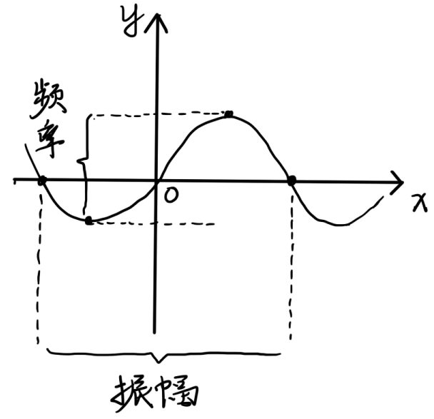
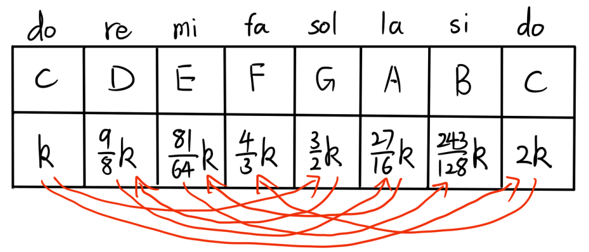
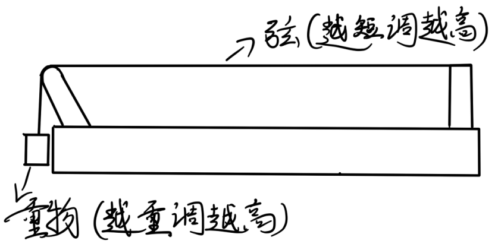
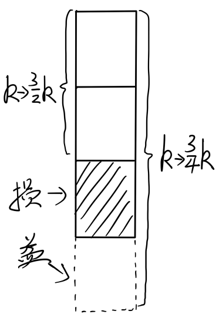
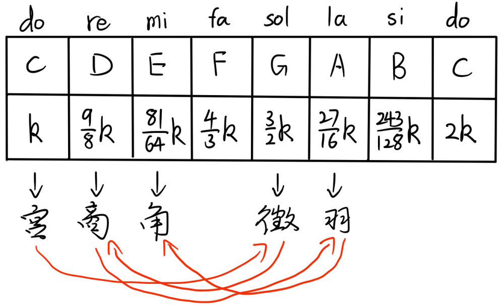
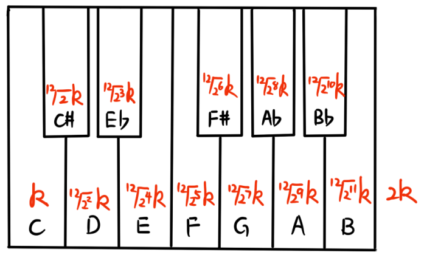
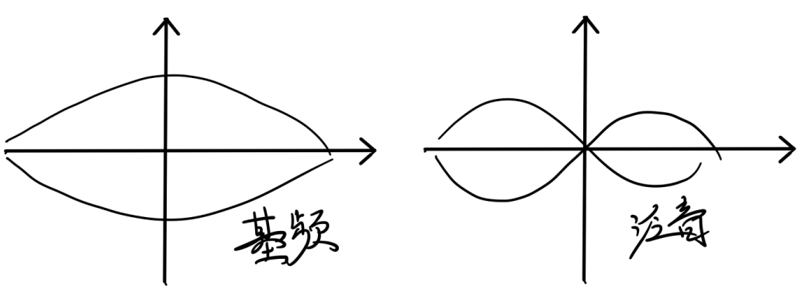
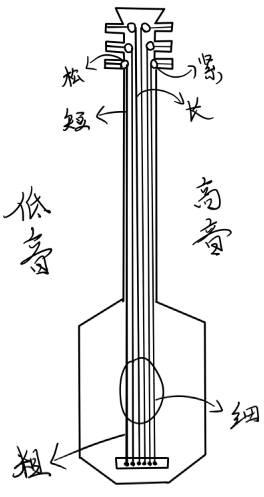

## 乐理随笔
#### （1）声音是什么
在我上初中的时候，我的物理老师就告诉过我：“声音是物体振动时发出的波，准确说是一种机械波，它有两个主要属性——振幅和频率”；所谓振幅代表音量的大小，而频率代表声调的高低，我们来画一张图以便理解。

如上图所示，振幅表示的是声波中波峰和波谷之间的距离（两个最值），而频率表示的是声波的左右相同点的距离（最小正周期）
#### （2）五度相生法
在我上小学的时候，我的数学老师在讲“无理数”的概念时，曾提到一个人——古希腊的数学家，毕达哥拉斯（因为他认为“万物皆有理”，所有的数都是有理数），这里其实还有一个关于第一次数学危机的故事，我们便不提了；毕达哥拉斯其实还是乐理的发明者，“五度相生法”就是由他发明的，我们现在就来简单地介绍介绍这所谓的五度相生法。

传说，哥斯拉（毕达哥拉斯）有一天，闲着没事，就隔街上瞎晃悠，无意中听到铁匠们打铁的声音，很带感，让人想抖腿，他隔那琢磨，这是咋回事呢，琢磨来琢磨去，发现铁匠们打铁很有节奏，其频率之比多为：
$$ 2:1\quad 3:2\quad 4:3 $$

上图便是，由“五度相生法”推导出来的一个“八度”，哥斯拉还研究出一种“琴”用于证明自己的理论，琴的结构如下：

#### （3）三分损益法
无独有偶，在中国，有一个叫管仲的人，提出了“三分损益法”，其原理与哥斯拉的“五度相生法”大同小异，我们通过一个笛子的模型，来介绍它。

吹笛子，会响，是因为笛子内部的空气柱在发生振动，这个空气柱越短，音调越高；通过这种加三分之一，减三分之一的办法，发明了中国的音律——宫商角徵羽（所以有一个成语叫“五音不全”）

#### （4）十二平均律
中国的“三分损益法”比西方的“五度相生法”更有规律，但音阶更少，而且它们都存在一个问题，那就是相邻音之间的比值不同。

于是，明代的朱载堉发明了“十二平均律”，即把一个“八度”划分成十二个音阶，每个音阶之间相差的比值相等，后一个音阶都是前一个音阶的$\sqrt[12]{2}k$倍（这样就便于“转调”，如C大调转D大调）

这个十二平均律，传入西方后，被大名鼎鼎的德国音乐家巴赫发扬光大。
#### （5）基频与泛音

