#### 安装anacanda
anacanda是一个开源的python发行版本，集成了一下常用工具，如：jupyter notebook、NumPy等，相当于一个python全家桶

我们可以去它的官网上，下载最新版本
https://www.anaconda.com/products/individual

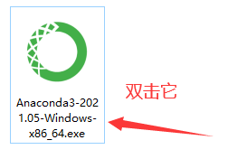
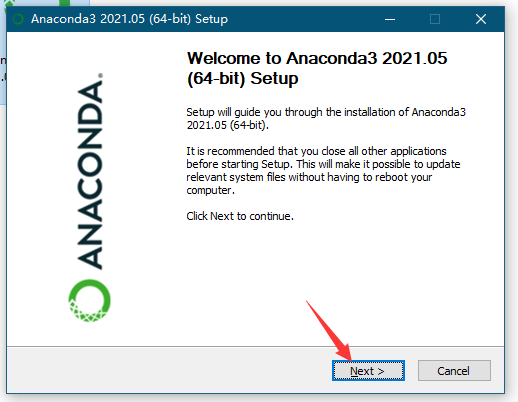
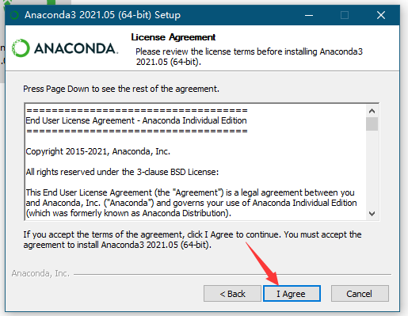
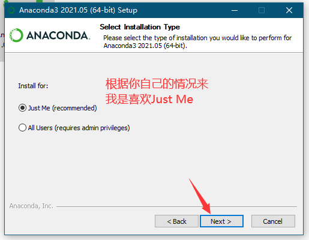


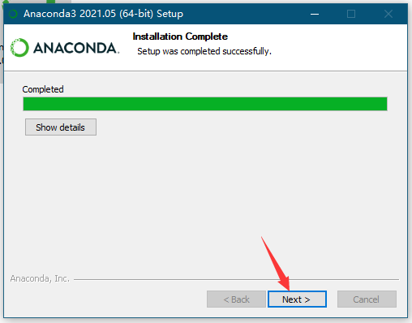
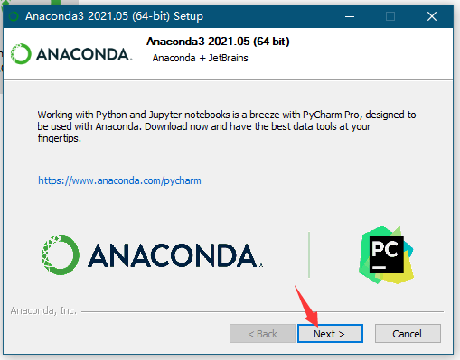
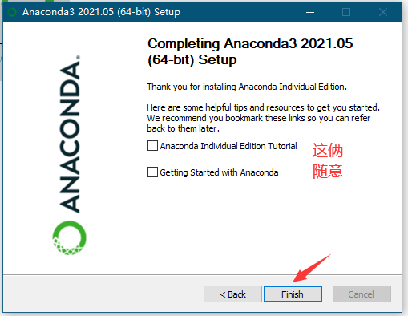
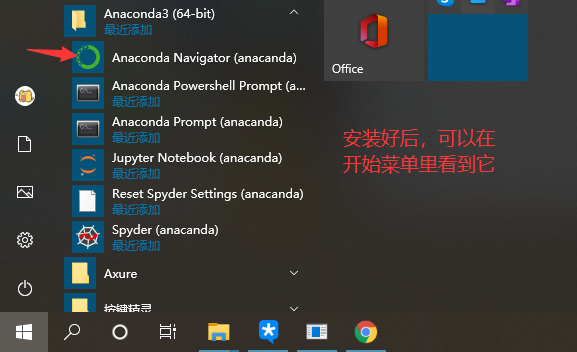
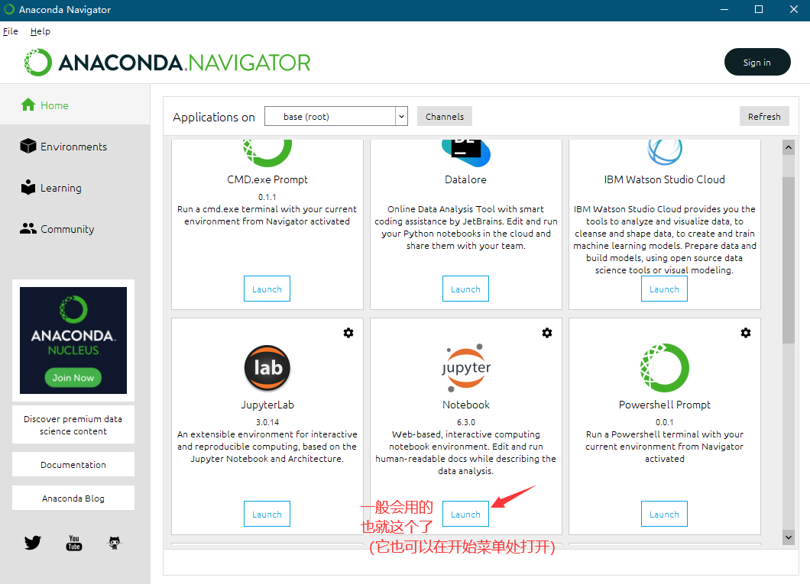
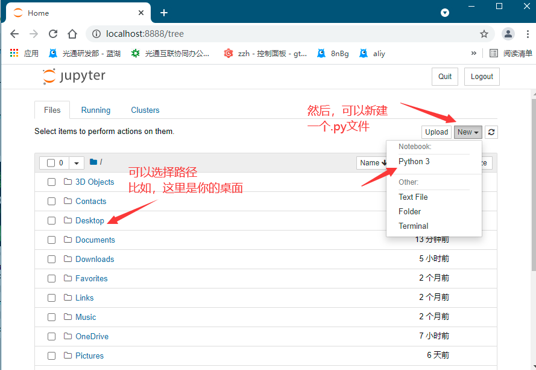
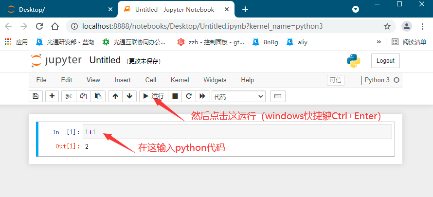
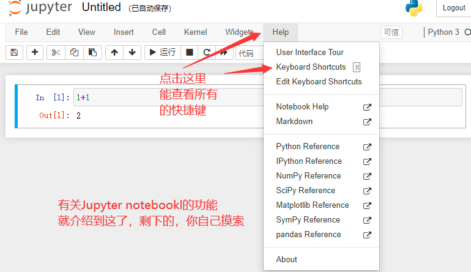

#### 如何运行一个网页
我们可以通过内嵌webview的方式，在Windows、Mac OS、Android、IOS等平台上，显示html文件，你可以当作是制作了一个简易的浏览器。

通过pip（python的包管理工具，装python时会自带，无需特定安装）安装pywebview
（如果pip行不通，可以试试pip3）
```
pip install pywebview
```
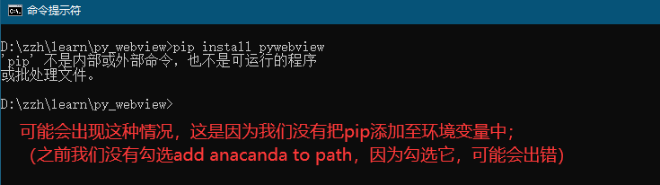
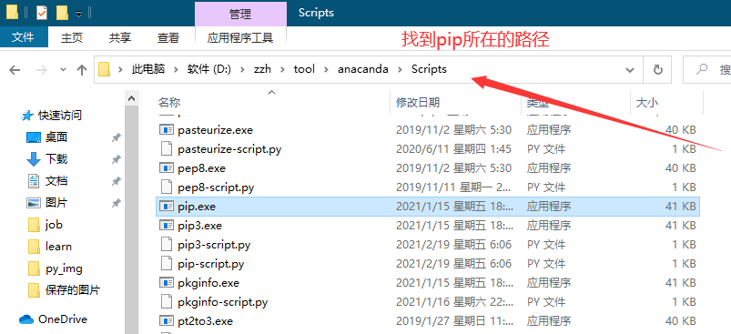
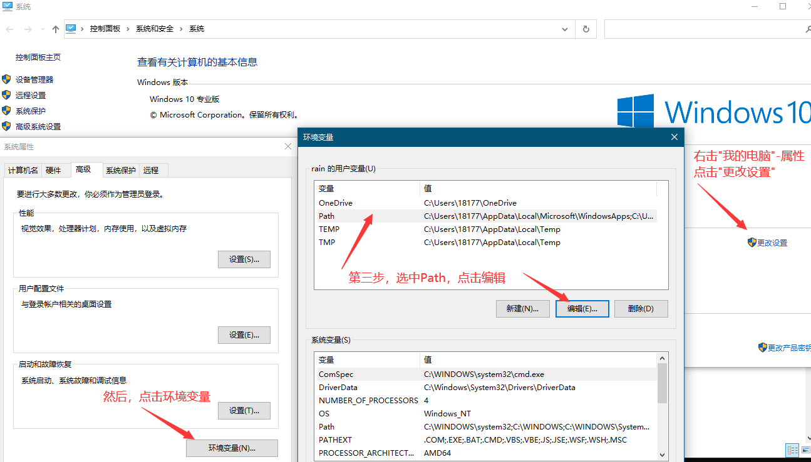
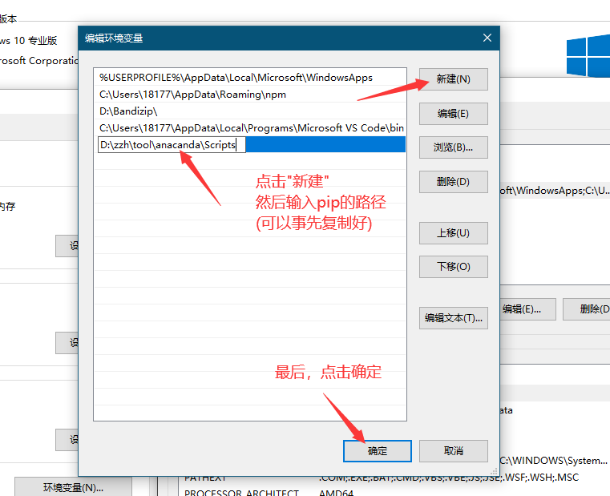
然后再运行`pip install pywebview`
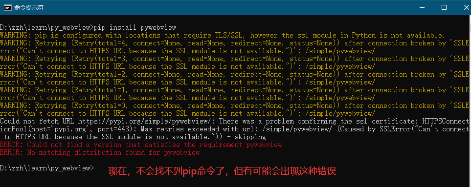
https://slproweb.com/products/Win32OpenSSL.html
去这里下载一个东西就好了
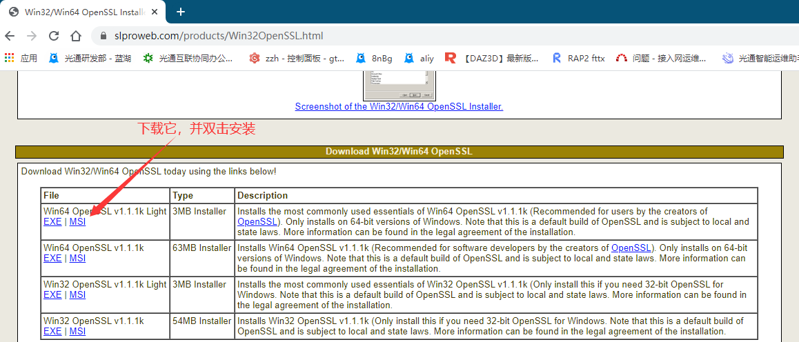
再运行`pip install pywebview`
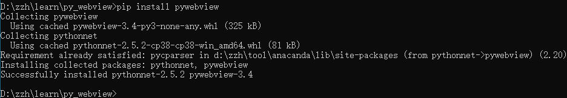
现在，就成功安装pywebview了

此时，新建一个python文件，然后编写代码
```
import webview

webview.create_window('Title', html='<h1>hello world</h1>')
webview.start()
```
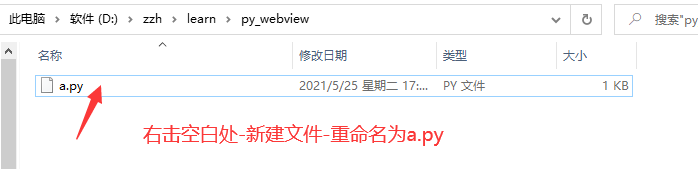
编写好后，在(同级目录下的)终端运行它
```
python a.py
```
此时，你有可能需要将python也添加至环境变量
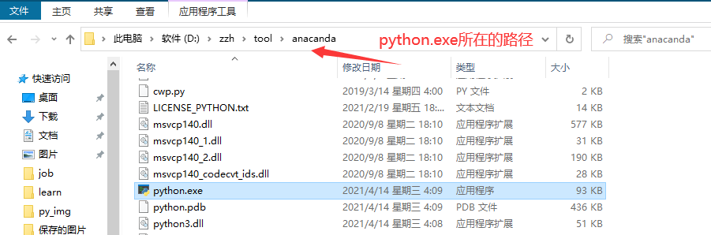
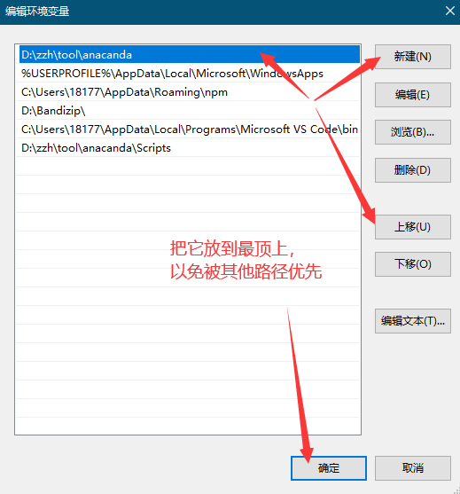
然后运行`python a.py`就好了
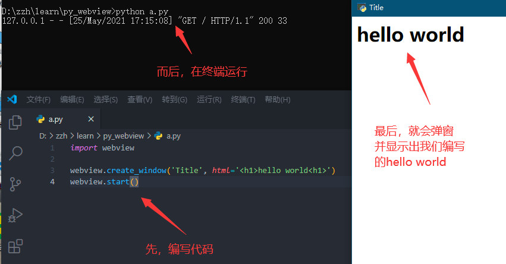

#### 如何打包成.exe文件
```
pip install auto-py-to-exe
```
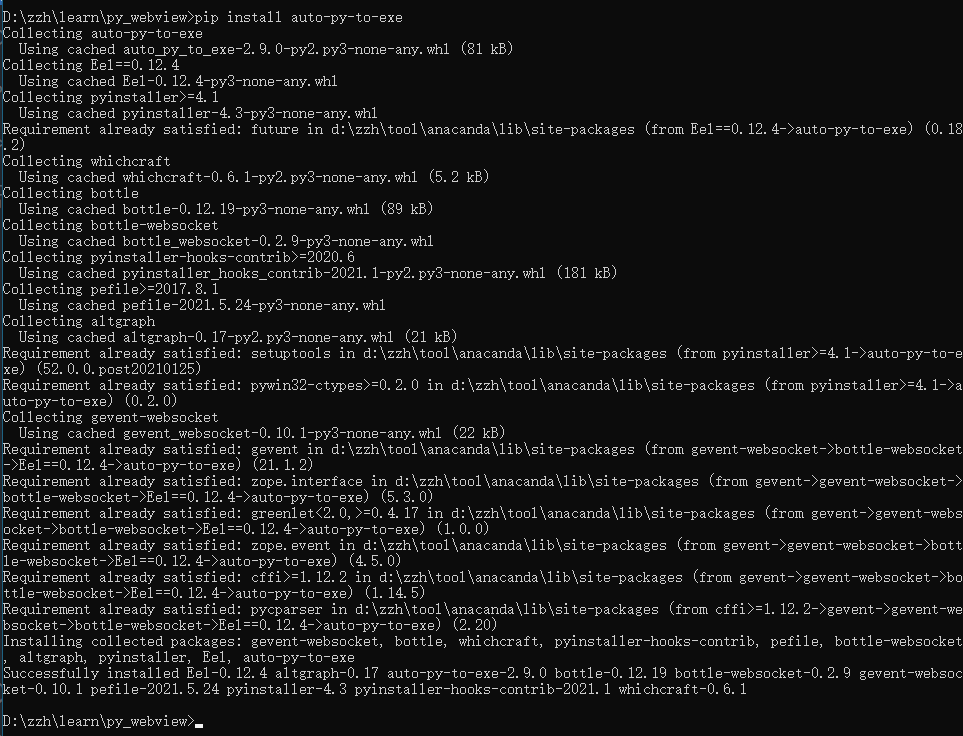
```
auto-py-to-exe
```
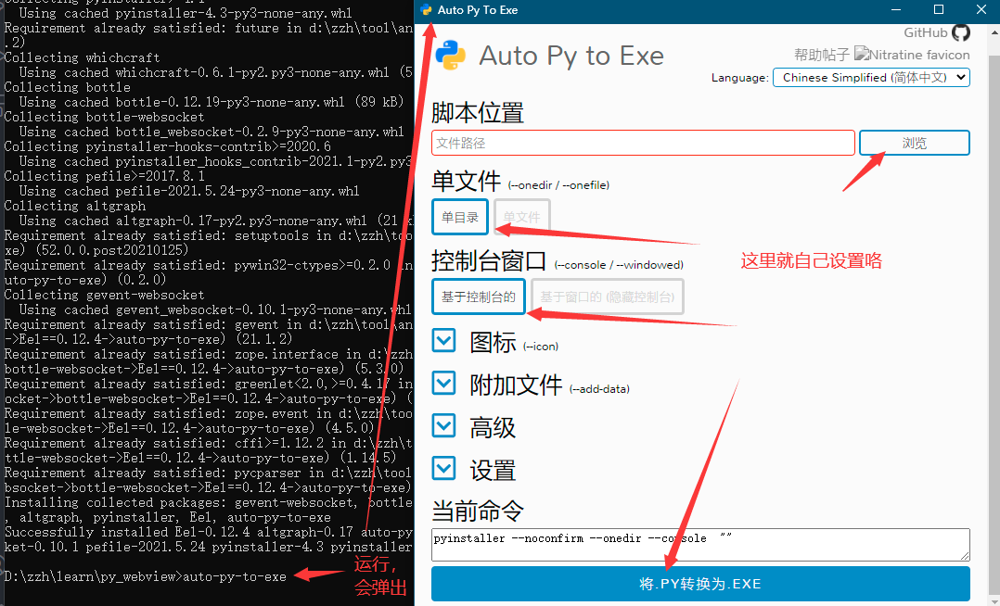
如果，在a.py中，写的并不是
```
webview.create_window('Title', html='<h1>hello world</h1>')
```
而是，引的一个外部html文件
```
webview.create_window('Title', 'index.html')
```
这时一定要选“单目录”，打包成功后，把index.html放入导出的文件夹里就好了
