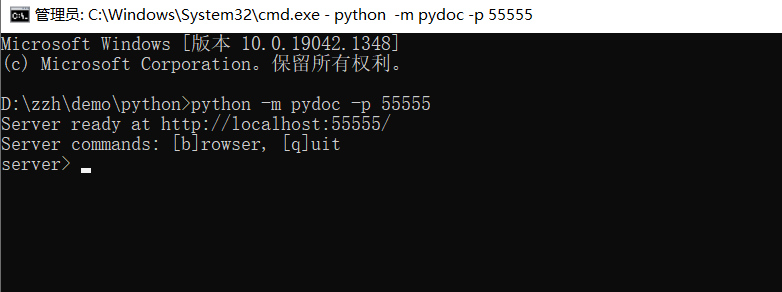
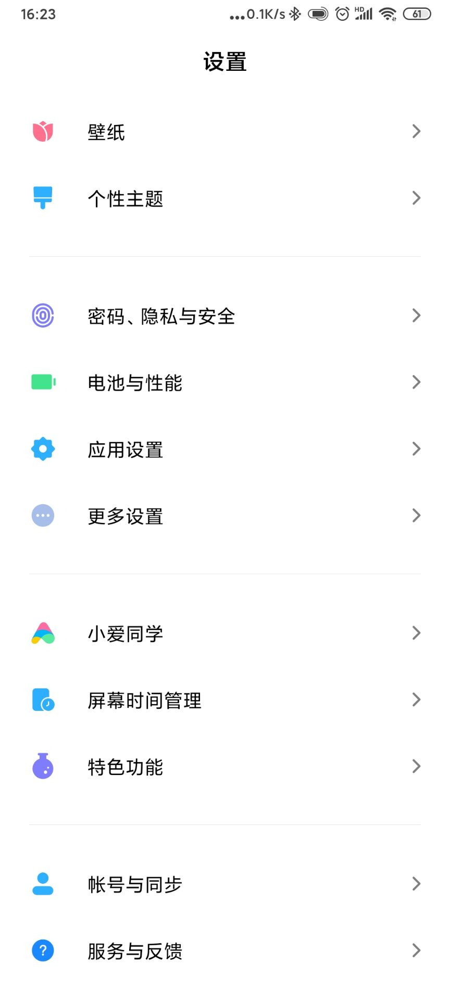
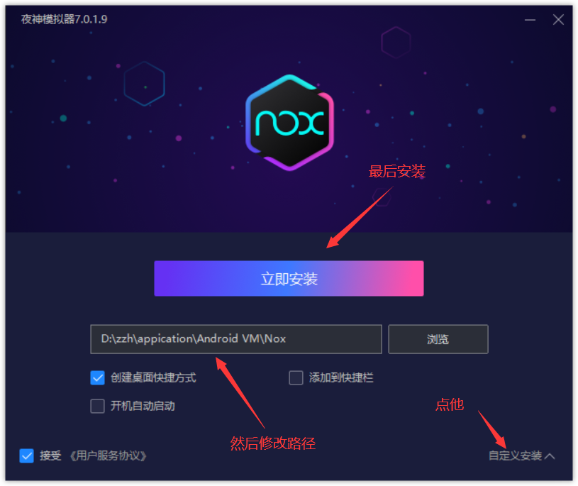
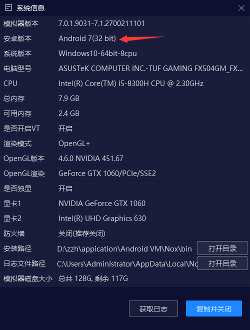
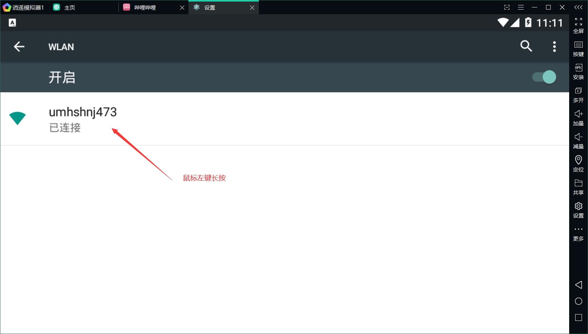

#### 安装与运行

安装

```
pip3 install mitmproxy
```


查看版本

```
mitmproxy --version
```


运行，方法一（会出现一个终端）

```
mitmproxy
```


方法二（会出现一个网页）

```
mitmweb
```


方法三（会出现一个后台程序）

```
mitmdump
```


#### API文档

官网文档（英文）：https://docs.mitmproxy.org/stable/

PyTorch版（中文）：https://ptorch.com/docs/10/mitmproxy_introduction

由于mitmproxy更新的太快了，所以官方文档比较简略（跟不上啊），所以推荐用有以下方法来阅读文档

```
python -m pydoc -p 55555
```



而后，在浏览器里输入地址


在里面找到mitmproxy


打开它，就可以慢慢研究API了


如想要保存下来，离线查看

```
python -m pydoc -w mitmproxy.net.http
```


#### 为何运行没效果

mitmproxy的工作原理，是一个拦截器（相当于一个中间人）

A向B发生请求，B向A返回响应，这一个过程，我们记作A->b->A

加入mitmproxy后，就变成了，A->M->B->M->A


所以在之前的运行中，mitmproxy没有任何效果

因为我们没有把它设置成我们的中间人，我们仅仅是启动了它


如何设置呢？

以Chrome为例：地址栏输入 chrome://settings


在终端输入命令

```
mitmdump -p 8888
```

用-p来指定监听的端口，默认是8080，注：windows下不支持mitmproxy，故用mitmdump


默认是不能监听https的，因为TLS通不过


如果想监听https，就需要去下一个证书

地址：http://mitm.it/

这个地址是http的，故它也可以用来测试mitmdump是否启动成


这时我们就发现终端里绿了，说明成功了


这是失败的样子


这是成功的样子（如果你有装谷歌访问助手，可以卸载它，或者换个浏览器）我是换了个浏览器


让去下载你所需要的平台证书


然后一直点下一步，直到提示导入成功


然后随便访问一个https的网址，你就会发现它成功抓了一堆的包


你也可以把写成一个脚本，再让mitmproxy来执行，这样打印出来的东西就更自由

```python
from mitmproxy import ctx

# 所有发出的请求数据包都会被这个方法所处理
# 所谓的处理，我们这里只是打印一下一些项；当然可以修改这些项的值直接给这些项赋值即可
def request(flow):
    # 获取请求对象
    request = flow.request
    # 实例化输出类
    info = ctx.log.info
    # 打印请求的url
    info(request.url)
    # 打印请求方法
    info(request.method)
    # 打印host头
    info(request.host)
    # 打印请求端口
    info(str(request.port))
    # 打印所有请求头部
    info(str(request.headers))
    # 打印cookie头
    info(str(request.cookies))

# 所有服务器响应的数据包都会被这个方法处理
# 所谓的处理，我们这里只是打印一下一些项
def response(flow):
    # 获取响应对象
    response = flow.response
    # 实例化输出类
    info = ctx.log.info
    # 打印响应码
    info(str(response.status_code))
    # 打印所有头部
    info(str(response.headers))
    # 打印cookie头部
    info(str(response.cookies))
    # 打印响应报文内容
    info(str(response.text))
```


```
mitmdump.exe -s mitmproxy.py -p 8888
```


或者

```
# 同样进入切换到安装有mitmproxy包的虚拟环境，cd到项目目录下，执行：
mitmdump -q -s mitmproxy.py --set body-size-limit=10k "~m post" -p 8888
# -q 屏蔽 mitmdump 默认的控制台日志，只显示自己脚本中的
# -s 入口脚本文件
# --set body-size-limit=10k 只处理小于 10k 的请求
# "~m post" 只处理 post 方法的请求
```


#### 试着抓bilibili的包

```
# 自定义输出
def log (*args, **kwargs):
    import time
    format = '%Y/%m/%d %H:%M:%S'
    value = time.localtime(int(time.time()))
    dt = time.strftime(format, value)
    print (dt, *args, **kwargs )

goalUrl = 'api.bilibili.com/x/web-interface/ranking/region'

def request(flow):
    # 获取请求对象
    req = flow.request
    # # 实例化输出类
    # info = ctx.log.info
    if goalUrl in req.url:
        log('----截到请求----')
        log(req)

def response(flow):
    # 获取请求对象
    req = flow.request
    # 获取响应对象
    res = flow.response
    # # 实例化输出类
    # info = ctx.log.info
    if goalUrl in req.url:
        log('----截到响应----')
        log(req)
        log(res)
        log('Content({})'.format(str(res.text)[:99]))
```


```
mitmdump -s mitmproxy.py -p 8888 -q
```


#### 捕获手机上的请求

```
# 自定义输出
def log (*args, **kwargs):
    import time
    format = '%Y/%m/%d %H:%M:%S'
    value = time.localtime(int(time.time()))
    dt = time.strftime(format, value)
    print (dt, *args, **kwargs )

goalUrl = ''

def request(flow):
    # 获取请求对象
    req = flow.request
    # # 实例化输出类
    # info = ctx.log.info
    if goalUrl in req.url:
        log('----截到请求----')
        log(req)

def response(flow):
    # 获取请求对象
    req = flow.request
    # 获取响应对象
    res = flow.response
    # # 实例化输出类
    # info = ctx.log.info
    if goalUrl in req.url:
        log('----截到响应----')
        log(req)
        log(res)
        log('Content({})'.format(str(res.text)[:99]))
```


```
mitmdump -s mitmproxy.py -p 8888 -q
```

然后去手机设置一下（要和电脑连同一个wifi）


此时手机上登录http://mitm.it/，就能在电脑终端上看到请求了


而此时手机浏览器上的页面是


可以在里面下载相应的证书，这样就能抓https的包了


#### 安装证书与问题


发现bilibli还是打不开


点击进个性装扮后，发现证书没通过


把上述链接地址在浏览器打开后


点击查看证书


#### 卸载证书




#### 尝试解决问题

从网上找到了原因

> Android证书分为“用户证书”和“系统证书”两种，在设置->安全->"查看安全证书"列表中，可以看到“系统”和“用户”两个列表。用户通过浏览器下载安装或者通过WLAN高级设置安装的证书均为用户证书。
>
> 安装为系统证书有什么好处呢?
>
> （1）安装用户证书必须要设置开机密码，而且设置后就不能取消，除非先删掉所有的用户证书。如果安装为系统证书就不需要设置开机密码，自动化操作时更方便。
>
> （2）Android 7以上版本APP默认不信任用户证书，只信任系统证书，安装为用户证书，对APP的HTTPS抓包会失败。安装为全局证书才能被所有APP信任，方可进行HTTPS抓包。
>
> 默认情况下，针对 Android 7.0+ (API level 24+) 的应用不再信任用户或管理员添加的CA证书来进行安全连接。（之前我们其实是将安全证书安装到安卓手机上作为用户信任安全证书，新版本如果APP开启了设置我们的代理请求会被认为是不安全的。）
>
> Android的系统证书的存储位置是/system/etc/security/cacerts，证书文件必须是PEM格式，而且文件命名必须符合系统证书规范

**出处**：https://www.cnblogs.com/oboth-zl


解决方法是要root，然后修改证书权限，感觉太麻烦了

所以想到了另一种办法，安装安卓模拟器，设置安卓版本，然后抓模拟器上的包


现在我们要做的就是挑选一款安卓模拟器

网上常见的安卓模拟器，主要有：夜神、逍遥、雷电、蓝叠、网易mumu、腾讯手游助手


雷电我以前用过，这次想换换新口味，故选择了老大哥夜神

夜神官网：https://www.yeshen.com/?utm_campaign=rj





安装好后，会自动打开，但我们不要它



因为它的安卓版本太高了


换个模拟器试试

这次我选择了逍遥

逍遥官网：https://www.xyaz.cn/





诶，模拟上是有直接说明，代理可能不被app信任（所以需要用低版本的安卓）

然后在电脑上，配置代理，并启动mitmproxy执行我们之前写好的python脚本


可惜的是...


对了，把模拟器关掉后，再次打开会提示这个，而且还有了锁屏（之前设置的）


