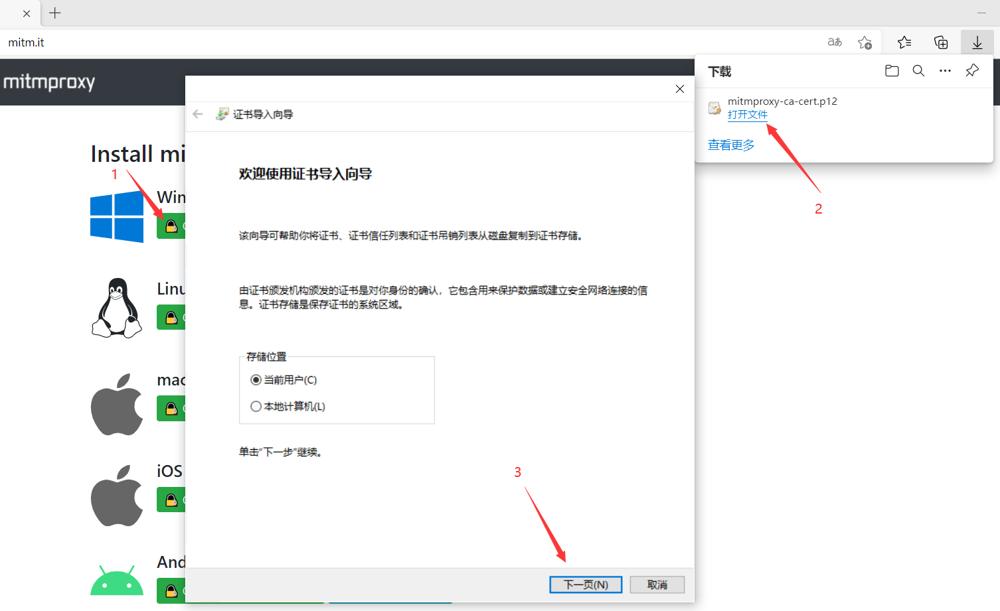

#### 安装与运行

安装

```
pip3 install mitmproxy
```


查看版本

```
mitmproxy --version
```


运行，方法一（会出现一个终端）

```
mitmproxy
```


方法二（会出现一个网页）

```
mitmweb
```


方法三（会出现一个后台程序）

```
mitmdump
```


#### API文档

官网文档（英文）：https://docs.mitmproxy.org/stable/

PyTorch版（中文）：https://ptorch.com/docs/10/mitmproxy_introduction

由于mitmproxy更新的太快了，所以官方文档比较简略（跟不上啊），所以推荐用有以下方法来阅读文档

```
python -m pydoc -p 55555
```


而后，在浏览器里输入地址


在里面找到mitmproxy


打开它，就可以慢慢研究API了


如想要保存下来，离线查看

```
python -m pydoc -w mitmproxy.net.http
```


#### 为何运行没效果

mitmproxy的工作原理，是一个拦截器（相当于一个中间人）

A向B发生请求，B向A返回响应，这一个过程，我们记作A->b->A

加入mitmproxy后，就变成了，A->M->B->M->A


所以在之前的运行中，mitmproxy没有任何效果

因为我们没有把它设置成我们的中间人，我们仅仅是启动了它


如何设置呢？

以Chrome为例：地址栏输入 chrome://settings


在终端输入命令

```
mitmdump -p 8888
```

用-p来指定监听的端口，默认是8080，注：windows下不支持mitmproxy，故用mitmdump


默认是不能监听https的，因为TLS通不过


如果想监听https，就需要去下一个证书

地址：http://mitm.it/

这个地址是http的，故它也可以用来测试mitmdump是否启动成


这时我们就发现终端里绿了，说明成功了


这是失败的样子


这是成功的样子（如果你有装谷歌访问助手，可以卸载它，或者换个浏览器）我是换了个浏览器


让去下载你所需要的平台证书



然后一直点下一步，直到提示导入成功


然后随便访问一个https的网址，你就会发现它成功抓了一堆的包


你也可以把写成一个脚本，再让mitmproxy来执行，这样打印出来的东西就更自由

```python
from mitmproxy import ctx

# 所有发出的请求数据包都会被这个方法所处理
# 所谓的处理，我们这里只是打印一下一些项；当然可以修改这些项的值直接给这些项赋值即可
def request(flow):
    # 获取请求对象
    request = flow.request
    # 实例化输出类
    info = ctx.log.info
    # 打印请求的url
    info(request.url)
    # 打印请求方法
    info(request.method)
    # 打印host头
    info(request.host)
    # 打印请求端口
    info(str(request.port))
    # 打印所有请求头部
    info(str(request.headers))
    # 打印cookie头
    info(str(request.cookies))

# 所有服务器响应的数据包都会被这个方法处理
# 所谓的处理，我们这里只是打印一下一些项
def response(flow):
    # 获取响应对象
    response = flow.response
    # 实例化输出类
    info = ctx.log.info
    # 打印响应码
    info(str(response.status_code))
    # 打印所有头部
    info(str(response.headers))
    # 打印cookie头部
    info(str(response.cookies))
    # 打印响应报文内容
    info(str(response.text))
```


```
mitmdump.exe -s mitmproxy.py -p 8888
```


或者

```
# 同样进入切换到安装有mitmproxy包的虚拟环境，cd到项目目录下，执行：
mitmdump -q -s mitmproxy.py --set body-size-limit=10k "~m post" -p 8888
# -q 屏蔽 mitmdump 默认的控制台日志，只显示自己脚本中的
# -s 入口脚本文件
# --set body-size-limit=10k 只处理小于 10k 的请求
# "~m post" 只处理 post 方法的请求
```


#### 试着抓bilibili的包

```
# 自定义输出
def log (*args, **kwargs):
    import time
    format = '%Y/%m/%d %H:%M:%S'
    value = time.localtime(int(time.time()))
    dt = time.strftime(format, value)
    print (dt, *args, **kwargs )

goalUrl = 'api.bilibili.com/x/web-interface/ranking/region'

def request(flow):
    # 获取请求对象
    req = flow.request
    # # 实例化输出类
    # info = ctx.log.info
    if goalUrl in req.url:
        log('----截到请求----')
        log(req)

def response(flow):
    # 获取请求对象
    req = flow.request
    # 获取响应对象
    res = flow.response
    # # 实例化输出类
    # info = ctx.log.info
    if goalUrl in req.url:
        log('----截到响应----')
        log(req)
        log(res)
        log('Content({})'.format(str(res.text)[:99]))
```


```
mitmdump -s mitmproxy.py -p 8888 -q
```


#### 捕获手机上的请求

```
# 自定义输出
def log (*args, **kwargs):
    import time
    format = '%Y/%m/%d %H:%M:%S'
    value = time.localtime(int(time.time()))
    dt = time.strftime(format, value)
    print (dt, *args, **kwargs )

goalUrl = ''

def request(flow):
    # 获取请求对象
    req = flow.request
    # # 实例化输出类
    # info = ctx.log.info
    if goalUrl in req.url:
        log('----截到请求----')
        log(req)

def response(flow):
    # 获取请求对象
    req = flow.request
    # 获取响应对象
    res = flow.response
    # # 实例化输出类
    # info = ctx.log.info
    if goalUrl in req.url:
        log('----截到响应----')
        log(req)
        log(res)
        log('Content({})'.format(str(res.text)[:99]))
```


```
mitmdump -s mitmproxy.py -p 8888 -q
```

然后去手机设置一下（要和电脑连同一个wifi）


此时手机上登录http://mitm.it/，就能在电脑终端上看到请求了


而此时手机浏览器上的页面是


可以在里面下载相应的证书，这样就能抓https的包了


#### 安装证书与问题


发现bilibli还是打不开


点击进个性装扮后，发现证书没通过


把上述链接地址在浏览器打开后


点击查看证书


#### 卸载证书


