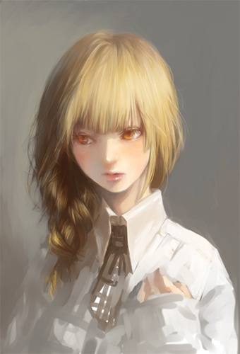
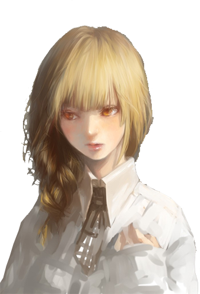

#### 如何创建一个透明立绘

想要创建不规则窗口，有两种办法，一种的是创建窗口后，将其背景设置为一张图片，再用遮罩将其不规则的外轮廓透明化；另一种是创建一个透明窗口，在里面添加一个webveiw，webview里显示一张png图片，再把webveiw透明化


##### 法一

```python
import sys
from PyQt5.QtWidgets import QApplication, QWidget 
from PyQt5.QtGui import  QPixmap, QPainter, QCursor, QBitmap
from PyQt5.QtCore import Qt

class Winform(QWidget):
	def __init__(self, parent = None):
		super(Winform,self).__init__(parent)
		self.setWindowTitle("不规则窗口(可拖拽)")
		self.mypix()

	# 显示不规则picture
	def mypix(self):
		# 黑色为显示，白色为隐藏
		self.pix = QBitmap("./mask.png")
		self.resize(self.pix.size())
		self.setMask(self.pix)
		print(self.pix.size())
		self.dragPosition = None

	# 重定义鼠标按下响应函数mousePressEvent(QMouseEvent)和鼠标移动响应函数mouseMoveEvent(QMouseEvent),使不规则窗体能响应鼠标事件,随意拖动。
	def mousePressEvent(self, event):
		if event.button() == Qt.LeftButton:
			self.m_drag = True
			self.m_DragPosition = event.globalPos()-self.pos()
			event.accept()
			self.setCursor(QCursor(Qt.OpenHandCursor))
		if event.button() == Qt.RightButton:  
			self.close()  
			
	def mouseMoveEvent(self, QMouseEvent):
		if Qt.LeftButton and self.m_drag:
		    # 当左键移动窗体修改偏移值
			self.move(QMouseEvent.globalPos()- self.m_DragPosition )
			QMouseEvent.accept()
	
	def mouseReleaseEvent(self, QMouseEvent):
		self.m_drag = False
		self.setCursor(QCursor(Qt.ArrowCursor))
    
    #一般 paintEvent 在窗体首次绘制加载, 要重新加载paintEvent 需要重新加载窗口使用 self.update() or self.repaint() 
	def paintEvent(self, event):
		painter = QPainter(self)
        # 在指定区域直接绘制窗口背景
		painter.drawPixmap(0,0,self.pix.width(),self.pix.height(),QPixmap("./npc.jpg"))
		# 绘制窗口背景,平铺到整个窗口,随着窗口改变而改变
        # painter.drawPixmap(0,0,self.width(),self.height(),QPixmap("./images/screen1.jpg"))
        
if __name__ == "__main__": 
		app = QApplication(sys.argv) 
		form = Winform()
		form.show()
		sys.exit(app.exec_())
```

所需图片：





##### 法二

```python
from PyQt5.QtCore import *
from PyQt5.QtGui import QRgba64
from PyQt5.QtWidgets import *
from PyQt5.QtWebEngineWidgets import *
import sys

# QMainWindow继承于QWidget
class MainWindow (QMainWindow):
    def __init__(self):
        super(QMainWindow, self).__init__()
        width = 340
        height = 500
        self.setWindowTitle('显示网页')
        self.resize(width, height)
        # 新建一个QWebEngineView对象
        self.qwebengine = QWebEngineView(self)
        # Qt.transparent是GlobalColor（全局的只读颜色，表透明），还有Qt.red, qt.darkRed等
        self.qwebengine.page().setBackgroundColor(Qt.transparent)
        # 设置网页在窗口中显示的位置和大小
        self.qwebengine.setGeometry(0, 0, width, height)
        baseUrl = sys.path[0]
        # fromLocalFile把路径转为file协议的url，后面跟上.toLocalFile()是逆映射
        url = QUrl.fromLocalFile(baseUrl + r"/index.html")
        print(url)
        # 在QWebEngineView中加载网址
        self.qwebengine.load(QUrl(url))


if __name__ == '__main__':
    app = QApplication(sys.argv)
    # QQuickWindow.setSceneGraphBackend(QSGRendererInterface.Software)
    win = MainWindow()
    # 去掉窗口的标题和按钮
    win.setWindowFlags(Qt.FramelessWindowHint)
    # 设置窗口透明
    win.setAttribute(Qt.WA_TranslucentBackground)
    win.show()
    sys.exit(app.exec_())
```

index.html

```html


<style>
    * {
        margin: 0;
    }

    body {
        background: rgba(0, 0, 0, 0);
        width: 340px;
        height: 500px;
    }
</style>
```

所需图片：




##### 现有问题

法一存在的问题是，交互及样式修改不灵活，毕竟设置QT控件比写html麻烦多了

法二存在的问题是，没法拖拽移动，我目前没找到拖拽webview的方法（应该有，没想好要怎么实现）

二者都存在一个问题：我想要鼠标右键是一个自定义的菜单


##### 解决方案

父窗口使用法一，用于拖拽，子窗口使用法二，用于展示网页

二者都使用了自定义的菜单

````python
import sys
from PyQt5.QtWidgets import *
from PyQt5.QtGui import QPixmap, QPainter, QCursor, QBitmap
from PyQt5.QtCore import *
from PyQt5.QtWebEngineWidgets import *


class Winform(QWidget):
    def __init__(self, parent=None):
        super(Winform, self).__init__(parent)
        self.setWindowTitle("纯Qt实现")
        # 置顶
        self.setWindowFlags(Qt.WindowStaysOnTopHint)
        self.setContextMenuPolicy(Qt.CustomContextMenu)
        self.customContextMenuRequested.connect(self.rightMenuShow)#开放右键策略
        self.mypix()
        # 避免按着右键move
        self.m_drag = False
        # button = QPushButton("弹窗", self)
        # button.clicked.connect(self.show_child)
        self.child_window = Child()

    def show_child(self):
        # child_window = Child()
        # child_window.show()
        # # 加了self不会一闪而过
        # self.child_window = Child()
        # self.child_window.show()
        # 不要重复new Child()
        self.child_window.show()

    #添加右键菜单
    def rightMenuShow(self, pos):
        menu = QMenu(self)
        menu.addAction(QAction('对话', menu))
        menu.addAction(QAction('关闭', menu))
        menu.triggered.connect(self.menuSlot)
        menu.exec_(QCursor.pos())

    def menuSlot(self, act):
        print(act.text())
        type = act.text()
        if type == '对话':
            # QMessageBox.information(self,"AI","你好啊")
            self.show_child()
        elif type == '关闭':
            self.close()

    # 显示不规则picture
    def mypix(self):
        # 黑色为显示，白色为隐藏
        self.pix = QBitmap("./mask.png")
        self.resize(self.pix.size())
        self.setMask(self.pix)
        print(self.pix.size())
        self.dragPosition = None

    # 重定义鼠标按下响应函数mousePressEvent(QMouseEvent)和鼠标移动响应函数mouseMoveEvent(QMouseEvent),使不规则窗体能响应鼠标事件,随意拖动。
    def mousePressEvent(self, event):
        if event.button() == Qt.LeftButton:
            self.m_drag = True
            self.m_DragPosition = event.globalPos()-self.pos()
            event.accept()
            self.setCursor(QCursor(Qt.OpenHandCursor))
        if event.button() == Qt.RightButton:
            pass
            # self.close()

    def mouseMoveEvent(self, QMouseEvent):
        if Qt.LeftButton and self.m_drag:
            # 当左键移动窗体修改偏移值
            self.move(QMouseEvent.globalPos() - self.m_DragPosition)
            QMouseEvent.accept()

    def mouseReleaseEvent(self, QMouseEvent):
        self.m_drag = False
        self.setCursor(QCursor(Qt.ArrowCursor))

    # 一般 paintEvent 在窗体首次绘制加载, 要重新加载paintEvent 需要重新加载窗口使用 self.update() or self.repaint()
    def paintEvent(self, event):
        painter = QPainter(self)
        # 在指定区域直接绘制窗口背景
        painter.drawPixmap(0, 0, self.pix.width(),
        self.pix.height(), QPixmap("./npc.jpg"))
        # 绘制窗口背景,平铺到整个窗口,随着窗口改变而改变
        # painter.drawPixmap(0,0,self.width(),self.height(),QPixmap("./images/screen1.jpg"))


class Child(QWidget):
    def __init__(self):
        super().__init__()
        width = 640
        height = 480
        self.setWindowTitle('Qt套Web')
        self.resize(width, height)
        # 镂空效果
        self.setAttribute(Qt.WA_TranslucentBackground)
        # # 鼠标透传
        # self.setAttribute(Qt.WA_TransparentForMouseEvents, True)
        # 自定义浏览器右键菜单
        self.web_menu = WebMenu()
        # 新建一个QWebEngineView对象
        self.qwebengine = QWebEngineView(self)
        """关键代码"""
        self.qwebengine.setContextMenuPolicy(Qt.CustomContextMenu) # 将浏览器右键菜单设置为用户自定义菜单
        self.qwebengine.customContextMenuRequested.connect(self.MyBrowser_Menu) # 将菜单的信号链接到自定义菜单槽函数
        """关键代码"""
        # Qt.transparent是GlobalColor（全局的只读颜色，表透明），还有Qt.red, qt.darkRed等
        self.qwebengine.page().setBackgroundColor(Qt.transparent)
        # 设置网页在窗口中显示的位置和大小
        self.qwebengine.setGeometry(0, 0, width, height)
        baseUrl = sys.path[0]
        # fromLocalFile把路径转为file协议的url，后面跟上.toLocalFile()是逆映射
        url = QUrl.fromLocalFile(baseUrl + r"/index.html")
        print(url)
        # 在QWebEngineView中加载网址
        self.qwebengine.load(QUrl(url))

    #创建自定义浏览器右键菜单
    def MyBrowser_Menu(self,pos):
        action = self.web_menu.exec_(self.qwebengine.mapToGlobal(pos))
        if action == self.web_menu.save_act:
            self.save_slot()
        elif action == self.web_menu.reload_act:
            self.reload_slot()

    def save_slot(self):
        QMessageBox.information(self,"对话框","你好啊")

    def reload_slot(self):
        self.close() 
        
class WebMenu(QMenu):
    def __init__(self):
        super(WebMenu, self).__init__()
        self.save_act = QAction("对话")
        self.reload_act = QAction("关闭")
        self.addAction(self.save_act)
        self.addAction(self.reload_act)

if __name__ == "__main__":
    app = QApplication(sys.argv)
    form = Winform()
    form.show()
    sys.exit(app.exec_())
````


##### 补充：Widget和MainWindow

Widget

```python
from PyQt5.QtCore import *
from PyQt5.QtWidgets import *
from PyQt5.QtWebEngineWidgets import *
import sys

class Winform(QWidget):
    def __init__(self, parent=None):
        super(Winform, self).__init__(parent)
        self.setWindowTitle("用Widget来封装网页")
        self.resize(900, 560)
        # 新建一个QWebEngineView对象
        self.qwebengine = QWebEngineView(self)
        # Qt.transparent是GlobalColor（全局的只读颜色，表透明），还有Qt.red, qt.darkRed等
        self.qwebengine.page().setBackgroundColor(Qt.white)
        # 设置网页在窗口中显示的位置和大小
        self.qwebengine.setGeometry(0, 0, 640, 480)
        # 在QWebEngineView中加载网址
        self.qwebengine.load(QUrl(r"http://www.baidu.com"))

if __name__ == '__main__':
    app = QApplication(sys.argv) 
    form = Winform()
    form.show()
    sys.exit(app.exec_())
```

MainWindow

```python
from PyQt5.QtCore import *
from PyQt5.QtWidgets import *
from PyQt5.QtWebEngineWidgets import *
import sys

# QMainWindow继承于QWidget
class MainWindow (QMainWindow):
    def __init__(self):
        super(QMainWindow, self).__init__()
        self.setWindowTitle('用MainWindow来封装网页')
        self.resize(900, 560)
        # 新建一个QWebEngineView对象
        self.qwebengine = QWebEngineView(self)
        # Qt.transparent是GlobalColor（全局的只读颜色，表透明），还有Qt.red, qt.darkRed等
        self.qwebengine.page().setBackgroundColor(Qt.white)
        # 设置网页在窗口中显示的位置和大小
        self.qwebengine.setGeometry(0, 0, 640, 480)
        # 在QWebEngineView中加载网址
        self.qwebengine.load(QUrl(r"http://www.baidu.com"))

if __name__ == '__main__':
    app = QApplication(sys.argv)
    win = MainWindow()
    win.show()
    sys.exit(app.exec_())
```

