### 1 WebGL与Three.js

#### 1.1 关于WebGL

大致在上个世纪五六十年代，人们对于计算机的操控方式还是纸带打孔、按钮开关。

十多年后，随着操作系统的出现，控制台终端应运而生。

所谓终端，便是那种黑底白字的文本型界面，被称为CUI。

人类作为一种视觉动物，自然不是很喜欢这种操作方式，于是图形化界面出现了，称为GUI，Microsoft的Windows系统便是代表。

但是即便如此，人的欲望是不会被满足的，生活的三维世界的人类自然对二维的界面所有不满。

于是，在数学工具的带领下，矩阵论与几何学的巧妙结合，使得计算机也发展迅猛，诞生了一门新的学科——计算机图形学。

也正是因为这一学科的诞生，计算机才有了大量图形运算的需求，显卡也由此而来（只不过现如今的显卡可不仅仅是用于处理图像，机器学习、挖比特币可都在使用它，其原因自然是它强大的矩阵运算能力）。


你应该玩过不少的3D游戏吧，像GTA、NBA2K、上古卷轴、塞尔达传奇。

游戏行业的一开始，可不是这番景象。

一如操作系统，游戏也从文字类发展到图形类，其中不少坎坷，那些常用的代码被层层封装，变成了游戏引擎。

从2D游戏到3D游戏，算是一次历史性的飞跃，其技术难度不言而喻，所以现在常见的游戏引擎都是3D的（因为2D游戏引擎的必要性没那么高）。

如果没有Unity，UE、CE游戏引擎等等，现在叫你做一款3D游戏，你该如何是好呢？

有人可能会说DirectX，也有人会说OpenGL。

诚然，这些可以实现一款3D游戏，但是太麻烦了，朋友圈里一哥们，前段时间还在OpenGL做了一个自走棋，其开发进度，啧啧啧。

而把OpenGL映射到网页上，变形成的WebGL，所以它们都需要使用着色器。


所以说，所谓WebGL就是浏览器里的OpenGL，你可以把它当作是开发3D页游的底层工具。

之所以说它底层，仅仅是因为使用它很麻烦，并不是因为它真的有多底层，比它更底层的东西多了。

那么，使用它有多麻烦呢？

我们来举一个例子。


#### 1.2 WebGL绘制一个点

想要用WebGL绘制一个点， 你首先需要获取到WebGL对象，和使用canvas的方法一致，只不过把`2d`改成了`webgl`

```
<canvas id="canvas" width="640" height="480"></canvas>
<script>
	var log = console.log.bind(console)
	var canvas = document.getElementById('canvas')
    var gl = canvas.getContext('webgl')
    // 打印出来看看
    log (gl)
</script>
```

其次，我们还需要设置一下着色器，其中顶点着色器用于确定位置，片段着色器用于确定颜色

（所谓着色器，就是显卡的运算指令，构造3D场景需要大量的颜色、位置等信息计算，把这些运算交给显卡，速度会更快；着色器代码是用一种叫做GLSL ES的类C语言写的）

```
// 创建顶点着色器
var vertexShader = gl.createShader(gl.VERTEX_SHADER)
// 顶点着色器的源码
var vertexGLSL = `
    // 声明一个attribute类型的4维向量a_Position
    attribute vec4 a_Position;
    void main()
    {
        // gl_Position和gl_PointSize是预定义变量，表示顶点位置和大小
        gl_Position = a_Position;
        // 点的大小
        gl_PointSize = 6.0;
    }
` 
// 设置顶点着色器
gl.shaderSource(vertexShader, vertexGLSL)
// 编译顶点着色器
gl.compileShader(vertexShader)
```

```
// 创建片段着色器
var fragmentShader = gl.createShader(gl.FRAGMENT_SHADER)
// 片段着色器的源码
var fragmentGLSL = `
    void main()
    {
        // gl_FragColor是预定义变量，表示片段的颜色
        gl_FragColor = vec4(0.3, 0.6, 0.8, 1.0);
    }
`
// 设置片段着色器的源代码
gl.shaderSource(fragmentShader, fragmentGLSL)
// 编译片段着色器
gl.compileShader(fragmentShader)
```

接着，我们需要通过`progrtam`把着色器运行起来，着色器的语言是类C语言，还记得C语言在运行之前，有一个叫链接的玩意嘛，着色器亦如是

```
// 创建着色器程序
var program = gl.createProgram()
// 程序加入顶点着色器
gl.attachShader(program, vertexShader)
// 程序加入片段着色器
gl.attachShader(program, fragmentShader)
// 链接程序
gl.linkProgram(program)
// 启用程序
gl.useProgram(program)
```

最后，稍作设置，然后把他绘制出来

```
// 获取a_Position的指针
var a_Position = gl.getAttribLocation(program, "a_Position")
// 设置位置为中心
gl.vertexAttrib2f(a_Position, 0.0, 0.0)
// 将颜色缓冲区的值设置为黑色
gl.clearColor(0, 0, 0, 1)
// 使用颜色缓冲区的值来填充
gl.clear(gl.COLOR_BUFFER_BIT)
// 画点
gl.drawArrays(gl.POINTS, 0, 1)
```

合起来就是

```
<head>
	<meta charset="utf-8" />
    <title>WebGL绘制一个点</title>
</head>

<body>
    <canvas id="canvas" width="640" height="480"></canvas>
    <script>
        var log = console.log.bind(console)
        var canvas = document.getElementById('canvas')
        var gl = canvas.getContext('webgl')

        // 创建顶点着色器
        var vertexShader = gl.createShader(gl.VERTEX_SHADER)
        // 顶点着色器的源码
        var vertexGLSL = `
            // 声明一个attribute类型的4维向量a_Position
            attribute vec4 a_Position;
            void main()
            {
                // gl_Position和gl_PointSize是预定义变量，表示顶点位置和大小
                gl_Position = a_Position;
                // 点的大小
                gl_PointSize = 6.0;
            }
        ` 
        // 设置顶点着色器
        gl.shaderSource(vertexShader, vertexGLSL)
        // 编译顶点着色器
        gl.compileShader(vertexShader)

        // 创建片段着色器
        var fragmentShader = gl.createShader(gl.FRAGMENT_SHADER)
        // 片段着色器的源码
        var fragmentGLSL = `
            void main()
            {
                // gl_FragColor是预定义变量，表示片段的颜色
                gl_FragColor = vec4(0.3, 0.6, 0.8, 1.0);
            }
        `
        // 设置片段着色器的源代码
        gl.shaderSource(fragmentShader, fragmentGLSL)
        // 编译片段着色器
        gl.compileShader(fragmentShader)

        // 创建着色器程序
        var program = gl.createProgram()
        // 程序加入顶点着色器
        gl.attachShader(program, vertexShader)
        // 程序加入片段着色器
        gl.attachShader(program, fragmentShader)
        // 链接程序
        gl.linkProgram(program)
        // 启用程序
        gl.useProgram(program)

        // 获取a_Position的指针
        var a_Position = gl.getAttribLocation(program, "a_Position")
        // 设置位置为中心
        gl.vertexAttrib2f(a_Position, 0.0, 0.0)
        // 将颜色缓冲区的值设置为黑色
        gl.clearColor(0, 0, 0, 1)
        // 使用颜色缓冲区的值来填充
        gl.clear(gl.COLOR_BUFFER_BIT)
        // 画点
        gl.drawArrays(gl.POINTS, 0, 1)
    </script>
</body>
```

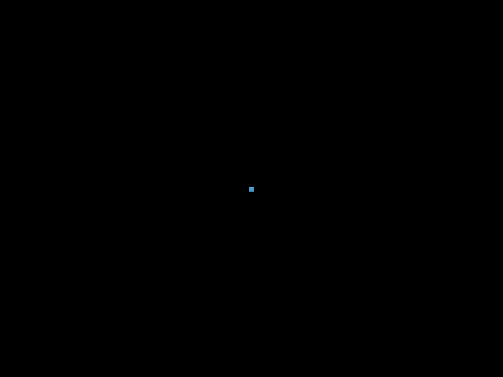

#### 1.3 Three.js绘制一个点

有没有发现使用WebGL是一件很麻烦的事，不止你这么认为，大家也都是这样想的，所以封装好的WebGL诞生了，名叫Three.js

我们来看看，同样的一个例子，用Three.js该怎么实现。


首先，导入Three.js这个文件

```
<script src="./js/three.js"></script>
```

你可以去github上下载：https://github.com/mrdoob/three.js/

也可以使用在线版：http://www.yanhuangxueyuan.com/versions/threejsR92/build/three.js

```
<script src="http://www.yanhuangxueyuan.com/versions/threejsR92/build/three.js"></script>
```

然后，如果说在WebGL中重要的是着色器和(尚未接触的矩阵)，那么在Three.js中重要的便是渲染器和相机。

Three.js中有三个主要概念，除了渲染器和相机，最后一个便是场景；所以，我们要做的就是把这三个主要概念创建出来。

```
// 场景
var scene = new THREE.Scene()
// 视图大小
let width = 900
let height = 600
// 正交投影的相机
var camera = new THREE.OrthographicCamera(
	width / - 2,
	width / 2,
	height / 2,
	height / - 2,
	1,
	1000
);
// 设置相机的位置
camera.position.z = 1;
// 渲染器
var renderer = new THREE.WebGLRenderer()
// 设置渲染器大小
renderer.setSize(width, height)
// 把渲染出来的元素（以canvas的方式）放进body中
document.body.appendChild(renderer.domElement)
```

使用three.js的时候，无需手动写入`<canvas></canvas>`，渲染器会自动帮你生成，只要你写了`document.body.appendChild(renderer.domElement)`

最后，我们就可以新建一个几何结构，设置其样式，并把它添加到场景里，再渲染出来

```
// 新建平面几何结构，宽高都为6
var geometry = new THREE.PlaneGeometry(6, 6)
// 新建材质，颜色为蓝色
var material = new THREE.MeshBasicMaterial({ color: 0x4d99cc })
// 创建一个正方形薄片
var plane = new THREE.Mesh(geometry, material)
// 把薄片添加到场景
scene.add(plane)
// 根据视角渲染场景
renderer.render(scene, camera)
```

合起来就是

```
<head>
    <meta charset="utf-8" />
    <title>Three.js绘制一个点</title>
</head>

<body>
    <script src="./js/three.js"></script>
    <script>
        // 场景
        var scene = new THREE.Scene()
        // 视图大小
        let width = 900
        let height = 600
        // 正交投影的相机
        var camera = new THREE.OrthographicCamera(
            width / - 2,
            width / 2,
            height / 2,
            height / - 2,
            1,
            1000
        );
        // 设置相机的位置
        camera.position.z = 1
        // 渲染器
        var renderer = new THREE.WebGLRenderer()
        // 设置渲染器大小
        renderer.setSize(width, height)
        // 把渲染出来的元素（以canvas的方式）放进body中
        document.body.appendChild(renderer.domElement)

        // 新建平面几何结构，宽高都为6
        var geometry = new THREE.PlaneGeometry(6, 6)
        // 新建材质，颜色为蓝色
        var material = new THREE.MeshBasicMaterial({ color: 0x4d99cc })
        // 创建一个正方形薄片
        var plane = new THREE.Mesh(geometry, material)
        // 把薄片添加到场景
        scene.add(plane)
        // 根据视角渲染场景
        renderer.render(scene, camera)
    </script>
</body>
```

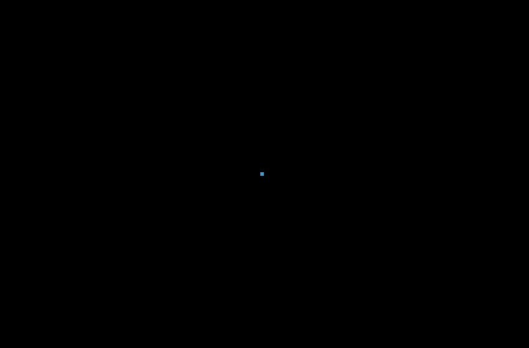

### 2 绘制其他图形

####  2.1 绘制一条线

```
<head>
    <meta charset="utf-8" />
    <title>绘制一条线</title>
</head>
<body>
    <script src="./js/three.js"></script>
    <script>
        // 场景
        var scene = new THREE.Scene();
        // 视图大小
        let width = 900
        let height = 600
        // 透视投影的相机（和正交投影不同，透视投影是有近大远小关系的） 
        var camera = new THREE.PerspectiveCamera(
            45,
            width / height,
            0.1,
            1000
        );
        // 设置相机位置
        camera.position.set(0, 0, 10)
        // 渲染器
        var renderer = new THREE.WebGLRenderer()
        // 设置渲染器大小
        renderer.setSize(width, height);
        // 把渲染出来的元素（以canvas的方式）放进body中
        document.body.appendChild(renderer.domElement);

        // 创建几何对象
        var geometry = new THREE.Geometry();
        // 设置材质
        var material = new THREE.LineBasicMaterial({ color: 0xff00ff });
        // 添加点
        geometry.vertices.push(new THREE.Vector3(-1, 0, 0))
        geometry.vertices.push(new THREE.Vector3(1, 0, 0))
        // 将点连成线
        var line = new THREE.Line(geometry, material)
        // 添加线
        scene.add(line)
        // 渲染
        renderer.render(scene, camera)
    </script>
</body>
```


在`geometry.vertices.push`那稍作修改，就可以绘制一个镂空的三角形，其他图形也如此

```
// 添加点
geometry.vertices.push(new THREE.Vector3(-1, 0, 0))
geometry.vertices.push(new THREE.Vector3(0, 1, 0))
geometry.vertices.push(new THREE.Vector3(1, 0, 0))
geometry.vertices.push(new THREE.Vector3(-1, 0, 0))
```

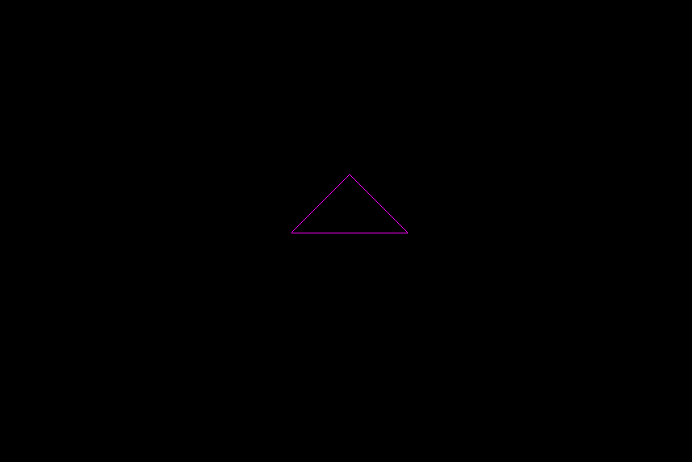

注：在新版本的three.js中删除了Geometry这个核心对象，故只能使用BufferGeometry，具体见**3.3**

如果想实现这例子，也可以去下载/引用老版本的three.js

```
 <script src="http://www.yanhuangxueyuan.com/versions/threejsR92/build/three.js"></script>
```


#### 2.2 绘制一个立方体

```
<head>
    <meta charset="utf-8" />
    <title>绘制一个立方体</title>
</head>
<body>
    <script src="./js/three.js"></script>
    <script>
        // 场景
        var scene = new THREE.Scene()
        // 视图大小
        let width = 900
        let height = 600
        // 透视投影的相机 
        var camera = new THREE.PerspectiveCamera(
            45,
            width / height,
            0.1,
            1000
        );
        // 设置相机位置
        camera.position.set(0, 0, 10)
        // 渲染器
        var renderer = new THREE.WebGLRenderer()
        // 设置渲染器大小
        renderer.setSize(width, height)
        // 把渲染出来的元素（以canvas的方式）放进body中
        document.body.appendChild(renderer.domElement)

        // 创建几何对象
        var geometry = new THREE.BoxGeometry(1, 1, 1)
        // 设置材质
        var material = new THREE.MeshBasicMaterial({ color: 0x337788 })
        // 网格模型对象Mesh
        var mesh = new THREE.Mesh(geometry, material)
        // 网格模型添加到场景中
        scene.add(mesh)
        // 旋转一点角度
        mesh.rotation.x += 0.5
        mesh.rotation.y += 0.5
        // 渲染
        renderer.render(scene, camera)
    </script>
</body>
```

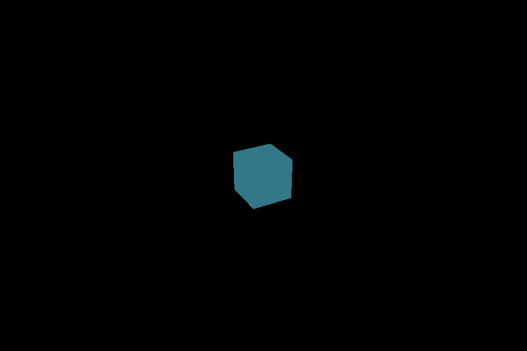

把上文中的`renderer.render(scene, camera)`替换成下文，就会动了

```
function render() {
	// requestAnimationFrame是一个定时器，默认60fps
    requestAnimationFrame(render)
    mesh.rotation.x += 0.1
    mesh.rotation.y += 0.1
    renderer.render(scene, camera)
}
render()
```

再把`var geometry = new THREE.BoxGeometry(1, 1, 1)`替换成

```
var geometry = new THREE.PlaneGeometry(1, 1)
```

就变成了一个薄片在旋转


当然，也可以修改材质和模型，改

```
// 设置材质
var material = new THREE.MeshBasicMaterial({ color: 0x337788 })
// 网格模型对象Mesh
var mesh = new THREE.Mesh(geometry, material)
```

为

```
// 线条渲染模式
var material = new THREE.LineBasicMaterial({ color: 0x337788 })
// 创建线模型对象   构造函数：Line、LineLoop、LineSegments
var mesh = new THREE.Line(geometry, material)
```

具体可见**4.1**

#### 2.3 添加光源和背景色

```
<head>
    <meta charset="utf-8" />
    <title>添加光源和背景色</title>
</head>
<body>
    <script src="./js/three.js"></script>
    <script>
        // 场景
        var scene = new THREE.Scene()
        // 视图大小
        let width = 900
        let height = 600
        // 透视投影的相机 
        var camera = new THREE.PerspectiveCamera(
            45,
            width / height,
            0.1,
            1000
        );
        // 设置相机位置
        camera.position.set(0, 0, 10)
        // 渲染器
        var renderer = new THREE.WebGLRenderer()
        // 设置渲染器大小
        renderer.setSize(width, height)
        // 把渲染出来的元素（以canvas的方式）放进body中
        document.body.appendChild(renderer.domElement)
        
        // 点光源
        var point = new THREE.PointLight(0xffffff)
        // 位置
        point.position.set(400, 200, 300)
        // 添加到场景中
        scene.add(point)
        // 环境光
        var ambient = new THREE.AmbientLight(0x444444)
        scene.add(ambient);
        // 背景色（色码与透明度，默认底色是黑色）
        renderer.setClearColor(0x665544, 1)

        // 创建几何对象
        var geometry = new THREE.BoxGeometry(1, 1, 1)
        // 设置材质（不能用MeshBasicMaterial）
        var material = new THREE.MeshLambertMaterial({ color: 0x337788 })
        // 网格模型对象Mesh
        var mesh = new THREE.Mesh(geometry, material)
        // 网格模型添加到场景中
        scene.add(mesh)
        // 渲染
        function render() {
            // 动画播放
            requestAnimationFrame(render)
            // 修改位置
            mesh.rotation.x += 0.1
            mesh.rotation.y += 0.1
            renderer.render(scene, camera)
        }
        render()
    </script>
</body>
```

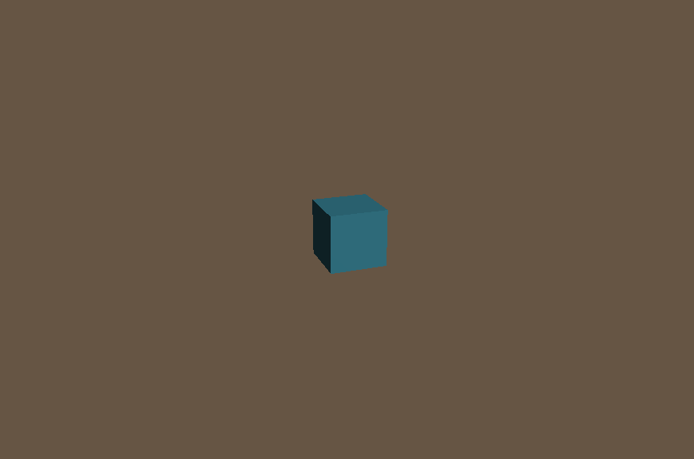

主要添加了这几行代码

```
// 点光源
var point = new THREE.PointLight(0xffffff)
// 位置
point.position.set(400, 200, 300)
// 添加到场景中
scene.add(point)
// 环境光
var ambient = new THREE.AmbientLight(0x444444)
scene.add(ambient);
// 背景色（色码与透明度，默认底色是黑色）
renderer.setClearColor(0x665544, 1)
```

需要注意的是，材质不能使用`MeshBasicMaterial`，必须用`MeshLambertMaterial`才有明暗效果，而且在无光源的情况下，使用`MeshLambertMaterial`是不显示的（黑暗中伸手不见五指）


### 3 控件与多个图形

#### 3.1 鼠标控制视图

Three.js官方，给了一个名叫OrbitControls.js文件在`three.js-master\examples\js\controls`中，你可以从github上下载，不过需要注意的是，three.js和OrbitControls.js版本要一致

首先导入OrbitControls.js

```
<script src="./js/OrbitControls.js"></script>
```

然后，稍稍添加一行代码，就可以用鼠标来控制视图了

- 缩放：滚动—鼠标中键
- 旋转：拖动—鼠标左键
- 平移：拖动—鼠标右键

```
var controls = new THREE.OrbitControls(camera, renderer.domElement)
```

全文如下

```
<head>
    <meta charset="utf-8" />
    <title>添加光源和背景色</title>
</head>

<body>
    <script src="./js/three.js"></script>
    <script src="./js/OrbitControls.js"></script>
    <script>
        // 场景
        var scene = new THREE.Scene()
        // 视图大小
        let width = 900
        let height = 600
        // 透视投影的相机 
        var camera = new THREE.PerspectiveCamera(
            45,
            width / height,
            0.1,
            1000
        );
        // 设置相机位置
        camera.position.set(0, 0, 10)
        // 渲染器
        var renderer = new THREE.WebGLRenderer()
        // 设置渲染器大小
        renderer.setSize(width, height)
        // 把渲染出来的元素（以canvas的方式）放进body中
        document.body.appendChild(renderer.domElement)

        // 点光源
        var point = new THREE.PointLight(0xffffff)
        // 位置
        point.position.set(400, 200, 300)
        // 添加到场景中
        scene.add(point)
        // 环境光
        var ambient = new THREE.AmbientLight(0x444444)
        scene.add(ambient);
        // 背景色（色码与透明度，默认底色是黑色）
        renderer.setClearColor(0x332211, 1)

        // 创建几何对象
        var geometry = new THREE.BoxGeometry(1, 1, 1)
        // 线条渲染模式
        var material = new THREE.LineBasicMaterial({ color: 0x337788 })
        // 创建线模型对象   构造函数：Line、LineLoop、LineSegments
        var mesh = new THREE.Line(geometry, material)
        // 网格模型添加到场景中
        scene.add(mesh)
        // 渲染
        function render() {
            // 动画播放
            requestAnimationFrame(render)
            // 修改位置
            mesh.rotation.x += 0.1
            mesh.rotation.y += 0.1
            renderer.render(scene, camera)
        }
        render()
        // 创建控件对象
        var controls = new THREE.OrbitControls(camera, renderer.domElement)
    </script>
</body>
```

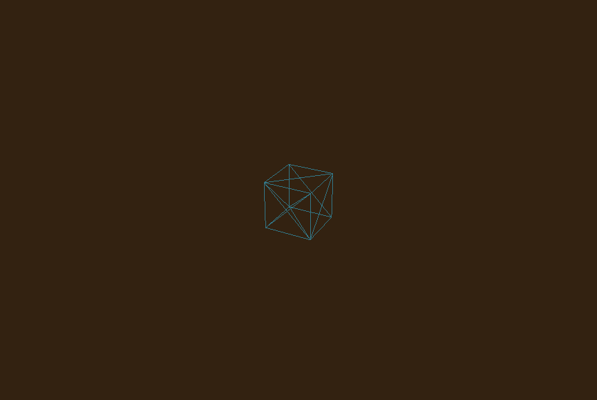

#### 3.2 球体和圆柱

```
<head>
    <meta charset="utf-8" />
    <title>球体和圆柱</title>
</head>

<body>
    <script src="./js/three.js"></script>
    <script src="./js/OrbitControls.js"></script>
    <script>
        // 场景
        var scene = new THREE.Scene()
        // 视图大小
        let width = 900
        let height = 600
        // 透视投影的相机 
        var camera = new THREE.PerspectiveCamera(
            45,
            width / height,
            0.1,
            1000
        );
        // 设置相机位置
        camera.position.set(0, 0, 10)
        // 渲染器
        var renderer = new THREE.WebGLRenderer()
        // 设置渲染器大小
        renderer.setSize(width, height)
        // 把渲染出来的元素（以canvas的方式）放进body中
        document.body.appendChild(renderer.domElement)

        // 点光源
        var point = new THREE.PointLight(0xffffff)
        // 位置
        point.position.set(400, 200, 300)
        // 添加到场景中
        scene.add(point)
        // 环境光
        var ambient = new THREE.AmbientLight(0x444444)
        scene.add(ambient);
        // 背景色（色码与透明度，默认底色是黑色）
        renderer.setClearColor(0x665544, 1)

        // 创建半径为0.5，精细程度为10的球
        var geometry = new THREE.SphereGeometry(0.5, 10, 10)
        // 设置材质
        var material = new THREE.MeshLambertMaterial({ color: 0x337788 })
        // 网格模型对象Mesh
        var mesh = new THREE.Mesh(geometry, material)
        // 网格模型添加到场景中
        scene.add(mesh)

        // 创建半径为0.5，高为1的圆柱
        var geometry2 = new THREE.CylinderGeometry(0.5, 0.5, 1)
        // 设置材质
        var material2 = new THREE.MeshLambertMaterial({ color: 0x337788 })
        // 网格模型对象Mesh
        var mesh2 = new THREE.Mesh(geometry2, material2)
        // 沿x轴平移2单位
        mesh2.translateX (2)
        // 网格模型添加到场景中
        scene.add(mesh2)

        // 渲染
        function render() {
            // 动画播放
            requestAnimationFrame(render)
            // 修改位置
            mesh.rotation.y += 0.1
            mesh2.rotation.x += 0.1
            renderer.render(scene, camera)
        }
        render()

        // 创建控件对象
        var controls = new THREE.OrbitControls(camera, renderer.domElement)
    </script>
</body>
```

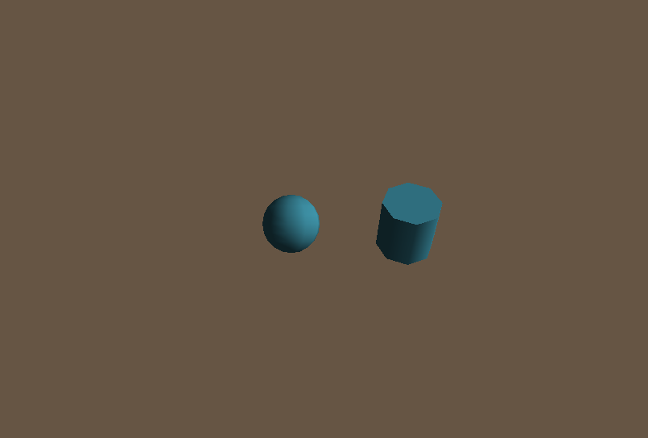

也可以，创建一个组，把球体和圆柱都放进组里，然后一起添加到场景中

```
group = new THREE.Group(mesh, mesh2)
group.add(textMesh)
scene.add(group)
```


#### 3.3 建立直角坐标系

```
// 辅助坐标系  参数250表示坐标系大小，可以根据场景大小去设置
var axisHelper = new THREE.AxisHelper(3)
scene.add(axisHelper)
```

来个例子

```
<head>
    <meta charset="utf-8" />
    <title>坐标系上绘制三角型</title>
</head>

<body>
    <script src="./js/three.js"></script>
    <script src="./js/OrbitControls.js"></script>
    <script>
        // 场景
        var scene = new THREE.Scene();
        // 视图大小
        let width = 900
        let height = 600
        // 透视投影的相机（和正交投影不同，透视投影是有近大远小关系的） 
        var camera = new THREE.PerspectiveCamera(
            45,
            width / height,
            0.1,
            1000
        );
        // 设置相机位置
        camera.position.set(0, 0, 10)
        // 渲染器
        var renderer = new THREE.WebGLRenderer()
        // 设置渲染器大小
        renderer.setSize(width, height);
        // 把渲染出来的元素（以canvas的方式）放进body中
        document.body.appendChild(renderer.domElement);

        var geometry = new THREE.BufferGeometry();
        // 用三角面片描述几何体
        var vertices = new Float32Array([
            1, 2, 0,
            0, 1, 0,
            1, 1, 0,
        ]);
        // itemSize = 3 因为每个顶点都是一个三元组
        geometry.setAttribute('position', new THREE.BufferAttribute(vertices, 3));
        var material = new THREE.MeshBasicMaterial({ color: 0xff0000 });
        var mesh = new THREE.Mesh(geometry, material);
        // 添加线
        scene.add(mesh)
        // 辅助坐标系  参数250表示坐标系大小，可以根据场景大小去设置
        var axisHelper = new THREE.AxisHelper(3)
        scene.add(axisHelper)
        // 鼠标控制
        var controls = new THREE.OrbitControls(camera, renderer.domElement)
        // 渲染
        function render() {
            // 动画播放
            requestAnimationFrame(render)
            renderer.render(scene, camera)
        }
        render()
    </script>
</body>
```

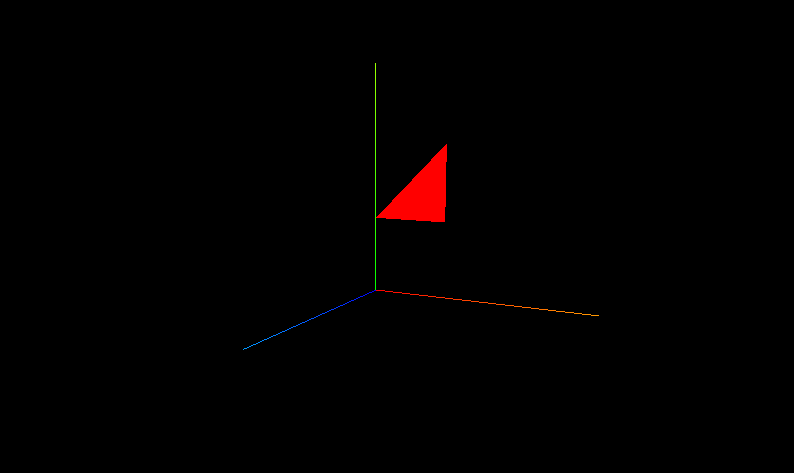

### 4 位移与图片精灵

#### 4.1 平移、旋转和缩放

```
// 几何体xyz方向分别缩放0.5,1.5,2倍
geometry.scale(0.5, 1.5, 2)
// 网格模型xyz方向分别缩放0.5,1.5,2倍
mesh.scale.set(0.5, 1.5, 2)

// 几何体沿着x轴平移50
geometry.translate(50, 0, 0);
// 沿x轴平移2单位
mesh.translateX (2)

// 绕x轴旋转
mesh.rotation.x += 0.1
```

#### 4.2 创建图片精灵

图片地址：http://www.webgl3d.cn/upload/threejs66rain.png

```
<head>
    <meta charset="utf-8" />
    <title>一滴下落的水</title>
</head>

<body>
    <script src="./js/three.js"></script>
    <script src="./js/OrbitControls.js"></script>
    <script>
        // 场景
        var scene = new THREE.Scene()
        // 视图大小
        let width = 900
        let height = 600
        // 透视投影的相机 
        var camera = new THREE.PerspectiveCamera(
            45,
            width / height,
            0.1,
            1000
        );
        // 设置相机位置
        camera.position.set(0, 0, 10)
        // 渲染器
        var renderer = new THREE.WebGLRenderer()
        // 设置渲染器大小
        renderer.setSize(width, height)
        // 把渲染出来的元素（以canvas的方式）放进body中
        document.body.appendChild(renderer.domElement)

        // 点光源
        var point = new THREE.PointLight(0xffffff)
        // 位置
        point.position.set(400, 200, 300)
        // 添加到场景中
        scene.add(point)
        // 环境光
        var ambient = new THREE.AmbientLight(0x444444)
        scene.add(ambient);
        // 背景色（色码与透明度，默认底色是黑色）
        renderer.setClearColor(0x665544, 1)

        // 加载树纹理贴图
        var textureTree = new THREE.TextureLoader().load("rain.png");
        var spriteMaterial = new THREE.SpriteMaterial({
            map: textureTree,//设置精灵纹理贴图
        });

        // 创建精灵模型对象
        var sprite = new THREE.Sprite(spriteMaterial);
        scene.add(sprite);

        // 控制精灵大小,
        sprite.scale.set(1, 1, 1); //// 只需要设置x、y两个分量就可以
        // 修改位置
        sprite.position.set(0, 5, 0)

        // 渲染
        function render() {
            // 动画播放
            requestAnimationFrame(render)
            // 雨滴的y坐标每次减1
            sprite.position.y -= 0.1;
            if (sprite.position.y < -5) {
                // 如果雨滴落到地面，重置y，从新下落
                sprite.position.y = 5;
            }
            renderer.render(scene, camera)
        }
        render()
        // 创建控件对象
        var controls = new THREE.OrbitControls(camera, renderer.domElement)
    </script>
</body>
```

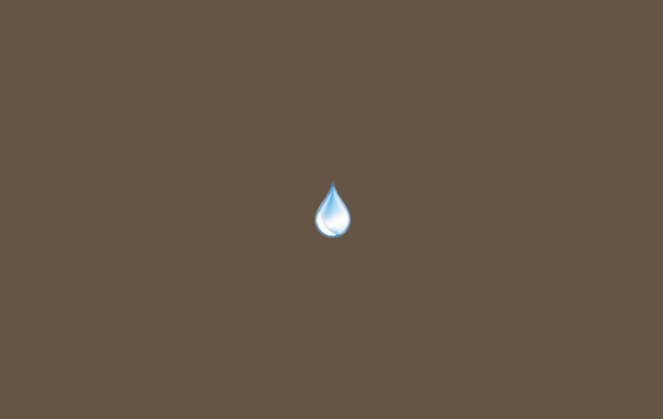

#### 4.3 添加文字

```
<head>
    <meta charset="utf-8" />
    <title>添加文字</title>
</head>

<body>
    <script src="./js/three.js"></script>
    <script src="./js/OrbitControls.js"></script>
    <script>
        // 场景
        var scene = new THREE.Scene()
        // 视图大小
        let width = 900
        let height = 600
        // 透视投影的相机 
        var camera = new THREE.PerspectiveCamera(
            45,
            width / height,
            0.1,
            1000
        );
        // 设置相机位置
        camera.position.set(0, 0, 10)
        // 渲染器
        var renderer = new THREE.WebGLRenderer()
        // 设置渲染器大小
        renderer.setSize(width, height)
        // 把渲染出来的元素（以canvas的方式）放进body中
        document.body.appendChild(renderer.domElement)

        // 点光源
        var point = new THREE.PointLight(0xffffff)
        // 位置
        point.position.set(400, 200, 300)
        // 添加到场景中
        scene.add(point)
        // 环境光
        var ambient = new THREE.AmbientLight(0x444444)
        scene.add(ambient);
        // 背景色（色码与透明度，默认底色是黑色）
        renderer.setClearColor(0x665544, 1)

        // 字体加载器
        var loader = new THREE.FontLoader();
        // 加载字体
        loader.load('fonts/helvetiker_regular.typeface.json', function (font) {
            // 创建文字
            var geometry = new THREE.TextGeometry('Hello World!', {
                font: font, // 字体
                size: 1, // 字号
                height: 1, // 立体侧面的长度
                curveSegments: 10, // 精细程度
                bevelEnabled: false, // 是否镶嵌在石板里
                // 暂不知作用
                bevelThickness: 1,
                bevelSize: 1,
                bevelSegments: 1,
            });
            // 文字颜色
            let materials = [
            	// 正面
                new THREE.MeshPhongMaterial({ color: 0x55bb55, flatShading: true }), 
                // 侧面
                new THREE.MeshPhongMaterial({ color: 0x338899 }) 
            ]
            textMesh = new THREE.Mesh(geometry, materials)
            // 调整位置
            textMesh.position.x = -3.5;
            textMesh.rotation.x = 0.3;
            // 添加到场景中
            scene.add(textMesh)
        });

        // 渲染
        function render() {
            // 动画播放
            requestAnimationFrame(render)
            renderer.render(scene, camera)
        }
        render()
        // 创建控件对象
        var controls = new THREE.OrbitControls(camera, renderer.domElement)
    </script>
</body>
```

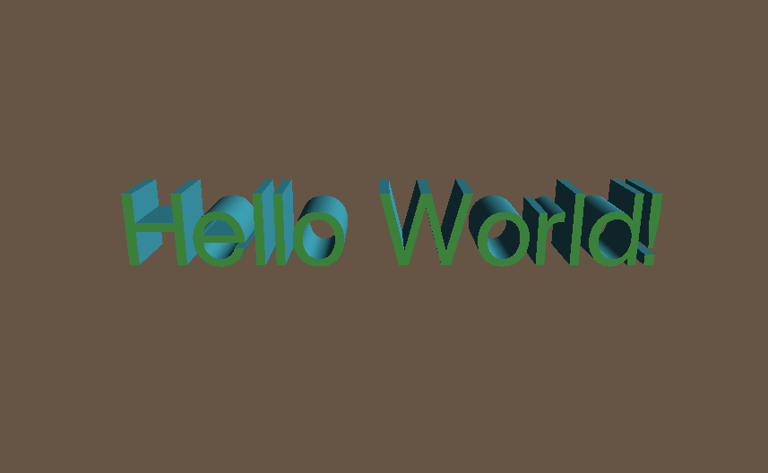

### 5 导入外部的3d模型

#### 5.1 导入.obj三维模型

先准备素材吧，我用的是3dmax

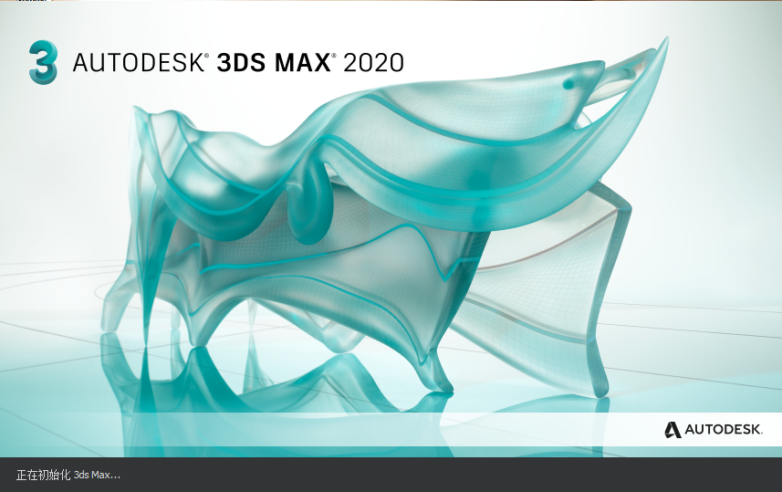

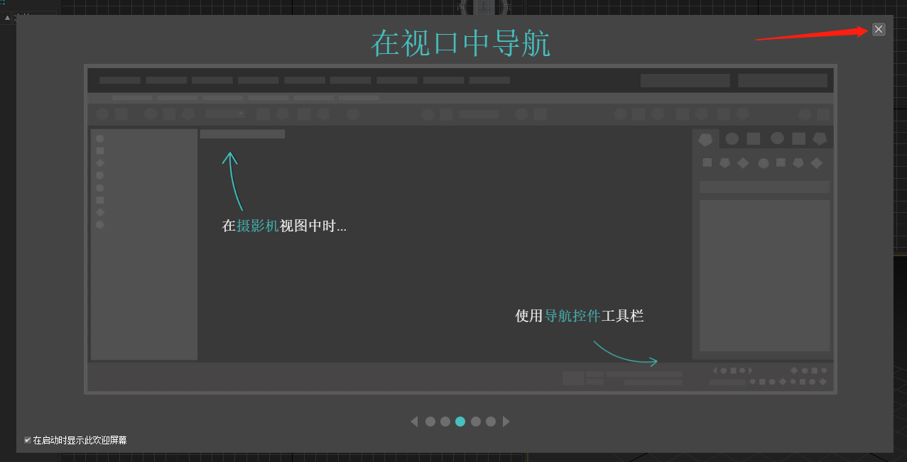

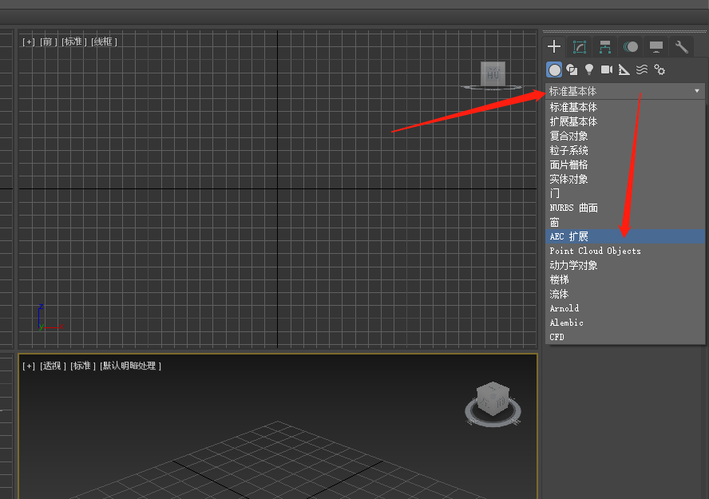

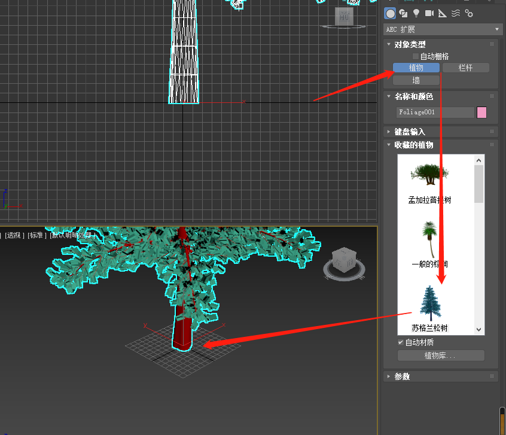

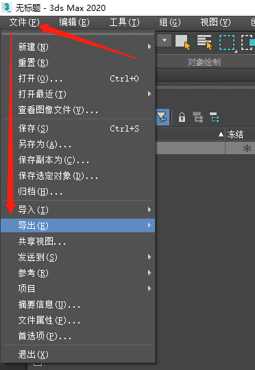

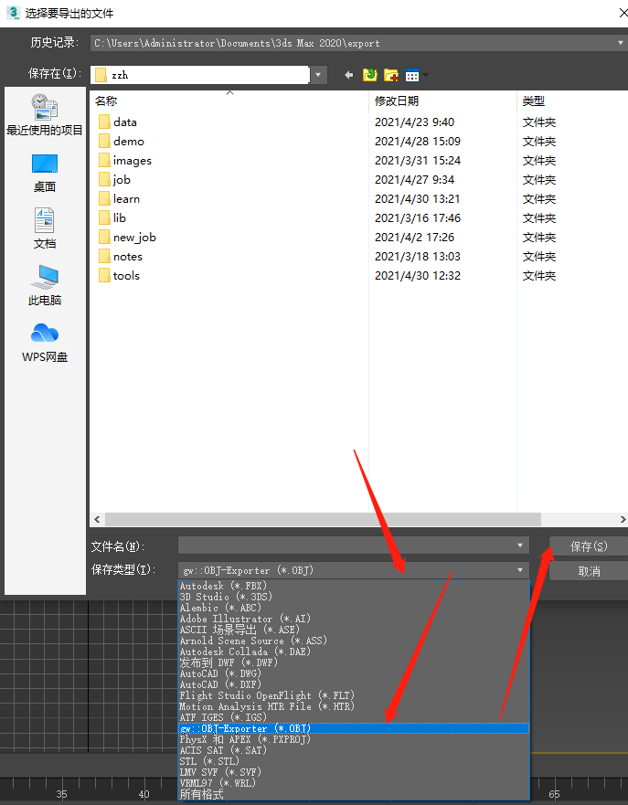

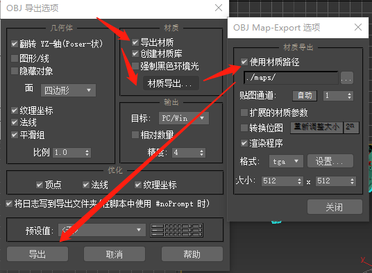

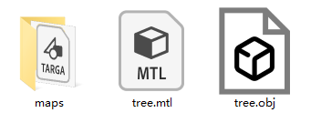

需要事先下载好`three.js-master/examples/js/loaders/OBJLoader.js`这个文件

```
<head>
    <meta charset="utf-8" />
    <title>3dmax里的一颗树</title>
</head>

<body>
    <script src="./js/three.js"></script>
    <script src="./js/OrbitControls.js"></script>
    <script src="./js/OBJLoader.js"></script>
    <script>
        // 场景
        var scene = new THREE.Scene()
        // 视图大小
        let width = 900
        let height = 600
        // 透视投影的相机 
        var camera = new THREE.PerspectiveCamera(
            45,
            width / height,
            0.1,
            1000
        );
        // 设置相机位置
        camera.position.set(0, 0, 100)
        // 渲染器
        var renderer = new THREE.WebGLRenderer()
        // 设置渲染器大小
        renderer.setSize(width, height)
        // 把渲染出来的元素（以canvas的方式）放进body中
        document.body.appendChild(renderer.domElement)

        // 点光源
        var point = new THREE.PointLight(0xffffff)
        // 位置
        point.position.set(400, 200, 300)
        // 添加到场景中
        scene.add(point)
        // 环境光
        var ambient = new THREE.AmbientLight(0x444444)
        scene.add(ambient);
        // 背景色（色码与透明度，默认底色是黑色）
        renderer.setClearColor(0x665544, 1)

        var loader = new THREE.OBJLoader();

        // 没有材质文件，系统自动设置Phong网格材质
        loader.load('./tree.obj', function (obj) {
            // 控制台查看返回结构：包含一个网格模型Mesh的组Group
            console.log(obj);
            // 查看加载器生成的材质对象：MeshPhongMaterial
            console.log(obj.children[0].material);

            scene.add(obj);
            // 修改位置与大小
            obj.scale.set(0.1, 0.1, 0.1)
            obj.translateY(-40)
        })

        // 渲染
        function render() {
            // 动画播放
            requestAnimationFrame(render)
            renderer.render(scene, camera)
        }
        render()
        // 创建控件对象
        var controls = new THREE.OrbitControls(camera, renderer.domElement)
    </script>
</body>
```

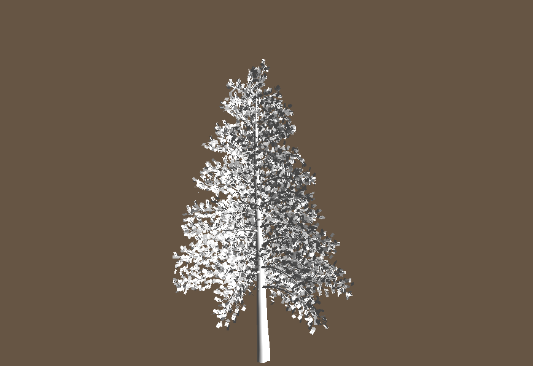

#### 5.2 导入.mtl材质文件

同样的方式，再做一个模型

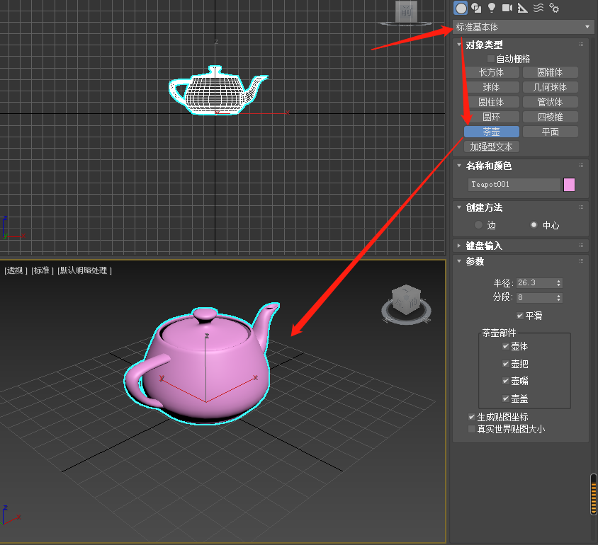

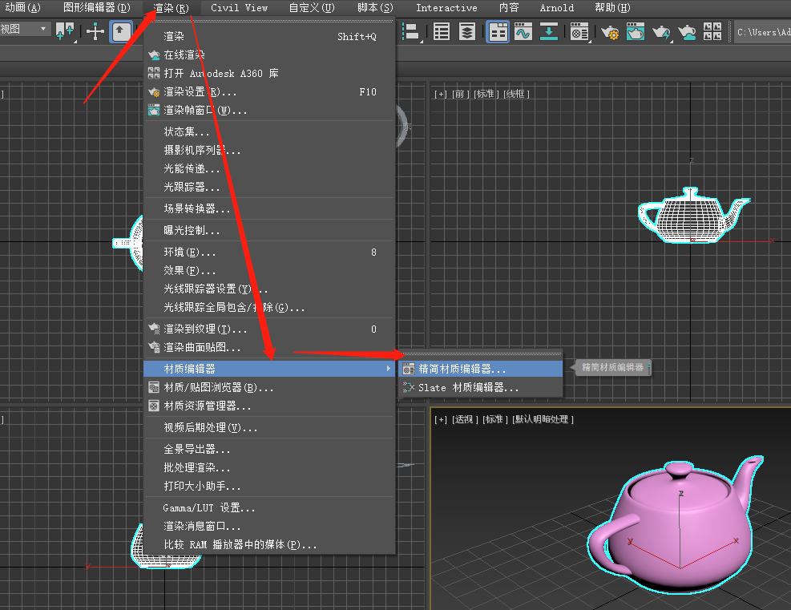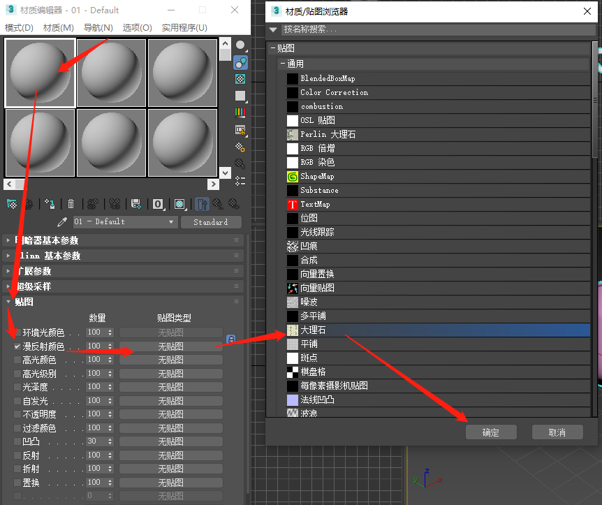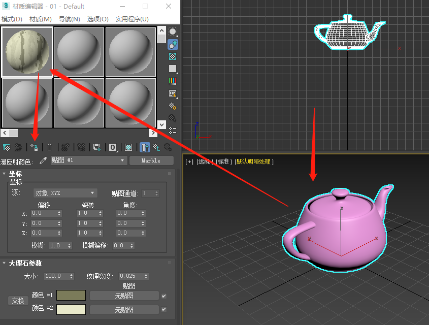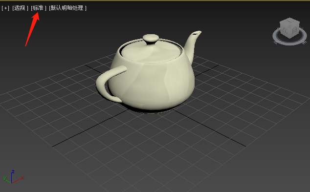

需要事先下载好`three.js-master/examples/js/loaders/MTLLoader.js`这个文件

添加材质后，可能会变黑，变透明，这是丢失了光影等细节信息（待解决）

```
<head>
    <meta charset="utf-8" />
    <title>导入材质文件</title>
</head>

<body>
    <script src="./js/three.js"></script>
    <script src="./js/OrbitControls.js"></script>
    <script src="./js/OBJLoader.js"></script>
    <script src="./js/MTLLoader.js"></script>
    <script>
        // 场景
        var scene = new THREE.Scene()
        // 视图大小
        let width = 900
        let height = 600
        // 透视投影的相机 
        var camera = new THREE.PerspectiveCamera(
            45,
            width / height,
            0.1,
            1000
        );
        // 设置相机位置
        camera.position.set(0, 0, 100)
        // 渲染器
        var renderer = new THREE.WebGLRenderer()
        // 设置渲染器大小
        renderer.setSize(width, height)
        // 把渲染出来的元素（以canvas的方式）放进body中
        document.body.appendChild(renderer.domElement)

        // 点光源
        var point = new THREE.PointLight(0xffffff)
        // 位置
        point.position.set(400, 200, 300)
        // 添加到场景中
        scene.add(point)
        // 环境光
        var ambient = new THREE.AmbientLight(0x444444)
        scene.add(ambient);
        // 背景色（色码与透明度，默认底色是黑色）
        renderer.setClearColor(0x665544, 1)

        var loader = new THREE.OBJLoader();
        // 材质文件加载器
        var MTLLoader = new THREE.MTLLoader();
        MTLLoader.load('./tree.mtl', function (materials) {
            // 返回一个包含材质的对象MaterialCreator
            console.log(materials);
            // obj的模型会和MaterialCreator包含的材质对应起来
            loader.setMaterials(materials);
        })

        // 没有材质文件，系统自动设置Phong网格材质
        loader.load('./tree.obj', function (obj) {
            // 控制台查看返回结构：包含一个网格模型Mesh的组Group
            console.log(obj);
            // 查看加载器生成的材质对象：MeshPhongMaterial
            console.log(obj.children[0].material);

            scene.add(obj);
            // 修改位置与大小
            obj.scale.set(0.1, 0.1, 0.1)
            obj.translateY(-40)
        })

        // 渲染
        function render() {
            // 动画播放
            requestAnimationFrame(render)
            renderer.render(scene, camera)
        }
        render()
        // 创建控件对象
        var controls = new THREE.OrbitControls(camera, renderer.domElement)
    </script>
</body>
```

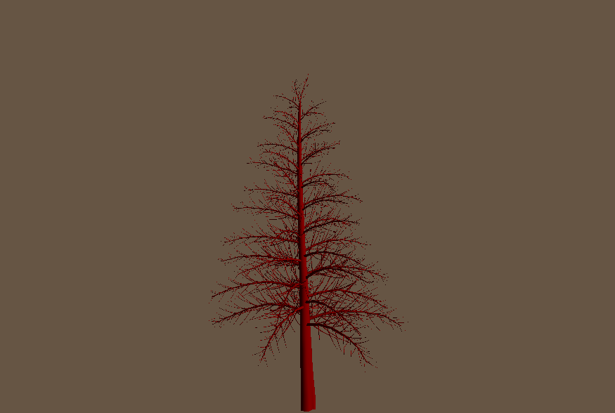

#### 5.3 设置颜色贴图

```
<head>
    <meta charset="utf-8" />
    <title>设置颜色贴图</title>
</head>

<body>
    <script src="./js/three.js"></script>
    <script src="./js/OrbitControls.js"></script>
    <script src="./js/OBJLoader.js"></script>
    <script>
        // 场景
        var scene = new THREE.Scene()
        // 视图大小
        let width = 900
        let height = 600
        // 透视投影的相机 
        var camera = new THREE.PerspectiveCamera(
            45,
            width / height,
            0.1,
            1000
        );
        // 设置相机位置
        camera.position.set(0, 0, 50)
        // 渲染器
        var renderer = new THREE.WebGLRenderer()
        // 设置渲染器大小
        renderer.setSize(width, height)
        // 把渲染出来的元素（以canvas的方式）放进body中
        document.body.appendChild(renderer.domElement)

        // 点光源
        var point = new THREE.PointLight(0xffffff)
        // 位置
        point.position.set(400, 200, 300)
        // 添加到场景中
        scene.add(point)
        // 环境光
        var ambient = new THREE.AmbientLight(0x444444)
        scene.add(ambient);
        // 背景色（色码与透明度，默认底色是黑色）
        renderer.setClearColor(0x665544, 1)

        var loader = new THREE.OBJLoader();
        let o;
        // 没有材质文件，系统自动设置Phong网格材质
        loader.load('./cup.obj', function (obj) {
            
            // texture创建一个纹理加载器对象，可以加载图片作为几何体纹理
            var texture = new THREE.TextureLoader().load('./texture/t2.jpg');
            // 设置第一部分的贴图
            // 该颜色贴图中不包含了光照信息，所以使用受光照影响的网格材质
            // 反之，就用MeshBasicMaterial
            obj.children[0].material = new THREE.MeshLambertMaterial({
                // 这里可以一起用，也可以只使用颜色或纹理
                color: 0xee5533,
                // 设置颜色纹理贴图
                map: texture,
            })

            scene.add(obj);
            // 修改一下位置
            obj.scale.set(0.5, 0.5, 0.5)
            obj.translateY(-4)
            obj.rotation.x += 0.4
            // 返回出去，用于动画
            o = obj;
        })

        // 渲染
        function render() {
            // 动画播放
            requestAnimationFrame(render)
            // 旋转
            if (o != null) {
                o.rotation.y += 0.02
            }
            renderer.render(scene, camera)
        }
        render()
        // 创建控件对象
        var controls = new THREE.OrbitControls(camera, renderer.domElement)
    </script>
</body>
```

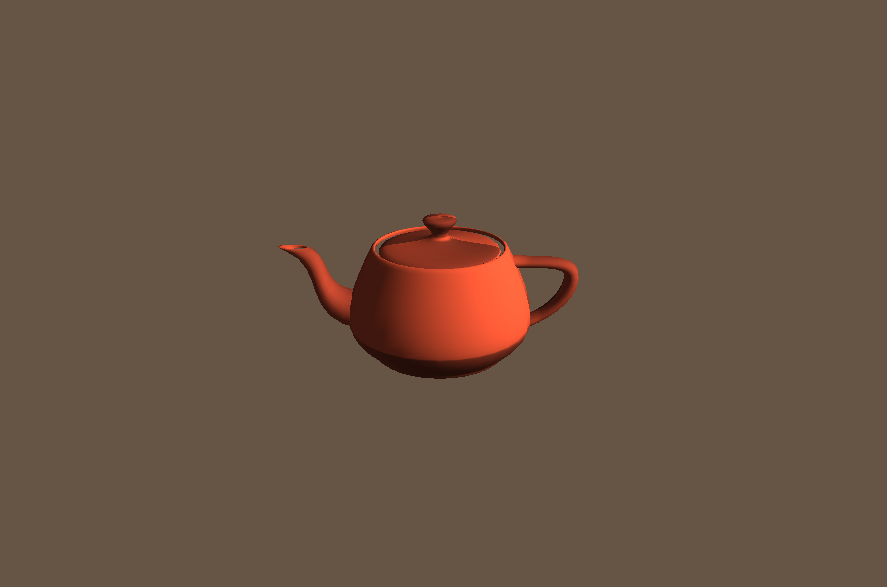

#### 5.4 使用别人的模型

模型地址：https://www.btbat.com/12859.html#comment-form

```
<head>
    <meta charset="utf-8" />
    <title>设置颜色贴图</title>
</head>

<body>
    <script src="./js/three.js"></script>
    <script src="./js/OrbitControls.js"></script>
    <script src="./js/OBJLoader.js"></script>
    <script src="./js/MTLLoader.js"></script>
    <script>
        // 场景
        var scene = new THREE.Scene()
        // 视图大小
        let width = 900
        let height = 600
        // 透视投影的相机 
        var camera = new THREE.PerspectiveCamera(
            45,
            width / height,
            0.1,
            1000
        );
        // 设置相机位置
        camera.position.set(0, 0, 20)
        // 渲染器
        var renderer = new THREE.WebGLRenderer()
        // 设置渲染器大小
        renderer.setSize(width, height)
        // 把渲染出来的元素（以canvas的方式）放进body中
        document.body.appendChild(renderer.domElement)

        // 创建几何对象
        var geometry = new THREE.BoxGeometry(1, 1, 1)
        // 设置材质
        var material = new THREE.MeshBasicMaterial({ color: 0x337788 })
        // 网格模型对象Mesh
        var mesh = new THREE.Mesh(geometry, material)
        mesh.position.set(40, 20, 30)
        // 网格模型添加到场景中
        scene.add(mesh)

        // 点光源
        var point = new THREE.PointLight(0xffffff)
        // 位置
        point.position.set(40, 20, 30)
        // 添加到场景中
        scene.add(point)
        // 环境光
        var ambient = new THREE.AmbientLight(0x444444)
        scene.add(ambient);
        // 背景色（色码与透明度，默认底色是黑色）
        renderer.setClearColor(0x665544, 1)

        var loader = new THREE.OBJLoader();
        // 材质文件加载器
        var MTLLoader = new THREE.MTLLoader();
        MTLLoader.load('./robert.mtl', function (materials) {
            // 返回一个包含材质的对象MaterialCreator
            console.log(materials);
            // obj的模型会和MaterialCreator包含的材质对应起来
            loader.setMaterials(materials);
        })
        let o;
        // 没有材质文件，系统自动设置Phong网格材质
        loader.load('./robert.obj', function (obj) {
            // for (let i = 0; i < obj.children.length; i++) {
            //     let texture = new THREE.TextureLoader().load('./texture/t3.jpg');
            //     obj.children[i].material = new THREE.MeshLambertMaterial({
            //         map: texture,//设置颜色纹理贴图
            //     })
            // }

            scene.add(obj);
            obj.scale.set(0.5, 0.5, 0.5)
            obj.translateY(-4)
            // obj.rotation.x += 0.1
            o = obj;
        })

        // 渲染
        function render() {
            // 动画播放
            requestAnimationFrame(render)
            if (o != null)
                o.rotation.y += 0.02
            renderer.render(scene, camera)
        }
        render()
        // 创建控件对象
        var controls = new THREE.OrbitControls(camera, renderer.domElement)
        let x = -10, y = 10, z = 10;
        window.addEventListener('keydown', e=>{
            if (e.key == 'a') {
                x++;
                console.log ('x', x)
            }else if (e.key == 'z') {
                x--;
                console.log ('x', x)
            }else if (e.key == 's') {
                y++;
                console.log ('y', y)
            }else if (e.key == 'x') {
                y--;
                console.log ('y', y)
            }else if (e.key == 'd') {
                z++;
                console.log ('z', z)
            }else if (e.key == 'c') {
                z--;
                console.log ('z', z)
            }
            point.position.set(x, y, z)
            mesh.position.set(x, y, z)
        })
    </script>
</body>
```

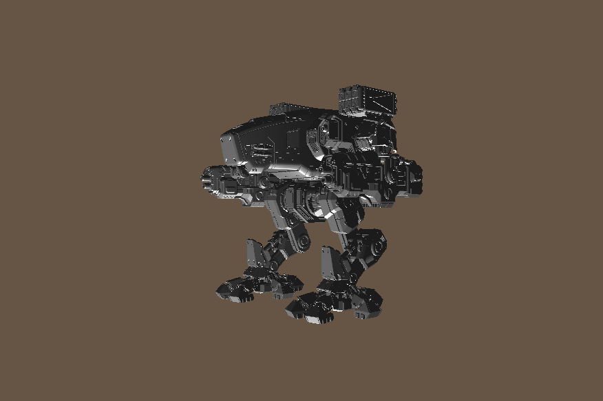

### 6.1 在vue-cli中使用three.js

```
npm install three
```

```
// 导入Three.js
import * as THREE from 'three'
// 导入其他
import {OrbitControls} from 'three/examples/jsm/controls/OrbitControls.js';
import {OBJLoader} from 'three/examples/jsm/loaders/OBJLoader.js';
import {MTLLoader} from 'three/examples/jsm/loaders/MTLLoader.js';
// 挂到THREE对象上
THREE.OrbitControls = OrbitControls
THREE.OBJLoader = OBJLoader
THREE.MTLLoader = MTLLoader
```

例子

```
<template>
  <div class="zh_page">
      <div ref="webgl" style="width: 300px; height: 700px"></div>
  </div>
</template>

<script>
// 导入Three.js
import * as THREE from 'three'
// 导入其他
import {OrbitControls} from 'three/examples/jsm/controls/OrbitControls.js';
import {OBJLoader} from 'three/examples/jsm/loaders/OBJLoader.js';
import {MTLLoader} from 'three/examples/jsm/loaders/MTLLoader.js';
// 挂到THREE对象上
THREE.OrbitControls = OrbitControls
THREE.OBJLoader = OBJLoader
THREE.MTLLoader = MTLLoader

console.log (THREE)

export default {
  data() {
    return {
      width: window.innerWidth,
      height: window.innerHeight,
    };
  },
  methods: {
    //   this.$refs.webgl.appendChild(renderer.domElement);
    three() {
      // 场景
        var scene = new THREE.Scene()
        // 视图大小
        let width = this.width
        let height = this.height
        // 透视投影的相机 
        var camera = new THREE.PerspectiveCamera(
            45,
            width / height,
            0.1,
            1000
        );
        // 设置相机位置
        camera.position.set(0, 0, 50)
        // 渲染器
        var renderer = new THREE.WebGLRenderer()
        // 设置渲染器大小
        renderer.setSize(width, height)
        // 把渲染出来的元素（以canvas的方式）放进body中
        this.$refs.webgl.appendChild(renderer.domElement);

        // 点光源
        var point = new THREE.PointLight(0xffffff)
        // 位置
        point.position.set(400, 200, 300)
        // 添加到场景中
        scene.add(point)
        // 环境光
        var ambient = new THREE.AmbientLight(0x444444)
        scene.add(ambient);
        // 背景色（色码与透明度，默认底色是黑色）
        renderer.setClearColor(0x665544, 1)

        var loader = new THREE.OBJLoader();
        let o;
        // 没有材质文件，系统自动设置Phong网格材质
        loader.load('cup.obj', function (obj) {
            
            // texture创建一个纹理加载器对象，可以加载图片作为几何体纹理
            var texture = new THREE.TextureLoader().load('texture/t2.jpg');
            // 设置第一部分的贴图
            // 该颜色贴图中不包含了光照信息，所以使用受光照影响的网格材质
            // 反之，就用MeshBasicMaterial

            obj.children[0].material = new THREE.MeshLambertMaterial({
                // 这里可以一起用，也可以只使用颜色或纹理
                color: 0xee5533,
                // 设置颜色纹理贴图
                map: texture,
            })

            scene.add(obj);
            // 修改一下位置
            obj.scale.set(0.5, 0.5, 0.5)
            obj.translateY(-4)
            obj.rotation.x += 0.4
            // 返回出去，用于动画
            o = obj;
        })

        // 渲染
        function render() {
            // 动画播放
            requestAnimationFrame(render)
            // 旋转
            if (o != null) {
                o.rotation.y += 0.02
            }
            renderer.render(scene, camera)
        }
        render()
        // 创建控件对象
        var controls = new THREE.OrbitControls(camera, renderer.domElement)
    },
  },
  mounted: function () {
      this.three()
  },
};
</script>

```

