## VB教学笔记
——By 张子涵（南平职业中专——计算机教师）
### 一、简介
#### 1.关于编程
**（1）什么是编程**
所谓编程，就是写信，就是发消息，写一份给计算机的信，发一条消息给计算机，好让计算机按照我们的意愿去执行

和英国人交流要用英语，和日本人交流要用日语，和计算机交流当然要用计算机的语言——编程语言

假设计算机是一个人，叫作小明，我想让小明替我去买包子，我该怎么说
```
小明，到楼下去买一个个包子给我
```
这就是代码，也可以这么说：
```
去买包子
```
明显比上面的那个简洁，编程也是如此（称为语法糖），当然简洁有简洁的坏处，会产生歧义，谁去买，到哪买，买几个？

所以，人为规定了的专门针对计算机的没有歧义的语法体系，被称之为代码（编程语言）
**（2）编程语言发展史**
机器语言：用1和0来写代码，完整使用二进制
```
1010111001
0001100110
0011010011
1101001100
```
汇编语言：用一些简单的单词来代替1和0的常用组合
```
MOV cx 0001
```
高级语言：用更符合人为书写方式的语法，且无视平台
```
if (age >= 14):
    print("算你命好")
else:
    print("别说了，死刑死刑")
```
智能语言：几乎和自然语言一致，相当于和人在交流
```
小爱同学，帮我去华为之家抢一部苹果来
```
#### 2.关于VB
VB：Visual Basic是Microsoft公司开发的一款以事件驱动为机制，面向对象的可视化程序设计语言

VB家族：VBS（windows脚本），VBA（office脚本），VBScript（IE脚本），VB.net（.net框架上的后台语言）

注：Basic语言（早期的一门语言，盖茨老爷子很喜欢它），事件驱动（以事件为触发器），面向对象（一种编程范式，主要相对于面向过程而言），可视化（GUI vs CUI）
#### 3.关于程序设计
数据结构 + 算法 = 程序设计
——忘了出处是哪的名言（反正我上大学的第一节课，就听到了它）

数据结构：数据的存储方式
算法：指令之间的搭配步骤

编程范式：面向过程，面向对象，面向切片，函数式编程，...
### 二、环境搭建
这里我们安装的是vbMini（简化版），而非企业版
安装步骤其实就是不断地点击“下一步”就好了
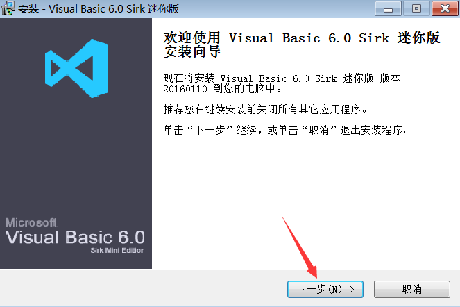
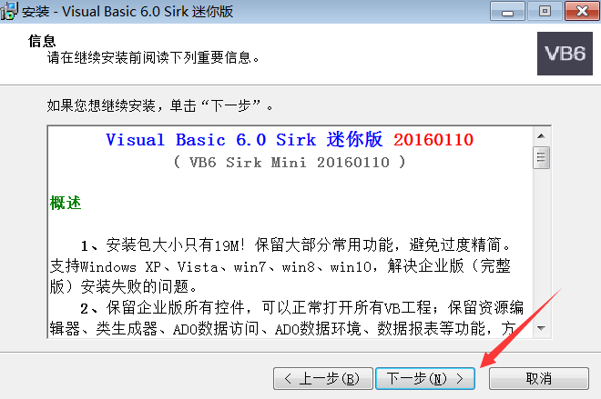
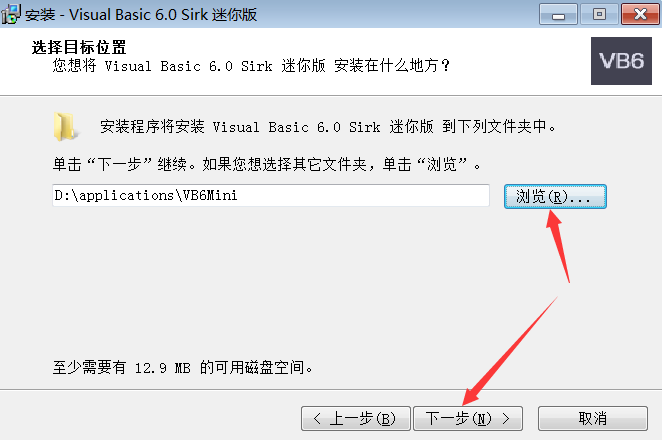
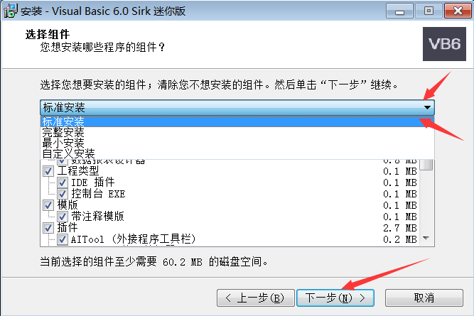
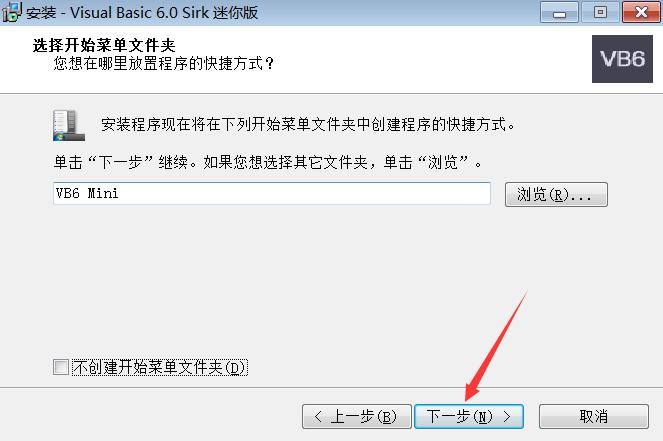
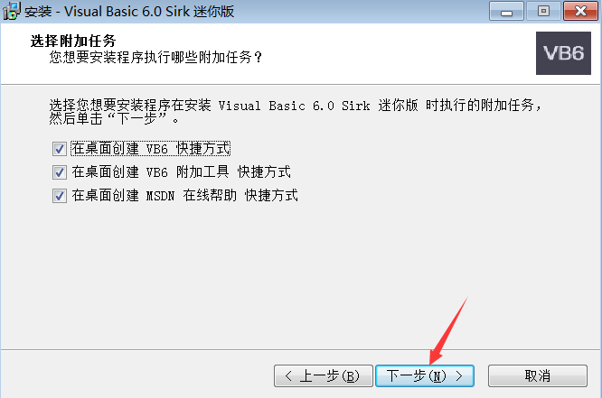
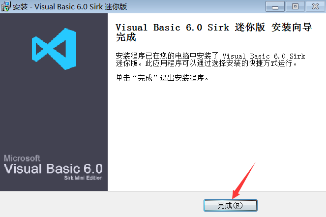
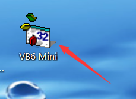
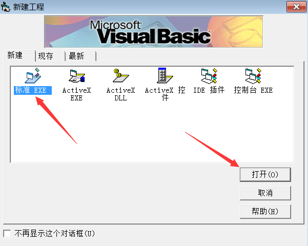
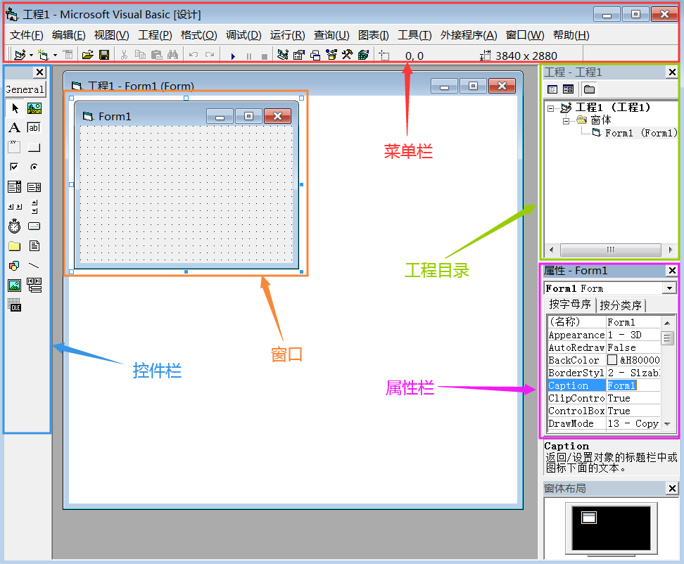
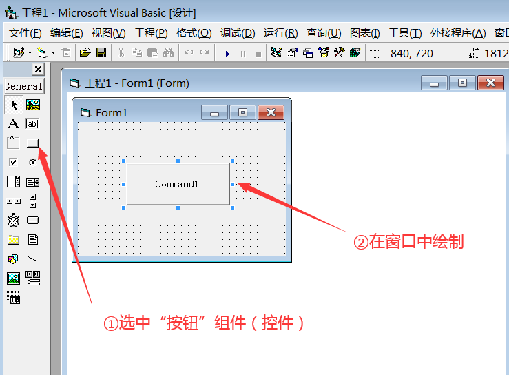
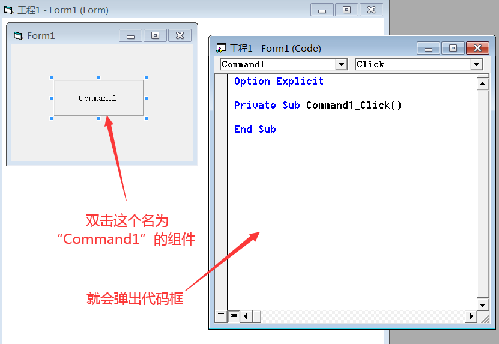
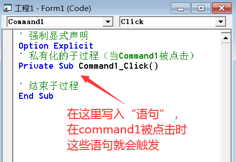
```
' 强制显式声明
Option Explicit
' 私有化的子过程（当Command1被点击）
Private Sub Command1_Click()

' 结束子过程
End Sub
```
### 三、Hello World
#### 1.语句、运算符和表达式
语句：就是一段完整的指令，操作数 + 操作码 = 指令
运算符：用于运算的符号，如+-*/
表达式：操作码全是运算符的指令
```
Option Explicit

Private Sub Command1_Click()
    MsgBox ("hello world")
End Sub
```
#### 2.变量与常量
**（1）什么是变量**
变量：可变的量，习惯用小写字母表示，如小学数学中的$x$
```
Option Explicit

Private Sub Command1_Click()
    ' 定义变量a为整型
    Dim a As Integer
    ' 且a = 100
    a = 100
End Sub
```
**（2）什么是常量**
常量：恒定的量，习惯用大写字母表示，如小学数学中的$\pi$
```
Option Explicit

Private Sub Command1_Click()
    ' 定义常量A为整型，且等于99
    Const A As Integer = 99
End Sub
```
注：常量不是静态变量，在vb中静态变量是指生命周期较长的变量，这块内容会在第五章中讲到
#### 3.输入与输出
**（1）输入框与打印输出**
```
Option Explicit

Private Sub Command1_Click()
    ' 定义变量a为字符串
    Dim a As String
    ' 返回值 = 输入框函数（提示，标题，默认值，x，y）
    ' 注：VB中的长度单位是缇（twip）
    a = InputBox("输入你的名字", "你叫啥", "张子涵", 500, 1000)
    ' 输出函数（要输出的话）
    Print "原来你就是大名鼎鼎的" & a
End Sub
```
**（2）信息框**
```
Option Explicit

Private Sub Command1_Click()
    Dim a As Integer
    ' 返回值 = 信息框（信息，按钮类型，标题，...）
    a = MsgBox("是我是我就是我", 0, "谁是天才？")
End Sub
```
详情可见：https://docs.microsoft.com/zh-cn/office/vba/language/reference/user-interface-help/msgbox-function

作业：制作一个输入内容=输出内容的复读机
### 四、过程控制
#### 1.跳转语句
```
Option Explicit

Private Sub Command1_Click()
    ' 跳转至sign处
    GoTo sign
    Print "第一句话"
' sign标志
sign:
    Print "第二句话"
End Sub
```
#### 2.分支语句
if语句
```
Option Explicit

Private Sub Command1_Click()
    ' 如果（条件）则
    If (1 > 0) Then
        Print "1比0大"
    ' 否则
    Elseif (1 < 0) Then
        Print "0比1大"
    Else
        Print "1和0相等"
    ' 结束如果
    End If
End Sub
```
selete语句
```
Option Explicit

Private Sub Command1_Click()
    Dim a As Integer
    ' a = text1里的内容（并转换为数值）
    a = Val(Text1.Text)
    ' 选择 情况 变量
    Select Case a
    ' 情况（a=1）
    Case Is = 1
        Print "羊"
    ' 情况（a=2）
    Case 2
        Print "猴"
    ' 情况（a=3）
    Case 3
        Print "鸡"
    ' 情况（a=4）
    Case 4
        Print "亮"
    ' 结束选择
    End Select
End Sub
```
注：Is（不能匹配String）
#### 3.循环语句
while循环
```
Option Explicit

Private Sub Command1_Click()
    Dim i As Integer
    i = 1
    ' 当i<=10成立时执行
    While i <= 10
        Print i
        i = i + 1
    ' 下一趟
    Wend
End Sub
```
loop循环（先判断后执行）
```
Option Explicit

Private Sub Command1_Click()
    Dim i As Integer
    i = 1
    ' 当i<=10成立时执行
    Do While i <= 10
    Print i
    i = i + 1
    ' 循环执行
    Loop
End Sub
```
loop循环（先执行后判断）
```
Option Explicit

Private Sub Command1_Click()
    Dim i As Integer
    i = 1
    ' 开始执行
    Do
    Print i
    i = i + 1
    ' 当i<=10成立循环执行
    Loop While i <= 10
End Sub
```
for循环
```
Option Explicit

Private Sub Command1_Click()
    Dim i As Integer
    ' 循环从1到10
    For i = 1 To 10
        Print i
    ' 下一趟
    Next i
End Sub
```
作业：判断成绩区间
1+2+3+...+100 = ？
1+3+5+...+101 = ？
九九乘法表

### 五、变量
#### 1.声明与定义
声明：宣告某个东西是什么类型
定义：声明 + 辅助

我们来讲讲变量声明的两种方式，隐式声明和显式声明。

隐式声明：就是不声明变量，直接使用，由VB自动补上其类型；这种方法虽然简介，但不易检查。

显式声明：就是先声明变量，再使用它，这样有利于自定义其类型和检查。

强制显式声明：可以在类模块、标准模块和窗体模块的最顶部添上一句“Option Explicit”，这表示在该模块中，你必须先声明才能使用变量。
#### 2.数据类型
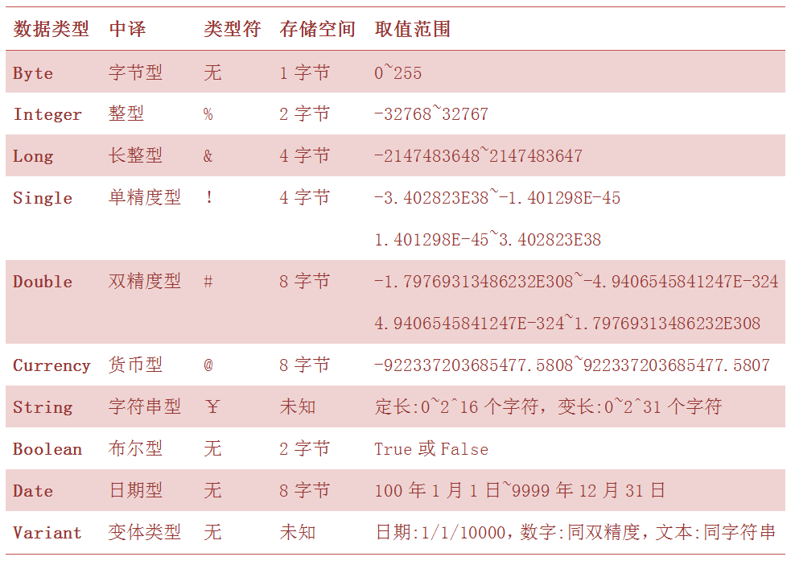
#### 3.作用域
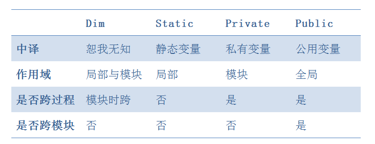
Dim在模块顶部声明时，即在过程外声明时，为模块变量，而不是局部变量；此时它的作用域为模块级别，即在整个模块中皆可使用。

Static与Dim的区别：用static声明的变量为静态变量，其存在时间较其作用域更久，即在程序运行时，用static声明的变量会一直存在，而用Dim声明的变量只在过程中存在；但Static只能在模块顶部使用。

Dim和private的区别：Dim可以在过程内声明，而Private不行；当Dim和Private都在模块顶部声明时，恕我无知，找不出它们的区别。

Static不仅可以用来声明变量，还可以用来声明function函数过程和sub子过程。

Public公用变量，只能在窗体模块或标准模块顶部声明，当其在标准模顶部时，可以跨模块调用；当其在窗体模块顶部时，想跨模块调用必须在变量名前加上窗体名。

模块变量（全局变量）和过程变量（局部变量）
```
Option Explicit

Dim a As Integer

Private Sub Command1_Click()
    a = 1
    Dim b As Integer
    b = 2

End Sub

Private Sub Command2_Click()
    Print "a = " & a
    ' 这行就报错
    Print "b = " & b
End Sub
```
静态变量的妙用
```
Option Explicit

' 用模块变量
Dim a As Integer
Private Sub Command1_Click()
    a = a + 1
    Command1.Caption = a
End Sub

' 用静态变量
Private Sub Command2_Click()
    Static b As Integer
    b = b + 1
    Command2.Caption = b
End Sub
```
块级变量
```
Option Explicit
' 证明vb没有块级变量
Private Sub Command1_Click()
    Dim i As Integer
    For i = 0 To 5
        Dim c As Integer
        c = 0
    Next i
    Print c
End Sub
```
作业：制作一个初始值为0的button，点一下变1，再点一下变2...
### 六、函数
#### 1.定义与返回值
```
Option Explicit

' 定义fun函数
Public Function fun(x)
    ' 打印参数
    Print "参数x = " & x
    ' 设置返回值
    fun = 1
End Function

Private Sub Command1_Click()
    Dim r As Integer
    ' 调用fun()
    r = fun(2)
    ' 打印返回值
    Print "返回值r = " & r
End Sub

```
#### 2.函数有什么用

#### 3.函数四大性质
闭包
```
Option Explicit

Public Function fun1()
    Dim a As Integer
    a = 1
    fun1 = a
End Function

Public Function fun2()
    ' 在fun2()中输出fun1()中的变量
    Print fun1()
End Function

Private Sub Command1_Click()
    Call fun2
End Sub
```
回调
```
Option Explicit

Public Function fun1()
    fun1 = 1
End Function

Public Function fun2(a)
    Print a
End Function

Private Sub Command1_Click()
    ' 把fun1()作为fun2()的参数
    Call fun2(fun1())
End Sub
```
递归
```
Option Explicit

Public Function fun(n)
    Print n
    ' 当n=1时返回1
    If (n = 1) Then
        fun = 1
    Else
        ' 否则，返回n * fun(n-1)
        fun = n * fun(n - 1)
    End If
End Function

Private Sub Command1_Click()
    Print fun(4)
End Sub
```
注：VB不支持重载
### 七、数组
```
Option Explicit

Private Sub Command1_Click()
    Dim a(3) As Integer
    Dim i As Integer
    Dim j As Integer
    For i = 0 To 3
        a(i) = i + 1
    Next i
    For j = 0 To 3
        Print a(j)
    Next j
End Sub
```
### 八、指针
### 九、对象
### 十、游戏制作

**——第一题 求平方根——**
输入：一个非负整数
输出：其平方数
```
Option Explicit

Private Sub Command1_Click()
Dim a As Long
Dim b As Double
a = Val(Text1.Text)
b = Math.Sqr(a)
Text2.Text = b
End Sub
```
**——第二题 验证ABC——**
若输入："ABC"
则输出："正确"
否则输出："错误"
```
Option Explicit

Private Sub Command1_Click()
If (Text1.Text = "ABC") Then
    MsgBox ("正确")
Else
    MsgBox ("错误")
End If
End Sub
```
**——第三题 判断质数——**
输入：一个大于2的整数
判断是否是质数
是，输出：该数"是质数"
否，输出：该数"不是质数"
```
Option Explicit

Private Sub Command1_Click()
Dim a, i As Long
a = Val(Text1.Text)
For i = 2 To a - 1
    If (a Mod i = 0) Then
        Label1.Caption = a & "不是质数"
        GoTo finish
    End If
Next i
Label1.Caption = a & "是质数"
finish:
End Sub
```
**——第四题 欢迎光临——**
启动后：窗体标题为"欢迎光临"
点击按钮：清楚窗体标题
点击窗体：打印"欢迎光临"
```
Option Explicit

Private Sub Command1_Click()
    Form1.Caption = ""
End Sub

Private Sub Form_Click()
    Print "欢迎光临"
End Sub

Private Sub Form_Load()
    Form1.Caption = "欢迎光临"
End Sub
```
**——第五题 判断奇偶——**
输入：一个正整数
判断奇偶
奇，输出："奇数"
偶，输出："偶数"
```
Option Explicit

Private Sub Command1_Click()
    Dim a As Long
    a = InputBox("请输入一个正整数")
    If (a Mod 2 = 0) Then
        Label1.Caption = "偶数"
    Else
        Label1.Caption = "奇数"
    End If
End Sub
```
**——第六题 打印降序数——**
打印出所有的两位降序数（注意和逆序数的区别）
每行十个
```
Option Explicit

Private Sub Command1_Click()
    Dim a, b, c As Integer
    c = 0
    For a = 1 To 9
        For b = 0 To a
            c = c + 1
            If (c = 10) Then
                Print a * 10 + b
                c = 0
            Else
                Print a * 10 + b;
            End If
        Next b
    Next a
End Sub
```
**——第七题 移动按钮——**
点击按钮后，按钮移动至左上角
```
Option Explicit

Private Sub Command1_Click()
    Command1.Top = 0
    Command1.Left = 0
End Sub

```
**——第八题 求阶乘——**
输入：一个正整数
输出：其阶乘
方法一（循环法）
```
Option Explicit

Private Sub Command1_Click()
    Dim a, i As Long
    a = Val(Text1.Text)
    For i = 2 To a - 1
        a = a * i
    Next i
    Label1.Caption = a
End Sub
```
方法二（递归法）
```
Option Explicit

Function f(a)
    If (a = 1) Then
        f = 1
    Else
        f = a * f(a - 1)
    End If
End Function

Private Sub Command1_Click()
    Dim a As Long
    a = Val(Text1.Text)
    Label1.Caption = f(a)
End Sub
```
**——第九题 打印守形数——**
打印出1000以内的所有守形数（$X^2=AX$）
```
Option Explicit

Private Sub Command1_Click()
    Dim i As Long
    For i = 1 To 1000
        Select Case i
        Case Is < 10
            If (i = i ^ 2 Mod 10) Then
                Print i
            End If
        Case Is < 100
            If (i = i ^ 2 Mod 100) Then
                Print i
            End If
        Case Is < 1000
            If (i = i ^ 2 Mod 1000) Then
                Print i
            End If
        End Select
    Next i
End Sub
```
**——第十题 绑定标题——**
当文本框发生改变时，更改窗体标题为文本框里的内容
```
Option Explicit

Private Sub Text1_Change()
    Form1.Caption = Text1.Text
End Sub
```
**——第十一题 求最大值——**
求出三个文本框中最大的数
```
Option Explicit

Private Sub Command1_Click()
Dim a, b, c As Double
a = Val(Text1.Text)
b = Val(Text2.Text)
c = Val(Text3.Text)
If (a <= b) Then
    a = b
End If
If (a >= c) Then
    Label1.Caption = a
Else
    Label1.Caption = c
End If
End Sub
```
**——第十二题 打印水仙花数——**
打印全部的水仙花数（$abc = a^3 + b^3 + c^3$）
方法二
```
Option Explicit

Private Sub Command1_Click()
    Dim a, b, c As Integer
    For a = 1 To 9
        For b = 0 To 9
            For c = 0 To 9
                If (a * 100 + b * 10 + c = a ^ 3 + b ^ 3 + c ^ 3) Then
                    Print a * 100 + b * 10 + c
                End If
            Next c
        Next b
    Next a
End Sub
```
方法二（注意用int来避免四舍五入）
```
Option Explicit

Private Sub Command1_Click()
    Dim i, a, b, c As Integer
    For i = 100 To 999
        a = Int(i / 100)
        b = Int((i Mod 100) / 10)
        c = i Mod 10
        If (a * 100 + b * 10 + c = a ^ 3 + b ^ 3 + c ^ 3) Then
            Print a * 100 + b * 10 + c
        End If
    Next i
End Sub
```