#### 1 安装VueCLI
什么是CLI？其实就是模板，用官方的说法叫**脚手架**，它把一些前端常用的功能插件集成在了一起，便于快速开发（直接生成一个基本的单页应用框架）

从本质来说，VueCLI是一个全局安装的npm包，里面包含了vue create（创建）、vue server（构建）、vue ui（图形化管理）等命令

在安装了Node的前提下，在cmd中输入下列命令，便可以全局安装VueCLI
```
npm install -g @vue/cli
```
注：-g表示全局安装
#### 2 创建一个新项目
在cmd中输入下命令
```
vue create hello-world
```
如下图所示，它要你进行一系列的选择
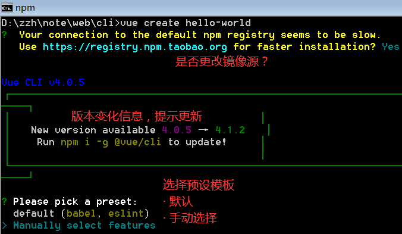
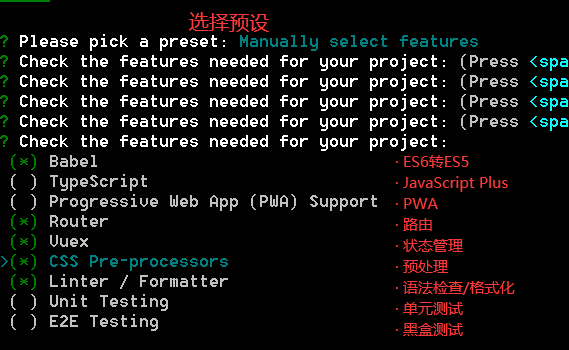
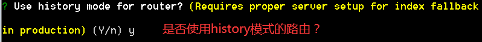
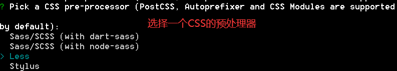
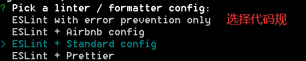
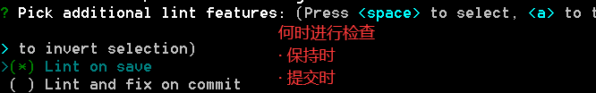
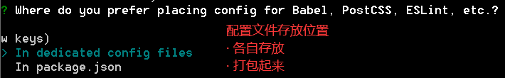
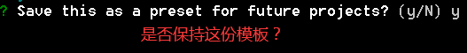
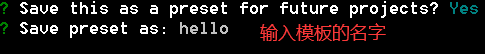
等待一段时间，就可以根据下面的提示，运行项目
```
npm run serve
```
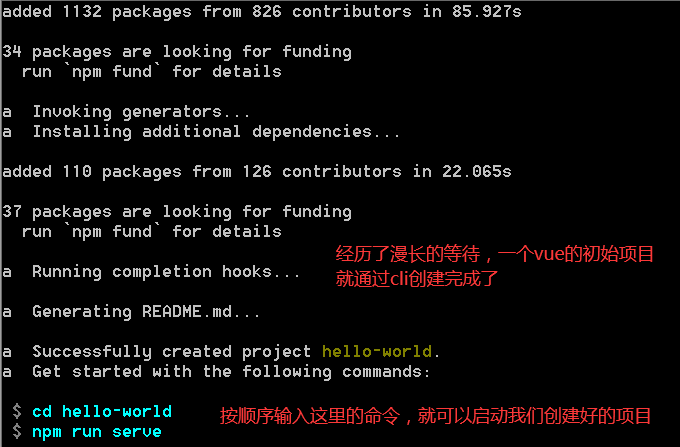
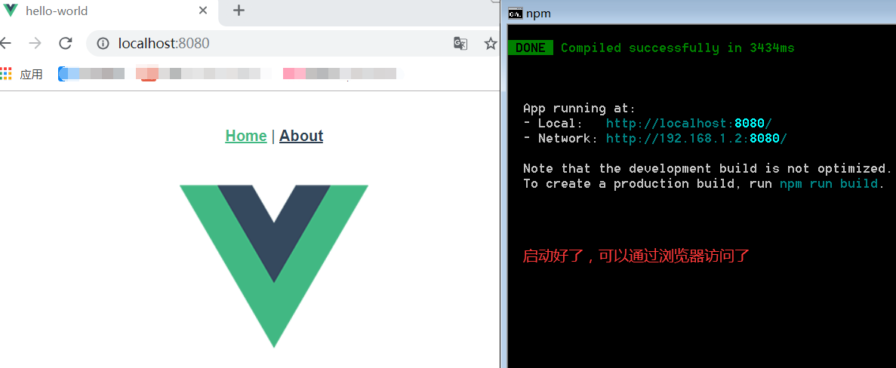
#### 3 文件结构
```
- node_modules // 存放该项目所用的npm包，或者叫模块（很大，一般不上传）
- public // 公共资源
- src // 主文件夹（主要的东西都在这）
- .editorconfig // 代码规范 （用于格式化代码）
- .gitignore // 版本管理规则（用于规定git时哪些文件要上传，哪些不要）
- babel.config.js // Babel模块（用于ES6转ES5）
- package.json // 配置文件（我们在vue create时的那些配置）
- package-lock.json // 也是配置文件（用于存储npm模块的版本信息）
- README.md // 说明文档（该项目的说明书）
```
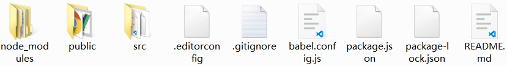
然后，我们来细看src中的文件结构
```
- assets // 静态资源文件夹（图片、视频、外部文件等）
- components // 公用组件文件夹（C）
- router // 路由文件夹
- store // 存储文件夹（vuex状态管理）
- views // 视图组件文件夹（B）
- App.vue // 根组件（A）
- main.js // 主入口
```
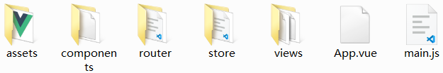
注：A由B组成，B由C组成
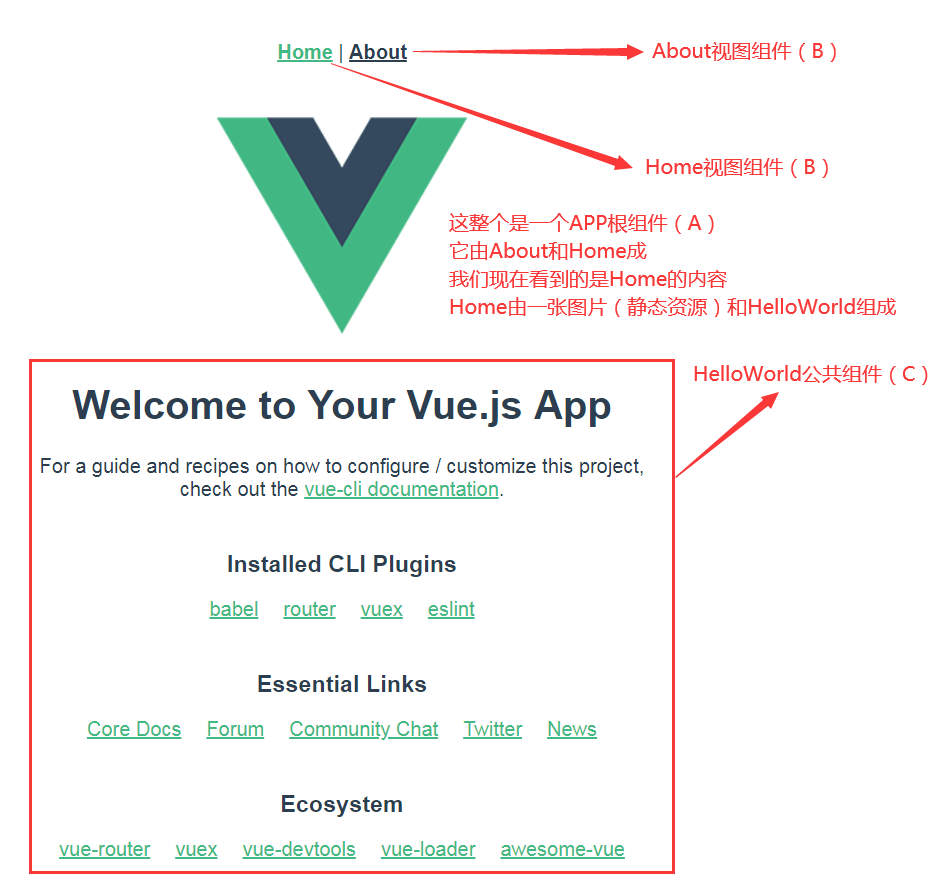
#### 4 组件格式
```
<template>
    <!-- 这里写html，注意最外只能有一层 -->
</template>

<script>
    // 这里写JavaScript，注意要export出来
</script>

<style>
    /* 这里也CSS */
</style>
```
在components中，建一个myNav.vue文件，用来作导航栏的公共组件，代码如下：
```
<template>
  <div id="menu">
    <!-- 用v-for，就一定要用v-bind:key（ESLint语法要求） -->
    <div class="one" v-for="set in arr" :key="set.text">{{ set.text }}</div>
  </div>
</template>

<script>
// 导出给别的组件使用
export default {
  // 这个name可写可不写（因为它的调试用的）
  name: 'myNavTop',
  data: function () {
    return {
      arr: [
        { text: '一级标题1' },
        { text: '一级标题2' },
        { text: '一级标题3' }
      ]
    }
  }
}
</script>

<style lang="less">
#menu {
  width: 100%;
  height: 50px;
  background: #555;
  color: #fff;
}
.one {
    float: left;
    width: 25%;
    height: 50px;
    line-height: 50px;
    text-align: center;
    cursor: default;
}
.one:hover {
    background: #333;
}
</style>

```
将aoubt.vue中改写为：
```
<template>
  <div class="about">
    <h1>This is an about page</h1>
    <navTop msg="Welcome to Your Vue.js App"/>
  </div>
</template>

<script>
// 导入myNav，@表示src目录
import navTop from '@/components/myNav.vue'
// 导出给上面的template用
export default {
  components: {
    navTop
  }
}
</script>

```
然后运行一下，看效果
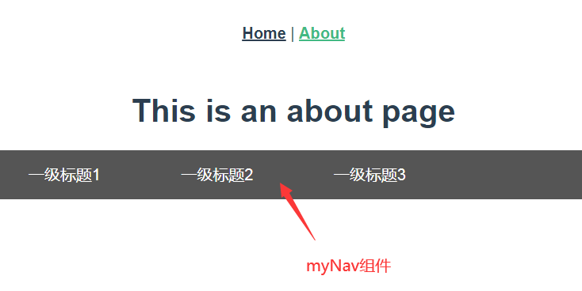