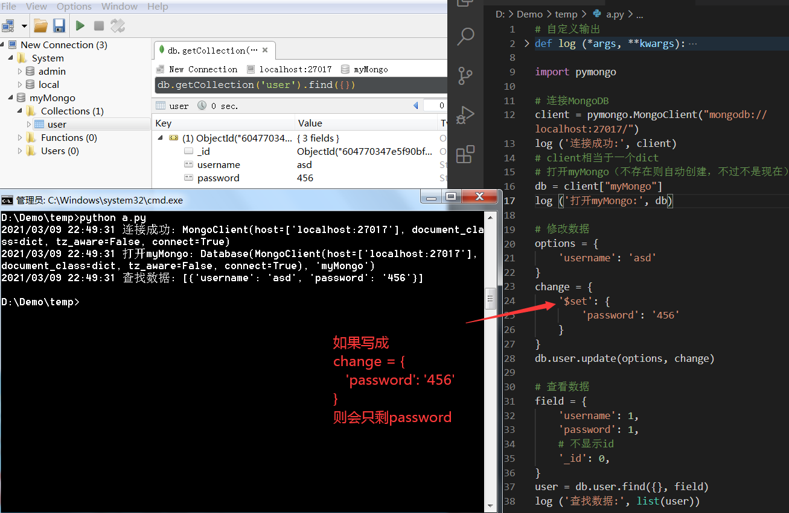

### Web全栈开发
本文旨在带你进入Web开发的大门，由于Web开发是一个较广的话题，单就前端，单就前端里的JavaScript，就足够写一本书了，所以呢我们旨在入门，不会太过详细，很多地方都会做一些取舍，比如HTML里的标签有哪些，它们是干嘛的，JavaScript的语法是怎么样的，怎么装数据库等等都不涉及。

我们将用一个俗到不能再俗的例子——个人博客，带大家了解全栈开发，前端是干什么的，它的套路有哪些，后端又是干什么的，它的套路又有哪些？

本人喜欢讲述对于概念的理解，而对于大多的记忆内容，文中少有赘述，对于计算机的一些基础理论，比如数据结构，操作系统、计算机网络等，可能会涉猎一些。
### 1.Web发展史
#### （1）通信的出现
20世纪50年代，电子计算机诞世，早期计算机的作用就是计算，而后慢慢发展出各种应用。

由于某些任务的特殊性，和单个计算机性能的局限性，使得计算机与计算机之间有了通信的需求。

比如，计算机A负责每届村长选举的票数统计，计算机B负责把统计结果展示给村民们看。

这就要求计算机A在统计完后，需要把统计结果发送给计算机B。

当通信的主体变得越来越丰富，不再是计算机A与计算机B，还有CDEFG，此时网络就出现了。

在之前的例子中，计算机A向计算机B发送消息，而计算机B无需向计算机A发送消息，这种通信被称为**单工**通信；而实际的情况可能计算机B也需要向计算机A发送消息。

比如，计算机B上有两个按钮，一个是支持张三当村长，一个是支持李四当村长，当村民按下按钮时，计算机B就是发送一条消息给计算机A，告诉他哪一个人的票数需要+1。

有人问，为什么不让计算机B自己统计呢？

嗨，还不是因为单个计算机的性能有限，计算机B存放不了太多数据，所以需要把数据交给计算机A。

这种A向B发消息，B也能向A发消息的通信方式，被称为**双工**通信，但如果在A向B发送消息时，B不能向A发送消息，即同一时间只能存在一方发另一方收，这种就被称为**半双工**通信，就像水管一样，水管里的水可以往左流，也可以往右流，但同一时刻只能往一边流。

而我们的网络通信便是半双工，A向B发消息时，B就不能向A发消息了，不仅如此A向B发消息所用的线路，计算机C是不能使用的（在同一时刻）。

#### （2）网络的发展
当通信的主体变多，网络就是出现了。

刚开始是LAN（Local Area Network），被称为**局域网**，范围小，人数少；主要使用的设备是Hub（集线器）与Switch（交换机），其中Hub只能广播，而Switch可以点对点地传输，于是Hub便慢慢被Switch替代了。

无论是Hub的广播，还是Switch的点对点，我们都需要明确发消息的是谁与收消息的又是谁？

而且通信的主体多了，最容易出现的问题就是线路的占用，比如A、B、C共用一条线路，A向B发消息，B就不能向A或者C发消息，因为线路被A占用了，同理，C也不能向A或者B发消息。

为了解决这些问题，出现了**以太网**，它是局域网中最常用的协议，它的特点是规划地址与碰撞检测。

首先，给每一台计算机（中的网卡）配一个**MAC地址**（Media Access Control Address），通过这个MAC地址来确定发消息的主体与收消息的客体。

当Hub广播时，所有连接该Hub计算机都会收到消息，一看收信人不是自己的MAC地址，就弃之；而在Switch中它会存储所有连接自己的计算机的MAC地址，从而进行点对点通信。

其次，当两台计算机同时使用一条线路发消息时，依照以太网协议，会检查这种碰撞；当发生碰撞时，两台计算机都会停止发生消息，并等待1秒多，比如A等1.2秒，B等1.5秒，之后再发送消息；如果再次碰撞，会继续停止-等待，等待时长为2秒多，再碰撞就是4妙多，8秒多……这被称为指数等待。

而后是WAN（Wide Area Network），被称为**广域网**，范围大，人数多；主要使用的设备是router（路由），路由可以传播的更远，这功归于我们的基站建设；零几年的时候，大家都是通过ADSL拨号上网，走的是电话网，现在都是光纤到户，以前的猫（modem）也被集成到无线路由中（WIFI）。

广域网使用的协议是**互联网**（Internet），其中最具有代表性是就是IP协议，互联网顾名思义就是把所有的网络都串起来，所以可以这么说广域网是有多个局域网组成的。

每一个router都有一个**IP地址**（Internet Protocol Address），router自身还具有路径选择功能，当A发消息给遥远的B，消息会有A所连接的router（网关）发出进入互联网，再由router选择路径，从而兜兜转转来到B的网关，最后发给B。

#### （3）MAC与内外网IP
为什么有了MAC地址还要IP地址？

答：因为MAC只能用于局域网通信。

有人说，不对啊，我写局域网程序用的也是IP地址啊。

答：你用的那是内网IP，其本质上是在用MAC地址，相当于做了一个映射表。
```
内网IP地址    MAC地址
192.168.1.1  A4F7B632C9045B8...
192.168.1.2  C953F6045B328C9...
192.168.1.3  32CF75BB690A448...
```
那为什么要这么做呢？

答：原因有两个，①IP地址短，MAC地址长（你写通信代码时应该不会想用MAC地址+端口号的）；②IP地址可变，MAC地址固定，为了实现点到点通信，就需要记下所有设备的MAC地址，假设一台计算机坏了扔了，可它的MAC地址还会被记得，占用资源；而IP地址就不一样了，当计算机联网后，我才会给你一个IP地址，你一断网IP地址我就回收了。

为什么要分内网IP和外网IP？

答：出于安全考虑，不是每台计算机都喜欢被人连接（你也不喜欢什么牛鬼蛇神都来加你微信吧）。

内网IP用于局域网，局域网内的设备想要与外界通信，必须通过网关，而网关具有外网IP（对互联网可视），能够与外界通信。

相当于你呆在监狱里，和监狱外的人通信，需要警察来帮你传口信，不过呢监狱里安全（你也不想莫名其妙地就被人远程控制了对吧）。

#### （4）C/S与B/S
早年的计算机比较单纯，一台计算机只运行一个程序，比如计算机A运行便是一个专门计数的程序，而计算机B运行的是一个具有按钮事件和显示数据的程序，所以其实在通信的是A中的程序与B中的程序。

这种程序与程序之间通信，被称为**C/S架构**（Client/Server）客户端与服务器。

作为21世纪的我们，所遇见的计算机就比较成熟了，一台计算机可以运行好多个程序，其中有一个程序比较特殊——浏览器（用访问网页的那个东西）。

它怎么特殊了呢？

浏览器本身是一个程序，但它又能运行很多个网页，而这些网页又具备部分程序的功能；说得简单一点，就是一个大程序叫浏览器，上面运行着一堆小程序叫网页。

So what? 所以呢？

总所周知，计算机是由硬件和软件组成的，硬件部分就是我们能触摸的硬盘啊，内存啊，CPU啊这些，而软件部分则是我们常用的QQ啊，浏览器啊，Steam啊等等；其中在软件部分有一个比浏览器还特殊的软件，叫操作系统，比如我们常见的Windows。

操作系统是最底层的软件，可以说它介于软件与硬件之间是二者沟通的桥梁，它的下面是硬件，它的上面是各种像QQ、浏览器这样的软件。

有没有感觉，浏览器和操作系统有点像，浏览器上可以运行网页，操作系统上可以运行浏览器。

正是因为这种结构（自下而上）：硬件-操作系统-浏览器-网页

导致网页不能使用操作系统提供的API，正如浏览器不能操纵硬件一般。

比如，你想在写一段JavaScript代码，运行在浏览器上，实现往用户D盘里创建一个文件，这是不可能滴，这是一个妄想！

有人说不对啊，JS可以进行文件I/O操作啊，那是因为你没运行在浏览器上，比如，你写的是node.js，它运行在一个dos终端上（黑底白字的窗口）。

假设计算机B里的那个程序其实是一个网页，现在它想要向计算机A里的程序发消息，必须通过计算机B里的浏览器（因为网页运行在浏览器上嘛），所以实则是B里的浏览器向A里的程序发消息。

这就要求网页必须遵守浏览器的协议，否则你的消息浏览器不帮你发，比如http协议，比如你的端口是浏览器把你指定的。

这种网页向程序通信的模式，被称为**B/S架构**（Brower/Server）浏览器与服务器。

所以，C/S与B/S有什么区别呢，我们做Web开发需要注意什么呢？

我们先来看C和B这一侧，由于B/S一切要通过浏览器，而浏览器又不是我们Web开发人员能改变的，所以我们的灵活度较低，比如**跨域**问题（同源安全策略问题），这是Web开发经常遇到的。

你可能会问，凭什么？凭什么不让跨域，答：规定！

浏览器就是不让你跨域，所以你要是向跨域就得伪装成没有跨域的样子去跨域（披着羊皮的狼混入青青草原）。

而在S这一侧，会稍微简单一点，需要一下C发来的request（请求）与B发来的request是不一样的，且它俩想要的response（响应）也经常是不一样的。

一些细节问题，等遇到了再聊。

#### （5）万维网与域名
我们之前提过互联网，有些人以为万维网与互联网是一个概念，其实不是的，万维网只是互联网下的一个产物，专门用于网页通信。

之前所提的B/S架构也是用于网页通信的，通信就需要有地址，常见是便是IP地址。

所以，我们来谈谈万维网、B/S架构和IP地址之前的关联。

B/S架构表示网页通过浏览器与服务器进行通信，IP地址表示通信需要通过IP地址来定位；此时思考两个问题：网页是什么，为什么有了程序之后还需要网页？IP地址会不会太复杂，能不能简化？

正是因为这两个问题，于是出现了万维网。

网页的由来，还得谈到**超文本**，所谓超文本就是具有跳转功能的文字（能显示图片的那个叫富文本），当然一般来讲超文本多数都是富文本。

文本本身就携带信息，点击后还能跳转，又能获取新的信息，所有的信息汇成一本书，每翻一页就多知道一页，这便是超文本的核心思想。

为了实现这种特殊的功能，网页诞生了，每一个网页就像书中的一页，所有的网页汇集而成形成了**万维网**（World Wide Web）简称WWW，这便是万维网创立的目的，把网页们都连到一起。

那么这么多的网页，它们之间如何实现跳转呢？

当然是通过IP地址，但是由于网页面向用户，对于用户而言，IP地址过于复杂，于是**域名**（Domain Name）诞生了。

域名与外网IP的关系，就像内网IP与MAC地址的关系，都在一种一一对应的映射（一个域名其实是可以绑多个IP地址的，为了简单理解姑且认为是一对一的）。
```
域名            外网IP
www.baidu.com   14.215.177.38
www.g.cn        180.163.151.34
www.hao123.com  220.181.107.181
```
从右至左数，.com和.cn这种叫顶级域名，之后baidu和hao123这种叫一级域名，再往下还可能有二级域名以此类推，而www是表示你使用的是万维网（这个可写可不行，因为浏览器默认你走的就是万维网）。

内网IP与MAC的对应关系是有Switch来记录的，那么域名与外网IP的对应关系是由谁来记录的呢？

答：**DNS服务器**（Domain Name System），有专门的服务器用于域名与IP地址的记录，这些服务器叫DNS服务器，它们以树状拓扑连接。

最上面的叫根DNS服务器，从上往下还有很多DNS服务器，当我们在浏览器里输入网址（域名），浏览器会先把域名发给路由指定的DNS服务器解析。

如果该服务器没有该域名，则会向上寻找其它服务器，直至找到对应的IP地址，或者到了根服务器也没找到对应IP。

找到对应IP后，浏览器找根据IP地址，向对方发送请求。

### 2.前端部分
#### （1）Web前端发展史
所谓前端，就是数据展示，就是交互界面，而我们一般说前端指的是Web前端，即网页中的交互界面。

Web前端大致经历过三次发展：table布局到div布局，同步通信到AJAX，JQuery到前后端分离。

在零几年的时候，当初制作网页，流行的还是网页三剑客——Dreamweaver、Flash和Fireworks（我当时用PS代替）。

那时的Web前端不叫前端，叫网页设计，因为那时制作一个网址的工作量很小，而且前后端也没有分开，导致前端的工作基本是后端包了。

当时的前端基本就是一个平面设计，偶尔布布局，写写样式，被称为切图仔。

后来是由于AJAX的加入，HTML5的出现，JS的频繁使用，前端才慢慢有了点程序员的样子。

我们来介绍介绍Web的那三次发展。

**table布局**，又叫表格布局，因为早年的网页里的内容大多排布整齐，且密密麻麻，故适合四四方方的table布局；后来随着极简主义与个性化的潮流，**div布局**兴起了，其实现在的常说的FLex布局、栅格化和响应式也是多以div为容器。

**同步通信**的意思就是，计算机A发消息给计算机B，计算机B收到消息后返回信息给计算机A，在此过程中，计算机A不能别的任何事情。

同步通信的优缺点很明显，优点是专一，一段时间只做一件事，这件事没做完绝不做下一件事，缺点就是效率低，交互性弱，容易让用户长时间的陷入等待之中。

故**AJAX**（Asynchronous Javascript And XML）出现了，顾名思义AJAX就是异步的JavaScript，用于异步通信。

正是异步通信的出现，使得网页能够局部更新，比如当用户点击网页中的按钮时，能从服务器上取出一段文字显示给用户。

这个看似简单的功能，在同步通信的时候是没法完成的，因为在等待服务器返回文字的这段时间内，网页会无视用户其他的任何操作。

所以早期的网页基本上都是在你打开网页的那一刻把该网页所学的所有东西统统加载好（要等就集中起来，在固定的一个时间等）。

**JQuery**是JavaScript的一个库，能使得JS（JavaScript的缩写）更方便地操作DOM。

注：JavaScript是用于网页的一门编程语言，DOM是对网页中的元素的抽象表达。

本来JQuery用的好好的，一些老道的后端程序员加入前端，发现了前端的一个毛病，数据与显示不分离，这样当甲方需求一改，你数据那块的代码要改，显示那块的代码也得改，麻烦！

于是以Vue、React和Angular为代表MV*前端框架出现了，这种分离的思想进一步发展，就形成了**前后端分离**，借助Node.js让前端可以成为一个独立的端，这样前端的运行就不需要后端的支持（前端写代码就不需要后端陪加班）。

### 1. MV*时代还未到来
#### （1）HTML与CSS
#### （2）JavaScript
#### （3）AJAX与JSON
#### （4）JQuery
#### （5）ES6
#### （6）HTML5与CSS3
#### （7）Flax布局与Less
#### （8）Canvas
#### （9）tree3d.js
### 2.使用Vue来快速开发
#### （1）使用vue-cli创建初始项目
#### （2）使用element-UI进行页面布局
#### （3）使用echats来绘制图表
#### （4）调用百度地图API
#### （5）Github与Git
#### （6）Markdown与latex
### 3.项目实战
#### （1）个人博客
#### （2）电商网站
#### （3）HTML5游戏
## 二、后端部分
### 1.无框架下网络编程
#### （1）后端语言与数据库
如果说前端是对数据的展示，那么后端就是对数据的处理。

所以说，后端开发离不开两样东西——后端语言与数据库。

前者用于编写代码，实现对数据的各种处理，后者用于存放数据。

有人说，为什么一定要用数据库存放数据呢？

答：你也可以不用数据库存放数据，如果你的数据量比较小的话，比如个人博客，当就学习而言，还是要学数据库滴，没有公司会招一个不懂数据库的后端。

**后端语言**，能用于编写后端代码的编程语言，后端语言有很多种，不像前端就一种——JavaScript（ActionScript已经死去，TypeScript暂时不算）。

有哪些后端语言呢？

常见的有：Java、C#、PHP、Python、Ruby、GO、C/C++、Node.js等。

这么多后端语言，我该选哪一个呢？

答：你选啥，你的自用，反正我用的是Python，原因嘛，就两，一个是Python写起来方便，另一个是其他的后端语言要么我没学过，要么我忘差不多了，算了（鉴于你很有可能是初学者）我大致地聊一聊这些后端语言，都是个人的刻板影响，切勿偏听偏信。

Java：用的人最多，最火，国外火，国内更火，框架特别多，早年好像是SSH，现在好像是SSM，具体的我也记不起了，至大二后我对Java就没了影响。

C#：国外还行，国内挺冷门的，和Java语法相似，与C/C++表面上一脉相承（C，C+1=C++，C+0.5=C#），我只在用Unity3D时能想起它来。

PHP：我最早学的就是PHP，咋说嘛，主打的就是网络编程，上手很容易，但也有不少毛病，是IT界梗最多的编程语言。

Ruby：哦，刚刚我说错了，我最早学的应该是Ruby，不过我学的是Ruby的变体，叫RGSS，而且学的也不是网络编程，而是用它写游戏脚本；对于Ruby的评价，国外还行，国内极其冷门，可以说是没人用，虽然它有一个超NB的框架——RoR。

GO：一门新型语言，听说很不错，但我没学过，Bilibili的后端就是用它写的。

C/C++：一个字，难，两个字，麻烦（Java也麻烦），大多数人应该都是用它做游戏的服务器，网页服务器很少见用C++的，用C更是天方夜谭，我个人只用它俩写过LeetCode。

Node.js：我个人建议把Node归给前端，纯后端很少有学它的，大多是前端学，而且还是把它当作中间件。

聊完后端语言，来聊聊数据库吧。

**数据库**，顾名思义就是存放数据的仓库，为什么要有数据库，当然是因为数据多了，有了数据库方便管理，否则一大堆数据都是以文件的形式存放在磁盘上，很凌乱，而且数据与数据之间的关系难以表示。

数据库也有好多种（嗨，我觉得我们Linux到时候也能聊一会），大致分为以MySQL为代表的关系型数据库，和以MongoDB为代表的非关系型数据库。

这两个我都会用，而其他的像Oracle、SqlServer啊，还有大学里最喜欢教的Access啊，我是不用的。

#### （2）创建一台简易服务器
什么是服务器？

答：能与客户端通信的，就叫服务器。

服务器需要具备哪些功能？

答：废话，当然是通信功能，能收到客户端发来的请求，能对客户端的请求作出响应。

一台网页服务器有什么需要注意的呢？

答：由于通信的对象是浏览器，故要注意请求的格式与响应的格式（是否遵循HTTP协议），以及浏览器常见的需求，比如输入网址返回网页。

好，我们来写一个简单的服务器。

首先能我们要搞清楚，服务器需要做什么，分成几步，其实能还有稿清楚，通过什么那实现这些功能？

服务器需要做的事情是通信，与客户端（姑且把浏览器也叫做客户端）通信，分为三步：
①监听来自客户端的请求
②创建会话（连接）并接收请求（客户端发来的数据）
③处理请求做出响应并断开本次会话

简单来说，就是①守在电话旁等铃声响，②接起电话并倾听，③做出回应并挂断电话。

那我们需要借助什么工具才能完成这些过程呢？

答：socket（套接字），可以理解成是一个类，这个类就是端（用于通信的端），所以我们需要实例化一个socket对象用于通信。

（关于类、对象、实例化这些OOP里的概念，我们就不做赘述了，你随便看几篇“面向对象”的文章就能理解这些概念）

为什么要叫套接字呢？

据说是因为流，物理学家们喜欢用水来做比喻，把电流比喻成水流，计算机学家们亦如是，他们把数据看作水流，称其为数据流。

数据用字符来表示，数据流就像是把字符一个一个接起来，叫接字，而用于通信的端口便是存放这些接字的，所以把端口抽象化，称为套接字。

好，现在我们知道了，服务器要通信，通信需要三步，通过socket来实现，那么具体的代码应该如何编写呢？（本文以Python为例）

先准备工具
```
# 导入socket库
import socket

# 实例化socket对象
s = socket.socket ()
```
然后第一步：监听
``` 
# 设置(来访)IP地址与(自身)端口号
# ''表示监听所有IP的请求
s.bind (('', 2333))

# 监听请求（此处会等待）
s.listen (5)
```
接着第二步：倾听
```   
# 当有客户端连接时，s.accept会返回连接与客户ip
connection, address = s.accept()
print ('客户端地址：{}'.format(address))

# 接收请求，返回bytes
request = connection.recv(1024)
print ('客户端请求：{}'.format(request.decode('utf-8')))
```
最后第三部：回应并挂断
```
# b''表示这是一个bytes对象
# 协议名/版本 状态码 描述\r\n\r\n数据内容
response = b'HTTP/1.1 200 OK\r\n\r\n<h1>Hello World</h1>'

# 响应客户端
connection.sendall (response)

# 关闭连接
connection.close()
```
需要注意，在response那要遵循http协议的标准，否则浏览器可能会不认。

把上述代码合起来，就是一个完整的、可运行的、最简单的服务器程序（只能接一次电话）
```
# 导入socket库
import socket

# 实例化socket对象
s = socket.socket ()
 
# 设置(来访)IP地址与(自身)端口号
# ''表示监听所有IP的请求
s.bind (('', 2333))

# 监听一次请求（此处会等待）
s.listen (5)
    
# 当有客户端连接时，s.accept会返回连接与客户ip
connection, address = s.accept()
print ('客户端地址：{}'.format(address))

# 接收请求，返回bytes
request = connection.recv(1024)
print ('客户端请求：{}'.format(request.decode('utf-8')))

# b''表示这是一个bytes对象
# 协议名/版本 状态码 描述\r\n\r\n数据内容
response = b'HTTP/1.1 200 OK\r\n\r\n<h1>Hello World</h1>'

# 响应客户端
connection.sendall (response)

# 关闭连接
connection.close()
```

上图便是运行代码后被客户端访问的样子，你会发现，客户端发来的请求数据是：
```
GET / HTTP/1.1
Host: localhost:2333
Connection: keep-alive
……
User-Agent: Mozilla/5.0 (Windows NT 6.1; Win64; x64) AppleWebKit/537.36 (KHTML,like Gecko) Chrome/86.0.4240.111 Safari/537.36
Accept: text/html,application/xhtml+xml,application/xml;q=0.9,image/avif,image/webp,image/apng,*/*;q=0.8,application/signed-exchange;v=b3;q=0.9
……
Accept-Encoding: gzip, deflate, br
Accept-Language: zh-CN,zh;q=0.9


```
怎么多，乱七八糟的，这也是因为要遵守HTTP协议（其实HTTP已经算是约束较少的协议了）

我们稍微讲解一些请求的内容，以文档流的顺序（从左至右从上到下）：
GET是请求的方式，/是请求的路径，HTTP/1.1是协议与版本
Host里的内容是目标地址（收信人）
Connection: keep-alive，表示客户端希望保持连接（别我说一句你就挂电话）
User-Agent里的是浏览器内核（为什么这么多，这就说来话长了，涉及到浏览器大战，以后有时间再聊吧）
Accept里的是客户端希望收到的数据类型，比如text/html（html格式的文本），q=0.9代表权重为90%
Accept-Encoding是希望收到的编码（压缩）格式
Accept-Language是希望收到的语言，比如zh-CN（简体中文）

服务器需要根据客户端请求的内容来做出不同的响应，所以我们需要读懂客户端的请求，其中最重要的就是第一行
```
GET / HTTP/1.1
```

#### （3）循环监听请求
上文说了，我们这个程序，有个问题，只能接一次电话，这样的一个一次性电话，肯定是卖不出去的。

所以呢，我们需要用一个循环语句来不断地监听请求。
```
# 导入socket库
import socket

# 实例化socket对象
s = socket.socket ()

# 设置(来访)IP地址与(自身)端口号
# ''表示监听所有IP的请求
s.bind (('', 2333))

# 无限循环监听请求
while True:
    # 监听一次请求（此处会等待）
    s.listen (5)

    # 当有客户端连接时，s.accept会返回连接与客户ip
    connection, address = s.accept()
    print ('客户端地址：{}'.format(address))

    # 接收请求，返回bytes
    request = connection.recv(1024)
    print ('客户端请求：{}'.format(request.decode('utf-8')))

    # b''表示这是一个bytes对象
    # 协议名/版本 状态码 描述\r\n\r\n数据内容
    response = b'HTTP/1.1 200 OK\r\n\r\n<h1>Hello World</h1>'

    # 响应客户端
    connection.sendall (response)

    # 关闭连接
    connection.close()
    print ('来自{}连接已断开\n'.format(address))
```

由于我们循环监听请求，所以收到的请求不止一次，虽然我们之中浏览器中的地址栏上写上服务器地址，回车了一下，却打开了三个连接，这是为什么呢？

第一次连接，回车时请求的那一下，请求的是根目录/，得到的响应是Hello World。

第二次连接，是浏览器自动帮我们发的一次请求，浏览器默认网页都有logo，于是帮我们请求了一次logo，路径为/favicon.ico

第三次是因为Connection: keep-alive，浏览器会继续发生一个空请求，以保证服务器不断开连接，这样当该网页突然有数据需要向服务索取的时候，就不需要花时间来创建连接。

有人问，图中端口号2245、2246和2247是怎么来的？

答：浏览器自动分配的，我们之前在B/S架构里提到过这一点。

#### （4）循环接收数据
```
request = connection.recv(1024)
```
这是我们接收数据的代码，其参数为1024，也就是说，它只能接收1024个字节，多出的数据就接收不到了。

故我们也需要用循环来这段代码补全。

不过在其之前，我先带大家做一个事，那就是编程习惯，有好的编程习惯，往往会让你写起代码来更加清爽。

我们先来学习第一个编程习惯，那就是**输出日志**，这对你读懂程序和调试程序有很大的帮助，甚至有时输出日志都能代替注释。

所谓输出日志，就是带有时间的调试输出，所以我们需要自定义一个输出函数，在上面加上时间（你也可以加上其他所需的内容）
```
# 自定义输出
def log (*args, **kwargs):
    import time
    format = '%Y/%m/%d %H:%M:%S'
    value = time.localtime(int(time.time()))
    dt = time.strftime(format, value)
    print (dt, *args, **kwargs )
```
此后，我们就可以用log函数来完全代替print函数了。

有人说，你这不是多此一举吗？

答：这样做的好处至少有两个，①自定义输出你可以根据自己的需求做各种更改（比如加上时间），②当你代码中有很多输出语句，而你又不想输出时，只需要把log函数置空就行了。

这是我们学的第一个编程习惯，其他的习惯，会在后面慢慢知晓。

好，现在我们来用循环接收请求的数据吧。
```
# 接收步长
    buffer_size = 1024
    # 收到的数据（bytes对象）
    r = b''
    # 循环接收（倾听）
    while True:
        # 从连接中接收一定长度的数据
        request = connection.recv (buffer_size)
        r += request
        # 接收完了
        if len(request) < buffer_size:
            break
```
把`request = connection.recv(1024)`改成上述代码

全文是（注意现在用log代替print了，并且我们舍去了一下注释）
```
# 自定义输出
def log (*args, **kwargs):
    import time
    format = '%Y/%m/%d %H:%M:%S'
    value = time.localtime(int(time.time()))
    dt = time.strftime(format, value)
    print (dt, *args, **kwargs )

# 准备工具
import socket
s = socket.socket ()
s.bind (('', 2333))

# 循环监听
while True:
    # 监听（接电话）
    s.listen (5)
    connection, address = s.accept()
    log ('客户端地址：{}'.format(address))

    # 接收（倾听）
    buffer_size = 1024
    r = b''
    while True:
        request = connection.recv (buffer_size)
        r += request
        if len(request) < buffer_size:
            break
    log ('客户端请求：{}'.format(request.decode('utf-8')))

    # 响应（回答）
    response = b'HTTP/1.1 200 OK\r\n\r\n<h1>Hello World</h1>'
    connection.sendall (response)

    # 关闭连接（挂电话）
    connection.close()
    log ('来自{}连接已断开\n'.format(address))
```


#### （5）根据路径返回数据
首先，来学一个编程习惯，叫**函数式编程**。

我们目前写的这些代码，是面向过程的，而且是面向过程里最憨憨的，顺序执行，就像记流水账一样，没有结构，不符合高内聚低耦合（模块内的功能聚集，模块之间的关联降低）的程序设计原则。

所以，我们用面向过程里稍微高级一点的编程手法——函数式编程。

想要实现函数式编程，有一个前提，那就是你写的编程语言要支持函数式，最明显的一个特点就是头等函数（能不能把函数当作变量用，能做参数，能做返回值的那种）。

好在Python可以。

所谓函数式编程，就是程序仅有函数组成，基本不定义全局变量（除了特殊情况，导个包之类的），也就是说最外层的命名空间里全是函数名，其次程序具有一个主入口，叫main函数，这是程序最外层唯一执行的函数，其他函数都只能在main函数里嵌套执行。

这么做的好处，是可能提高程序的可维护性与拓展性，提高功能的复用性，并且别人阅读你的代码只需要看main里的东西就能了然一二。

我们先把之前的代码改成函数式编程
```
# 导入socket
import socket

# 自定义输出
def log (*args, **kwargs):
    import time
    format = '%Y/%m/%d %H:%M:%S'
    value = time.localtime(int(time.time()))
    dt = time.strftime(format, value)
    print (dt, *args, **kwargs )

# 创建服务器，参数为(来访)IP与(自身)端口号
def server(host, port):
    s = socket.socket ()
    s.bind ((host, port))
    while True:
        # 监听（接电话）
        s.listen (5)
        connection, address = s.accept()
        log ('客户端地址：{}'.format(address))
        # 接收（倾听）
        buffer_size = 1024
        r = b''
        while True:
            request = connection.recv (buffer_size)
            r += request
            if len(request) < buffer_size:
                break
        log ('客户端请求：{}'.format(request.decode('utf-8')))
        # 响应（回答）
        response = b'HTTP/1.1 200 OK\r\n\r\n<h1>Hello World</h1>'
        connection.sendall (response)
        # 关闭连接（挂电话）
        connection.close()
        log ('来自{}连接已断开\n'.format(address))

# 主函数
def main ():
    # 生成配置
    config = dict(
        host = '',
        port = 2333,
    )
    # 启动服务器
    server (**config)

# 作为模块被引用时不会调用main()
if __name__ == '__main__':
    main ()
```

然后根据客户端请求的路径，来响应对应的数据，这是Web服务最基本的功能了。

首先我们要分析请求
```
GET / HTTP/1.1
```
知道了，请求中第一行的第二个位置是请求的路径。

好，我们先把路径提取出来，然后更加路径做出不同的响应。

```
# 路由（根据路径返回数据）
def router(requset):
    # split()默认以空格切分
    path = request.split()[1]
    # 转为String
    url = path.decode('utf-8')
    log ('请求的路径:', url)
    return url
```
现在，我们把这个router函数加到之前的代码里，并稍作修改
```
# 导入socket
import socket

# 自定义输出
def log (*args, **kwargs):
    import time
    format = '%Y/%m/%d %H:%M:%S'
    value = time.localtime(int(time.time()))
    dt = time.strftime(format, value)
    print (dt, *args, **kwargs )

# 路由（根据路径返回数据）
def router(request):
    # split()默认以空格切分
    path = request.split()[1]
    # 转为String
    url = path.decode('utf-8')
    log ('请求的路径:', url)
    return url

# 创建服务器，参数为(来访)IP与(自身)端口号
def server(host, port):
    s = socket.socket ()
    s.bind ((host, port))
    while True:
        # 监听（接电话）
        s.listen (5)
        connection, address = s.accept()
        log ('客户端地址：{}'.format(address))
        # 接收（倾听）
        buffer_size = 1024
        r = b''
        while True:
            request = connection.recv (buffer_size)
            r += request
            if len(request) < buffer_size:
                break
        log ('客户端请求：{}'.format(request.decode('utf-8')))
        # 响应（回答）
        data = router(request).encode('utf-8')
        res_header = b'HTTP/1.1 200 OK\r\n\r\n'
        res_body = b'<h1>' + data + b'<h1>'
        response = res_header + res_body
        connection.sendall (response)
        # 关闭连接（挂电话）
        connection.close()
        log ('来自{}连接已断开\n'.format(address))

# 主函数
def main ():
    # 生成配置
    config = dict(
        host = '',
        port = 2333,
    )
    # 启动服务器
    server (**config)

if __name__ == '__main__':
    main ()
```
上述代码的功能是把用户请求的路径，直接输出给用户。

所以，我们在浏览器地址栏里的域名后写什么，网页就会显示什么。

来看效果：

诶诶诶，我写的是“hi guys”，可浏览器自动把它转为了“hi%20guys”。

这是为什么呢，这该怎么办呢？

#### （6）URL的编码与解码
怎么解决呢？

不着急，我们先来学一个编程习惯，嘻嘻~

前一个程序在运行一段时候，或关闭浏览器后，会报错。

原因是keep-alive会导致浏览器最后会发生一个空请求，这个空请求是没有内容的，这样的一个没有内容的东西，被我们拿去split，显然是不对的。

这个问题很好解决，但是我们要讲的不是怎么解决这个问题，而是一种编程习惯——学会用try（但是也不能滥用）。

这样做有什么好处呢？

答：两点，①让程序继续运行，就像一篇文章，有几句病句，先把它们遮住，通看全文，看看文章怎么样，有什么需要修改的地方；②便于找出出错位置，并且还能获取更多的有关信息。

有的人可能会觉得，写try就是垃圾程序，是程序员不负责任的表现。

我是这么想的，我们不是万能的，肯定会遇到解决不了的错误，或者说会遇到没时间解决的错误，所以呢，不如写个try，花时间把整个程序框架先打起来，具体的细节之后再慢慢修改，就像画画一样，先轮廓，后细节。

不过，有一个小前提，用try之前，你得知道为什么出错，因为try是会帮里略过编译器的报错信息的。

所以呢，把router函数进行改写：
```
# 路由（根据路径返回数据）
def router(request):
    try:
        # split()默认以空格切分
        path = request.split()[1]
        # 转为String
        url = path.decode('utf-8')
        log ('请求的路径:', url)
    except:
        log ('错误：router()，原因：对空字符做split引起的')
        url = ''
    return url
```

好，现在我们来解决之前“hi guys”的问题。

这是因为什么引起的呢？

答：URL编码，所谓**URL**（Uniform Resource Locator）就是浏览器地址栏里的地址，它被要求遵循万维网的标准，所以只能采用ASCII里的符号且不能有空格。

如果有不符合规范的符号，就被转成百分号% + 数字的形式，而空格如果是在表单中提交，则会转成加+号。

那应该怎么解决呢？

答：有编码，就有解码，解码就完事了；python有一个专门针对URL的库，叫urllib，调用里的unquote函数就OK了（啥都自己造轮子的话，等你程序写完，别人孙子都结婚了）

```
# 路由（根据路径返回数据）
def router(request):
    # 不直接import是因为urllib是一个库而非模块
    from urllib import parse
    try:
        # split()默认以空格切分
        path = request.split()[1]
        # 转为String
        url = path.decode('utf-8')
        url = parse.unquote (url)
        log ('请求的路径:', url)
    except:
        log ('错误：router()，原因：对空字符做split引起的')
        url = ''
    return url
```
为什么使用form...import而不用import？

答：unllib是一个库，一个包，一个文件夹，而不是一个文件，所以如果你用`import urllib`是不能`urllib.parse.unquote()`这样调用的。

那为什么在router函数里引用呢？

答：暂时之举，之后如果其他函数也用到了urllib，就会把它提到最外层。


#### （7）为连接创建线程
之前，我们的程序，有因为报错，而整个挂掉，虽然我们给它加上的try，但谁又能保证不会出现别的什么错误导致程序又挂了呢；而且一台服务器不是只对一个客户服务，当我们在为计算机A发出的请求创立连接时，那计算机B的请求是不是就不顾了呢？

所以，我们应该为每一个连接创建一个线程，从而保证每个连接都能照顾的到，从而保证不会因为某个连接的出错，使得服务器直接挂掉。

有人问，为什么用线程，不用进程？

答：因为**线程**共享资源，而进程占用资源，而且一般来讲一台服务器上的资源，对于所以连接来讲都应同等的（都可被访问），至于最终到底能不能访问，那就看你的业务逻辑是怎样的了。

比如说，我们服务上存放则丑人表和美人表，普通用户只能看到丑人表里的信息（比如联系方式啊啥的），而VIP可以看美人表，但这其实我们后端程序员设置的，根据用户的权限返回不同的数据，而非是针对连接（因为在建立连接的时候，我还不知道你是普通用户还是VIP）。

首先需要导入线程所需的模块
```
import threading
```
然后把需要开辟线程来运行的函数放进来

所以我们需要把更处理连接有关的代码封装起来
```
# 接受请求数据并处理
def link (connection, address):
    log ('客户端地址：{}'.format(address))
    # 接收（倾听）
    buffer_size = 1024
    r = b''
    while True:
        request = connection.recv (buffer_size)
        r += request
        if len(request) < buffer_size:
            break
    log ('客户端请求：{}'.format(request.decode('utf-8')))
    # 响应（回答）
    data = router(request).encode('utf-8')
    res_header = b'HTTP/1.1 200 OK\r\n\r\n'
    res_body = b'<h1>' + data + b'<h1>'
    response = res_header + res_body
    connection.sendall (response)
    # 关闭连接（挂电话）
    connection.close()
    log ('来自{}连接已断开\n'.format(address))
```
之后，把封装好的函数，用一个线程来处理
```
# 创建服务器，参数为(来访)IP与(自身)端口号
def server(host, port):
    s = socket.socket ()
    s.bind ((host, port))
    while True:
        # 监听（接电话）
        s.listen (5)
        connection, address = s.accept()
        # 创建一个新线程，用于处理本次连接
        t = threading.Thread(
            target = link, 
            args = (connection, address)
        )
        t.start()
```
全文是
```
# 导入socket（用于通信）
import socket
# 导入threading（用于多线程）
import threading

# 自定义输出
def log (*args, **kwargs):
    import time
    format = '%Y/%m/%d %H:%M:%S'
    value = time.localtime(int(time.time()))
    dt = time.strftime(format, value)
    print (dt, *args, **kwargs )

# 路由（根据路径返回数据）
def router(request):
    # 不直接import是因为urllib是一个库而非模块
    from urllib import parse
    try:
        # split()默认以空格切分
        path = request.split()[1]
        # 转为String
        url = path.decode('utf-8')
        url = parse.unquote (url)
        log ('请求的路径:', url)
    except:
        log ('错误：router()，原因：对空字符做split引起的')
        url = ''
    return url

# 接受请求数据并处理
def link (connection, address):
    log ('客户端地址：{}'.format(address))
    # 接收（倾听）
    buffer_size = 1024
    r = b''
    while True:
        request = connection.recv (buffer_size)
        r += request
        if len(request) < buffer_size:
            break
    log ('客户端请求：{}'.format(request.decode('utf-8')))
    # 响应（回答）
    data = router(request).encode('utf-8')
    res_header = b'HTTP/1.1 200 OK\r\n\r\n'
    res_body = b'<h1>' + data + b'<h1>'
    response = res_header + res_body
    connection.sendall (response)
    # 关闭连接（挂电话）
    connection.close()
    log ('来自{}连接已断开\n'.format(address))

# 创建服务器，参数为(来访)IP与(自身)端口号
def server(host, port):
    s = socket.socket ()
    s.bind ((host, port))
    while True:
        # 监听（接电话）
        s.listen (5)
        connection, address = s.accept()
        # 创建一个新线程，用于处理本次连接
        t = threading.Thread(
            target = link, 
            args = (connection, address)
        )
        t.start()

# 主函数
def main ():
    # 生成配置
    config = dict(
        host = '',
        port = 2333,
    )
    # 启动服务器
    server (**config)

if __name__ == '__main__':
    main ()
```
#### （8）线程池的使用
为每一个连接，创建一个线程，看似已经很不错了，但其实还有问题。

那就是消耗——时间消耗与空间消耗。

如果用户很多很多，导致连接就更多更多，于是线程就多得数不胜数，虽说线程是共享资源的，但是线程本身是需要资源的，太多的线程不仅是内存的负担，也是CPU的负担。

所以，我们需求限制线程的数量，用什么来限制呢——线程池。

为什么用线程池？

答：有三点好处，第一点是刚刚提到的能限制线程数量；第二点是把线程集中在一起方便管理；第三点，也是最重要的一点，那就是用线程池效率更高。

何以见得线程池效率更高呢？

答：因为创建线程是需要时间，假设创建一个线程为2秒，处理连接的时间为10秒，如果有10个用户陆续来访，每个用户都会产生5条连接，那么为第一个用户服务的耗时为10 + 5 * 2 = 20秒，以此类推，10个用户耗时20 * 10 = 200秒。

而用线程池的话，第一个用户耗时10 + 5 * 2 = 20秒，之后的每一个用户耗时10秒（前提是前一个用户已经服务完了），这样10个用户耗时20 + 10 * 9 = 110秒。

这怎么理解呢，我们来谈一谈线程池的思想。

所谓**线程池**就是一个存放线程的仓库，它是一种池化的思想，做法是长期使用而不过河拆桥。

啥意思，我们举个例子：当你肚子饿的时候（客户端来请求了）准备煮饭，于是生火（创建进程）做饭（处理连接），做完了就把火灭了，下次肚子饿又得生火；何不把火一直生着（用线程池），啥时煮饭啥时用。

有人说，那这多占用资源啊，一直生着！

所以呢，线程池其实里面一个有一个时间机制的，当一个线程一段时间一直没人使用，就会暂时关闭它。

就像一个出租充电宝的老板，进了五个充电宝（常驻线程），有人来就拿一个，充完就换回去；万一有一天来的人太多了，排起了长龙，都排不下（等待队列已满还来任务），我就去仓库里拿一个充电宝出来，还排不下，就再拿一个，一直拿到能排下（等待队列刚刚好满），或者都拿完了（线程池里的最大线程数）；等人少的时候，发现有一个充电宝，一直没人用，我就收起来（回收线程），免得占地方。

好，开始使用线程池吧，首先导入模块
```
# 用于线程池
from concurrent.futures import ThreadPoolExecutor
```
然后把之前的多线程代码改成用线程池
（之前的多线程代码被注释掉了）
```
# 创建服务器，参数为(来访)IP与(自身)端口号
def server(host, port):
    s = socket.socket ()
    s.bind ((host, port))
    # 创建一个最大线程数为5的线程池
    with ThreadPoolExecutor(max_workers=5) as TP:
        while True:
            # 监听（接电话）
            s.listen (5)
            connection, address = s.accept()
            # 创建一个新线程，用于处理本次连接
            # t = threading.Thread(
            #     target = link, 
            #     args = (connection, address)
            # )
            # t.start()
            # 取一个线程来服务
            TP.submit(link, connection, address)
```

#### （9）文件系统做存储
我们写的这个服务器到现在，还只是返回几个字符给用户，并且在网页中显示，那有个喵喵用！

至少要能让用户在输入地址时候，返回他想要的东西。

如：当用户输入127.0.0.1/a.html时，返回a.html这个网页，当用户输入127.0.0.1/b.png时，返回b.png这张图片。

而且，我们还要能存储用户发来的信息，比如：用户的账号密码等。

能读能写，这才叫数据库嘛。

因为我们需要做磁盘操作对本地进行读写，最简单的方法就是使用文件系统。

所谓**文件系统**，这学过操作系统的同学应该都知道，说白了就是你电脑上的那一个个文件，什么学习资料.mp4啊，什么奥数真题.avi啊，对吧。

如果说进程是对CPU的抽象，那么文件就是对磁盘的抽象。

在操作系统中，我们是以文件的方式来管理磁盘的，更多的我就不介绍了，有机会的话，咱们在其他文章里好好聊聊操作系统。

好，我们现在用文件系统来实现功能，比如返回一个静态页面给用户。
```
# 读取文件，参数为文件路径，返回文件内容（bytes对象）
def read_file (filePath):
    try:
        # 以二进制的方式读取（为了应对图片）
        with open(filePath, 'rb') as f:
            log (f'打开路径为{filePath}的文件')
            content = f.read()
    except:
        log (f'错误：404找不到{filePath}路径下的文件')
        content = b'<h1>404</h1>'
    finally:
        return content
```
首先编写一个html文件，放到同一文件夹下
```
<!DOCTYPE html>
<html lang="en">
<head>
    <meta charset="UTF-8">
    <meta http-equiv="X-UA-Compatible" content="IE=edge">
    <meta name="viewport" content="width=device-width, initial-scale=1.0">
    <title>Document</title>
</head>
<body>
    <h1>This is index.html</h1>
    <h2>这是主页</h2>
</body>
</html>
```
然后修改后端代码，全文如下：
（为了方便调试，其他函数里的代码也做了些修改）
```
# 导入socket（用于通信）
import socket
# 导入threading（用于多线程）
import threading
# 用于线程池
from concurrent.futures import ThreadPoolExecutor

# 自定义输出
def log (*args, **kwargs):
    import time
    format = '%Y/%m/%d %H:%M:%S'
    value = time.localtime(int(time.time()))
    dt = time.strftime(format, value)
    print (dt, *args, **kwargs )

# 路由（从请求中解析路径）
def router(request):
    # 不直接import是因为urllib是一个库而非模块
    from urllib import parse
    try:
        # split()默认以空格切分
        path = request.split()[1]
        # 转为String
        url = path.decode('utf-8')
        url = parse.unquote (url)
        log ('请求的路径:', url)
    except:
        log ('错误：router()，原因：对空字符做split引起的')
        url = b''
    return url

# 接受请求数据并处理
def link (connection, address):
    log ('有人来访')
    log (f'客户端地址：{address}')
    # 接收步长
    buffer_size = 1024
    # 用于临时存放接收的数据
    r = b''
    # 循环接收
    while True:
        # 接收（倾听）
        request = connection.recv (buffer_size)
        r += request
        # 收完了
        if len(request) < buffer_size:
            break
    log (f'客户端请求：{request}')
    # 获取请求中的路径
    url = router(request)
    # 响应头
    res_header = b'HTTP/1.1 200 OK\r\n\r\n'
    # 根据路径获取相应的二进制数据（加.因为./表示当前目录）
    res_body = read_file ('.' + url)
    response = res_header + res_body
    # 响应（回答）
    connection.sendall (response)
    log ('服务器响应（前100位）：{}'.format(response[:99]))
    # 关闭连接（挂电话）
    connection.close()
    log ('来自{}连接已断开\n'.format(address))

# 读取文件，参数为文件路径，返回文件内容（bytes对象）
def read_file (filePath):
    try:
        # 以二进制的方式读取（为了应对图片）
        with open(filePath, 'rb') as f:
            log (f'打开路径为{filePath}的文件')
            content = f.read()
    except:
        log (f'错误：404找不到{filePath}路径下的文件')
        content = b'<h1>404</h1>'
    finally:
        return content

# 创建服务器，参数为(来访)IP与(自身)端口号
def server(host, port):
    # 实例化socket
    s = socket.socket ()
    # 设置(来访)ip与(自身)端口号
    s.bind ((host, port))
    log ('服务器已启动')
    # 最大线程数
    n = 5
    # 线程池
    with ThreadPoolExecutor(max_workers=n) as TP:
        log (f'开辟最大线程数为{n}的线程池')
        # 循环监听
        while True:
            # 监听一次（接电话）
            s.listen (5)
            # 创建连接
            connection, address = s.accept()
            # 提交一个任务（处理连接）给线程池
            t = TP.submit(link, connection, address)
            # 临时改为同步，为方便调试
            t.result ()

# 主函数
def main ():
    # 生成配置
    config = dict(
        host = '',
        port = 2333,
    )
    # 启动服务器
    server (**config)

if __name__ == '__main__':
    main ()
```
在浏览器中输入地址，它就会把之前编写好的html页面，显示出来。

可是，我们想要它因为网页的形式呈现，而非文字

再看，如果请求的是图片的话

诶，是好的。

我们现在要把index.html以网页的形式显示出来，这就需要修改响应头（res_header）

```
# 响应头
res_header = b'HTTP/1.1 200 OK\r\nContent-Type: text/html\r\n\r\n'
```
可是如果这样的话，那图片就显示不出来了（也被当做html了）。

所以呢，我们需要做一个判断
```
# 组成响应
def make_response (filePath):
    # filePath是./aaa.bb的格式
    fileType = filePath.split('.')[2]
    if fileType == 'png':
        # 响应头
        res_header = b'HTTP/1.1 200 OK\r\nContent-Type: image/gif\r\n\r\n'
    else:
        # 响应头
        res_header = b'HTTP/1.1 200 OK\r\nContent-Type: text/html\r\n\r\n'
    # 根据路径获取相应的二进制数据（加.因为./表示当前目录）
    res_body = read_file (filePath)
    response = res_header + res_body
    return response
```
来看全文：
```
# 导入socket（用于通信）
import socket
# 导入threading（用于多线程）
import threading
# 用于线程池
from concurrent.futures import ThreadPoolExecutor

# 自定义输出
def log (*args, **kwargs):
    import time
    format = '%Y/%m/%d %H:%M:%S'
    value = time.localtime(int(time.time()))
    dt = time.strftime(format, value)
    print (dt, *args, **kwargs )

# 路由（从请求中解析路径）
def router(request):
    # 不直接import是因为urllib是一个库而非模块
    from urllib import parse
    try:
        # split()默认以空格切分
        path = request.split()[1]
        # 转为String
        url = path.decode('utf-8')
        url = parse.unquote (url)
        log ('请求的路径:', url)
    except:
        log ('错误：router()，原因：对空字符做split引起的')
        url = b''
    return url

# 读取文件，参数为文件路径，返回文件内容（bytes对象）
def read_file (filePath):
    try:
        # 以二进制的方式读取（为了应对图片）
        with open(filePath, 'rb') as f:
            log (f'打开路径为{filePath}的文件')
            content = f.read()
    except:
        log (f'错误：404找不到{filePath}路径下的文件')
        content = b'<h1>404</h1>'
    finally:
        return content

# 组成响应
def make_response (filePath):
    # filePath是./aaa.bb的格式
    fileType = filePath.split('.')[2]
    if fileType == 'png':
        # 响应头
        res_header = b'HTTP/1.1 200 OK\r\nContent-Type: image/gif\r\n\r\n'
    else:
        # 响应头
        res_header = b'HTTP/1.1 200 OK\r\nContent-Type: text/html\r\n\r\n'
    # 根据路径获取相应的二进制数据（加.因为./表示当前目录）
    res_body = read_file (filePath)
    response = res_header + res_body
    return response

# 接受请求数据并处理
def link (connection, address):
    log ('有人来访')
    log (f'客户端地址：{address}')
    # 接收步长
    buffer_size = 1024
    # 用于临时存放接收的数据
    r = b''
    # 循环接收
    while True:
        # 接收（倾听）
        request = connection.recv (buffer_size)
        r += request
        # 收完了
        if len(request) < buffer_size:
            break
    log (f'客户端请求：{request}')
    # 获取请求中的路径
    url = router(request)
    # 响应头
    res_header = b'HTTP/1.1 200 OK\r\n\r\n'
    # 根据路径获取响应（加.因为./表示当前目录）
    response = make_response ('.' + url)
    # 响应（回答）
    connection.sendall (response)
    log ('服务器响应（前100位）：{}'.format(response[:99]))
    # 关闭连接（挂电话）
    connection.close()
    log ('来自{}连接已断开\n'.format(address))

# 创建服务器，参数为(来访)IP与(自身)端口号
def server(host, port):
    # 实例化socket
    s = socket.socket ()
    # 设置(来访)ip与(自身)端口号
    s.bind ((host, port))
    log ('服务器已启动')
    # 最大线程数
    n = 5
    # 线程池
    with ThreadPoolExecutor(max_workers=n) as TP:
        log (f'开辟最大线程数为{n}的线程池')
        # 循环监听
        while True:
            # 监听一次（接电话）
            s.listen (5)
            # 创建连接
            connection, address = s.accept()
            # 提交一个任务（处理连接）给线程池
            t = TP.submit(link, connection, address)
            # 临时改为同步，为方便调试
            # （不同步的话，一个线程挂掉不会报错，而且log顺序会乱）
            t.result ()

# 主函数
def main ():
    # 生成配置
    config = dict(
        host = '',
        port = 2333,
    )
    # 启动服务器
    server (**config)

if __name__ == '__main__':
    main ()
```

这样就既能显示html也能显示图片了，如果有其他新的类型也可以在里面添加。

#### （10）GET与POST
之前，我们用了文件系统的读取功能，还没用过它的写入功能，现在正是时候。

要写什么呢？

这得看用户，看用户提交了什么。

用户怎么向服务器提交数据呢？

答：主要通过GET与POST。

什么是GET，什么是POST，这二者有何区别？

答：GET是索取，POST是付出。

客户端：服务器你帮我写一篇论文。

服务器会收到客户端的这句话，然后返回一长篇文章给它，这叫GET。

客户端：我了一篇论文，服务器你帮我裱起来。

服务器会收到来自客户的长篇大作，然后存储到本地并告诉客户端一声“裱好了”，这叫POST。

所以，二者的区别就是，GET短，POST长，GET短到可以放进URL（地址栏里的地址）里，而POST长到必须放到请求的body里。

GET请求是这样放在URL里的：
```
http://127.0.0.1:2333/index.html?user=asd&key=123
```
服务器读到是这样的：
```
b'GET /index.html?user=asd&key=123 HTTP/1.1\r\nConnection: keep-alive\r\n\r\n'
```
而POST请求是放在body里的，服务器读到是这样的：
```
b'POST /index.html HTTP/1.1\r\nConnection: keep-alive\r\n\r\nuser=asd&key=123'
```
所以，我们来获取一下，get与post的数据
```
# 获取请求中的POST（返回的是bytes对象）
def get_post (request):
    # 客户端提交的数据
    data = '没有数据'
    if request.find (b' /') != -1:
        mothed = request.split(b' /')[0]
        if mothed == b'POST':
            data = request.split(b'\r\n\r\n')[1]
    return data
        
# 路由（从请求中解析路径）
def router (request):
    # 不直接import是因为urllib是一个库而非模块
    from urllib import parse
    # 避免空请求
    if request.find (b' HTTP') != -1:
        tempPath = request.split(b' HTTP')[0]
        # split()默认以空格切分
        path = tempPath.split()[1]
        # 转为String
        url = path.decode('utf-8')
        # 先获取post
        postData = get_post (request)
        log ('POST数据:', postData)
        # 再获取get
        getData = '没有数据'
        if url.find('?') != -1:
            getData = url.split('?')[1]
            url = url.split('?')[0]
        log ('GET数据:', getData)
        # 处理URL编码
        url = parse.unquote (url)
        log ('请求的路径:', url)
    else:
        url = b''
    return url
```
全文是：
```
# 导入socket（用于通信）
import socket
# 导入threading（用于多线程）
import threading
# 用于线程池
from concurrent.futures import ThreadPoolExecutor

# 自定义输出
def log (*args, **kwargs):
    import time
    format = '%Y/%m/%d %H:%M:%S'
    value = time.localtime(int(time.time()))
    dt = time.strftime(format, value)
    print (dt, *args, **kwargs )

# 获取请求中的POST（返回的是bytes对象）
def get_post (request):
    # 客户端提交的数据
    data = '没有数据'
    if request.find (b' /') != -1:
        mothed = request.split(b' /')[0]
        if mothed == b'POST':
            data = request.split(b'\r\n\r\n')[1]
    return data
        
# 路由（从请求中解析路径）
def router (request):
    # 不直接import是因为urllib是一个库而非模块
    from urllib import parse
    # 避免空请求
    if request.find (b' HTTP') != -1:
        tempPath = request.split(b' HTTP')[0]
        # split()默认以空格切分
        path = tempPath.split()[1]
        # 转为String
        url = path.decode('utf-8')
        # 先获取post
        postData = get_post (request)
        log ('POST数据:', postData)
        # 再获取get
        getData = '没有数据'
        if url.find('?') != -1:
            getData = url.split('?')[1]
            url = url.split('?')[0]
        log ('GET数据:', getData)
        # 处理URL编码
        url = parse.unquote (url)
        log ('请求的路径:', url)
    else:
        url = b''
    return url

# 读取文件，参数为文件路径，返回文件内容（bytes对象）
def read_file (filePath):
    try:
        # 以二进制的方式读取（为了应对图片）
        with open(filePath, 'rb') as f:
            log (f'打开路径为{filePath}的文件')
            content = f.read()
    except:
        log (f'错误：404找不到{filePath}路径下的文件')
        content = b'<h1>404</h1>'
    finally:
        return content

# 组成响应
def make_response (filePath):
    # filePath是./aaa.bb的格式
    fileType = filePath.split('.')[2]
    if fileType == 'png':
        # 响应头
        res_header = b'HTTP/1.1 200 OK\r\nContent-Type: image/gif\r\n\r\n'
    else:
        # 响应头
        res_header = b'HTTP/1.1 200 OK\r\nContent-Type: text/html\r\n\r\n'
    # 根据路径获取相应的二进制数据（加.因为./表示当前目录）
    res_body = read_file (filePath)
    response = res_header + res_body
    return response

# 接受请求数据并处理
def link (connection, address):
    log ('有人来访')
    log (f'客户端地址：{address}')
    # 接收步长
    buffer_size = 1024
    # 用于临时存放接收的数据
    r = b''
    # 循环接收
    while True:
        # 接收（倾听）
        request = connection.recv (buffer_size)
        r += request
        # 收完了
        if len(request) < buffer_size:
            break
    log ('客户端请求（前100位）：{}'.format(request[:99]))
    # 获取请求中的路径
    url = router(request)
    # 响应头
    res_header = b'HTTP/1.1 200 OK\r\n\r\n'
    # 根据路径获取响应（加.因为./表示当前目录）
    response = make_response ('.' + url)
    # 响应（回答）
    connection.sendall (response)
    log ('服务器响应（前100位）：{}'.format(response[:99]))
    # 关闭连接（挂电话）
    connection.close()
    log ('来自{}连接已断开\n'.format(address))

# 创建服务器，参数为(来访)IP与(自身)端口号
def server(host, port):
    # 实例化socket
    s = socket.socket ()
    # 设置(来访)ip与(自身)端口号
    s.bind ((host, port))
    log ('服务器已启动')
    # 最大线程数
    n = 5
    # 线程池
    with ThreadPoolExecutor(max_workers=n) as TP:
        log (f'开辟最大线程数为{n}的线程池')
        # 循环监听
        while True:
            # 监听一次（接电话）
            s.listen (5)
            # 创建连接
            connection, address = s.accept()
            # 提交一个任务（处理连接）给线程池
            t = TP.submit(link, connection, address)
            # 临时改为同步，为方便调试
            t.result ()

# 主函数
def main ():
    # 生成配置
    config = dict(
        host = '',
        port = 2333,
    )
    # 启动服务器
    server (**config)

if __name__ == '__main__':
    main ()
```
然后我们把index.html里修改一下，加一个表单
```
<!DOCTYPE html>
<html lang="en">
<head>
    <meta charset="UTF-8">
    <meta http-equiv="X-UA-Compatible" content="IE=edge">
    <meta name="viewport" content="width=device-width, initial-scale=1.0">
    <title>Document</title>
</head>
<body>
    <h1>This is index.html</h1>
    <h2>这是主页</h2>
    <form action="" method="POST">
        <input type="text" name='key' value="123">
        <input type="submit" value="提交">
    </form>
</body>
</html>
```


#### （11）将数据写入本地
最后一讲了，我们已经成功获取到了GET和POST数据了，我就暂时不做解析了（我相信你应该也会解析了），直接把GET和POST的数据存到本地文件中。

那么就需要一个写入文件的函数：
```
# 写入文件
def write_file (filePath, text):
    # 以utf-8的编码写入文件
    with open(filePath, 'w', encoding='utf-8') as f:
            f.write(text)
            log (f'成功往{filePath}里写入{text}')
```
全文是：
```
# 导入socket（用于通信）
import socket
# 导入threading（用于多线程）
import threading
# 用于线程池
from concurrent.futures import ThreadPoolExecutor

# 自定义输出
def log (*args, **kwargs):
    import time
    format = '%Y/%m/%d %H:%M:%S'
    value = time.localtime(int(time.time()))
    dt = time.strftime(format, value)
    print (dt, *args, **kwargs )

# 获取请求中的POST（返回的是bytes对象）
def get_post (request):
    # 客户端提交的数据
    data = '没有数据'
    if request.find (b' /') != -1:
        mothed = request.split(b' /')[0]
        if mothed == b'POST':
            data = request.split(b'\r\n\r\n')[1]
    return data
        
# 写入文件
def write_file (filePath, text):
    # 以utf-8的编码写入文件
    with open(filePath, 'w', encoding='utf-8') as f:
            f.write(text)
            log (f'成功往{filePath}里写入{text}')

# 路由（从请求中解析路径）
def router (request):
    # 不直接import是因为urllib是一个库而非模块
    from urllib import parse
    # 避免空请求
    if request.find (b' HTTP') != -1:
        tempPath = request.split(b' HTTP')[0]
        # split()默认以空格切分
        path = tempPath.split()[1]
        # 转为String
        url = path.decode('utf-8')
        # 先获取post
        postData = get_post (request)
        log ('POST数据:', postData)
        # 再获取get
        getData = '没有数据'
        if url.find('?') != -1:
            getData = url.split('?')[1]
            url = url.split('?')[0]
        log ('GET数据:', getData)
        # 写入get和post数据
        if getData != '没有数据':
            write_file ('./get.txt', getData)
        if postData != '没有数据':
            write_file ('./post.txt', str(postData))
        # 处理URL编码
        url = parse.unquote (url)
        log ('请求的路径:', url)
    else:
        url = b''
    return url

# 读取文件，参数为文件路径，返回文件内容（bytes对象）
def read_file (filePath):
    try:
        # 以二进制的方式读取（为了应对图片）
        with open(filePath, 'rb') as f:
            log (f'打开路径为{filePath}的文件')
            content = f.read()
    except:
        log (f'错误：404找不到{filePath}路径下的文件')
        content = b'<h1>404</h1>'
    finally:
        return content

# 组成响应
def make_response (filePath):
    # filePath是./aaa.bb的格式
    fileType = filePath.split('.')[2]
    if fileType == 'png':
        # 响应头
        res_header = b'HTTP/1.1 200 OK\r\nContent-Type: image/gif\r\n\r\n'
    else:
        # 响应头
        res_header = b'HTTP/1.1 200 OK\r\nContent-Type: text/html\r\n\r\n'
    # 根据路径获取相应的二进制数据（加.因为./表示当前目录）
    res_body = read_file (filePath)
    response = res_header + res_body
    return response

# 接受请求数据并处理
def link (connection, address):
    log ('有人来访')
    log (f'客户端地址：{address}')
    # 接收步长
    buffer_size = 1024
    # 用于临时存放接收的数据
    r = b''
    # 循环接收
    while True:
        # 接收（倾听）
        request = connection.recv (buffer_size)
        r += request
        # 收完了
        if len(request) < buffer_size:
            break
    log ('客户端请求（前100位）：{}'.format(request[:99]))
    # 获取请求中的路径
    url = router(request)
    # 响应头
    res_header = b'HTTP/1.1 200 OK\r\n\r\n'
    # 根据路径获取响应（加.因为./表示当前目录）
    response = make_response ('.' + url)
    # 响应（回答）
    connection.sendall (response)
    log ('服务器响应（前100位）：{}'.format(response[:99]))
    # 关闭连接（挂电话）
    connection.close()
    log ('来自{}连接已断开\n'.format(address))

# 创建服务器，参数为(来访)IP与(自身)端口号
def server(host, port):
    # 实例化socket
    s = socket.socket ()
    # 设置(来访)ip与(自身)端口号
    s.bind ((host, port))
    log ('服务器已启动')
    # 最大线程数
    n = 5
    # 线程池
    with ThreadPoolExecutor(max_workers=n) as TP:
        log (f'开辟最大线程数为{n}的线程池')
        # 循环监听
        while True:
            # 监听一次（接电话）
            s.listen (5)
            # 创建连接
            connection, address = s.accept()
            # 提交一个任务（处理连接）给线程池
            t = TP.submit(link, connection, address)
            # 临时改为同步，为方便调试
            t.result ()

# 主函数
def main ():
    # 生成配置
    config = dict(
        host = '',
        port = 2333,
    )
    # 启动服务器
    server (**config)

if __name__ == '__main__':
    main ()
```

如上图所示，一切成功。

#### （12）cookie与session
```
# 自定义输出
def log (*args, **kwargs):
    import time
    format = '%Y/%m/%d %H:%M:%S'
    value = time.localtime(int(time.time()))
    dt = time.strftime(format, value)
    # 'a'表示追加
    with open ('log.txt', 'a', encoding='utf-8') as f:
        print (dt, *args, file=f, **kwargs)
```


这一块的学习，到这里就要say byebye了，虽然目前的服务器还欠缺很多功能，比如关于post和get的解析，虽然我相信你能想到该怎么解析（代码中有略微的暗示），但是呢我不纠结了。

因为在真正的后端开发中，我们并不是这么写代码的，而是会使用框架，大树底下好乘凉。
### 2.数据库与框架
#### （1）sqlite
后端部分的开篇，我们提过，数据库有很多，大致分为两类，以MySQL为代表的关系型数据库与以MongoDB为代表的非关系型数据库。

本小节我们来学习sqlite数据库。

它是什么勒？

答：python自带的一个数据库，至于为什么用它，为了方便。

其实我们在开发过程中，基本上都是用sqlite的，只有到了部署的时候，才会改用MySQL，反之大同小异。

所以，其实本节主要学习的是关于增删改查的SQL语句。
```
import sqlite3

# 设置数据库的路径（后缀名也可以填别的）
db_path = 'a.sqlite'
# 连接数据库（没有会创建）
connection = sqlite3.connect (db_path)
print ('打开数据库')

# 编写SQL语句
sql_create = '''
CREATE TABLE `users` (
    `id` INTEGER NOT NULL PRIMARY KEY AUTOINCREMENT,
    `username` TEXT DEFAULT 'someone' UNIQUE,
    `password` TEXT
)
'''
# INTEGER数字型，NOT NULL非空，PRIMARY KEY主键，AUTOINCREMENT自动++
# TEXT文本型，DEFAULT默认值，UNIQUE唯一

#执行一条SQL语句
connection.execute (sql_create)
print ('创建成功')
```
运行上述代码，创建一个sqlite数据库

图中的工具是一个管理sqlite的软件（这不是重点）

然后，我们来看怎么样增删改查
```
sql_insert = '''
INSERT INTO
    users (username, password)
VALUES
    ('asd', '123')
'''
connection.execute (sql_insert)
```
这是增加一条记录的SQL语句，我们也可以写成：
```
sql_insert = '''
INSERT INTO
    users (username ,password)
VALUES
    (?, ?)
'''
connection.execute (sql_insert, ('asd', '123'))
# 提交（不提交的话，无效）
connection.commit()
```
然后来看删除一条记录
```
sql_delete = '''
DELETE FROM
    users
WHERE
    username = ?
'''
# 第二个参数是一个元组，当其只有一个元素时，必须写成(xxx,)，而非(xxx)
# 这是因为(xxx)有歧义，即可指元素为xxx的元组，而可指高优先级的xxx
connection.execute (sql_delete, ('asd',))
# 提交（不提交的话，无效）
connection.commit()
```
再看修改一条记录
```
sql_update = '''
UPDATE
    `users`
SET
    `password` = ?
WHERE
    `username` = ?
'''
connection.execute (sql_delete, ('zxc','456'))
# 提交（不提交的话，无效）
connection.commit()
```
最后我们来看查找
```
sql_select = 'SELECT ? FROM users'
# 查看所有数据
table = connection.execute (sql_select, ('*',))
# 转为list打印出来
print ('数据:', list(table))
```
然后我们来看完整的代码
```
import sqlite3

# 自定义输出
def log (*args, **kwargs):
    import time
    format = '%Y/%m/%d %H:%M:%S'
    value = time.localtime(int(time.time()))
    dt = time.strftime(format, value)
    print (dt, *args, **kwargs )

# 创建表
def create (connection, name):
    sql_create = '''
    CREATE TABLE {} (
        `id` INTEGER NOT NULL PRIMARY KEY AUTOINCREMENT,
        `username` TEXT,
        `password` TEXT
    )
    '''.format(name)
    # 注意：这里我使用了format，所以需要防SQL注入
    # name参数不能有前端提供
    connection.execute (sql_create)
    log (f'{name}表创建成功')

# 增加记录
def insert (connection, options):
    sql_insert = '''
    INSERT INTO
        users (username ,password)
    VALUES
        (?, ?)
    '''
    connection.execute (sql_insert, options)
    connection.commit()
    log (f'增加记录：{options}')

# 删除记录
def delete (connection, options):
    sql_delete = '''
    DELETE FROM
        users
    WHERE
        `username` = ?
    '''
    connection.execute (sql_delete, options)
    connection.commit()
    log (f'删除用户名为{options}记录')
    # log (f'删除{options[0]}={options[1]}的记录')

# 修改记录
def update (connection, options):
    sql_update = '''
    UPDATE
        users
    SET
        `password` = ?
    WHERE
        `username` = ?
    '''
    connection.execute (sql_update, options)
    connection.commit()
    log (f'用户名为{options[0]}的密码改为{options[1]}')

# 查找记录
def select (connection, label):
    sql_select = f'SELECT {label} FROM users'
    # 查看所有数据
    table = connection.execute (sql_select)
    # 转为list打印出来
    print ('数据:', list(table))

def main ():
    # 设置数据库的路径（后缀名也可以填别的）
    db_path = 'a.sqlite'
    # 连接数据库（没有会创建）
    connection = sqlite3.connect (db_path)

    log (f'打开{db_path}')
    # 创建名为users的表
    create (connection, 'users')
    # 插入一条数据
    insert (connection, ('asd', '123'))
    select (connection, '*')
    # 插入一条数据
    insert (connection, ('zxc', '456'))
    select (connection, '*')
    # 删除一条数据
    delete (connection, ('asd',))
    select (connection, '*')
    # 修改一条数据
    update (connection, ('123', 'zxc'))
    select (connection, '*')

    # 用完数据库要关闭
    connection.close()

if __name__ == '__main__':
    main ()
```

需要注意几个问题：

第一，关系型数据库有限制，比如我们给username设置为UNIQUE，这就导致当我们插入两个username相同的记录时，会报错（程序就挂了），这其实是一件不好的事，因为限制应该为后端来保证，而非数据库，这样更灵活。

第二，当我们用软件修改user表里的数据，但还没写回（保存）数据库时，此时用python修改数据库，会报错所数据库已被锁定。

第三，sqlite数据库中自带一个叫做sqlite_sequence的表，这个表用于记录（除自身）所有表的表名及其初始主键，这出现一些不舒服。

比如，users表里有3条记录，我们用软件删除了这3条记录，此时如果用软件插入记录，其id应为1，可当我用python来插入一条记录时，其id为4。

注：只有用软件添加记录，才会重置id，用python添加的话，需修改sqlite_sequence表里对应的记录才行（麻烦，要多写几行代码），好在id从几开始不是什么大事。

第四：关于SQL注入，所谓SQL注入，就是前端提供的数据，其实是一个SQL语句，然后被我们后端运行了，导致数据库发生了修改，出现了不良影响。

所以，要开启假设性原则，假设用户通过前端提交来的数据就是一个SQL语句，我们后端收到后不要放进SQL语句里运行，如果非要放，可以用数据库自带的占位符，如?问号（问号只能替换value，不能替换属性名、表名这些）。
#### （2）MySQL
#### （3）MongoDB
MogoDB是一种非关系型数据库，什么叫非关系型数据库呢？

简而言之，就是数据库的限制比较少，这样就更灵活，而且适合非传统业务逻辑（xx管理系统这种）的程序。

安装MongoDB

安装好后，在dos中运行它


所以需要去对应位置，创建一个文件夹，再运行它


当然双击运行，也是可以的。

然后，我们就可以连接它了，这里我采用Robomongo来连接。


安装mongo模块（用于操作MongoDB）
```
pip install pymongo
```
诶，结果报错了

用了国内镜像就没问题了
```
pip install pymongo -i http://pypi.douban.com/simple/ --trusted-host pypi.douban.com
```

这样，就可以用python来操作MongoDB
```
# 自定义输出
def log (*args, **kwargs):
    import time
    format = '%Y/%m/%d %H:%M:%S'
    value = time.localtime(int(time.time()))
    dt = time.strftime(format, value)
    print (dt, *args, **kwargs )

import pymongo

# 连接MongoDB
client = pymongo.MongoClient("mongodb://localhost:27017/")
log ('连接成功:', client)
# client相当于一个dict
# 打开myMongo（不存在则自动创建，不过不是现在）
db = client["myMongo"]
log ('打开myMongo:', db)
someUser = {
    'username': 'asd',
    'password': '123',
}
# 插入一条数据（此时会创建myMongo）
db.user.insert(someUser)
log ('成功插入数据:', someUser)
```


查找数据
```
# 自定义输出
def log (*args, **kwargs):
    import time
    format = '%Y/%m/%d %H:%M:%S'
    value = time.localtime(int(time.time()))
    dt = time.strftime(format, value)
    print (dt, *args, **kwargs )

import pymongo

# 连接MongoDB
client = pymongo.MongoClient("mongodb://localhost:27017/")
log ('连接成功:', client)
# client相当于一个dict
# 打开myMongo（不存在则自动创建，不过不是现在）
db = client["myMongo"]
log ('打开myMongo:', db)

options = {
    'username': 'asd',
}
# find里不填的话，就是查找全部
user = db.user.find(options)
log ('查找数据:', list(user))
```

可以添加多个条件和逻辑条件
```
options = {
    'username': 'asd',
    # 可以加多个条件
    'age': {
        # 大于1
        '$gt': 1
    },
}
```
也可以进行部分查询
```
options = {}
field = {
    'username': 1,
    'password': 1,
    # 不显示id
    '_id': 0,
}
user = db.user.find(options, field)
```
修改数据
```
# 自定义输出
def log (*args, **kwargs):
    import time
    format = '%Y/%m/%d %H:%M:%S'
    value = time.localtime(int(time.time()))
    dt = time.strftime(format, value)
    print (dt, *args, **kwargs )

import pymongo

# 连接MongoDB
client = pymongo.MongoClient("mongodb://localhost:27017/")
log ('连接成功:', client)
# client相当于一个dict
# 打开myMongo（不存在则自动创建，不过不是现在）
db = client["myMongo"]
log ('打开myMongo:', db)

# 修改数据
options = {
    'username': 'asd'
}
change = {
    '$set': {
        'password': '456'
    }
}
# 默认之后修改第一个匹配的记录
db.user.update(options, change)

# 查看数据
field = {
    'username': 1,
    'password': 1,
    # 不显示id
    '_id': 0,
}
user = db.user.find({}, field)
log ('查找数据:', list(user))
```

```
db.user.update(options, change)
```
删除数据
```
db.user.remove(options)
```
这是删除数据的语法，但一般不用，而是用一个字段来表示是否被删除，比如`'_delete': False`，然后只输出符合False的记录。
#### （4）model类封装
#### （5）Flask框架上
```
pip install flask
```

```
from flask import (
    Flask,
    render_template,
    request,
    redirect,
)

# 自定义输出
def log (*args, **kwargs):
    import time
    format = '%Y/%m/%d %H:%M:%S'
    value = time.localtime(int(time.time()))
    dt = time.strftime(format, value)
    # 'a'表示追加
    with open ('log.txt', 'a', encoding='utf-8') as f:
        print (dt, *args, file=f, **kwargs)

# 实例化
app = Flask (__name__)

@app.route ('/', methods=['GET'])
def hello ():
    return '<h1>hello 你好</h1>'

def main ():
    config = dict (
        debug = True,
        host = '0.0.0.0',
        port = 2000,
    )
    app.run (**config)

if __name__ == '__main__':
    main ()
```
Flask有一个与Vue-cli一样的好处——热加载（修改代码后无需重启服务器）

有人问，热加载、热部署与热更新之间有什么区别？

答：热加载指的是开发环境下，热部署是生产环境（项目已经上线了），而热更新是客户端的事。
#### （6）Flask框架下
#### （7）Linux基础
什么是Linux？

Linux是一种操作系统的内核，也就是说它指的是一种类型的操作系统。

常见的Linux系统有Ubuntu、centOS等，这里我们选用Ubuntu（原因就是我喜欢MachineLeaning）。

由于，我们的程序只在本地跑，别人是用不了的，所以呢，我们需要把它放到一个服务器（专业电脑）上。

早年，我们需要买一台电脑放到IDC里做服务器，随着云技术的发展，现在我们可以直接租一个VPS（云服务器），这可省了不少钱。

我这里推荐是去vultr上租服务器，一是便宜（一个月只要几美元，而且是按小时计费），二是国外的服务器方便（不用备案，还可以拿来科学上网）。

具体怎么租服务器，怎么远程连接，这里就不做赘述。

假设你已经租好了一台服务器，并且给它安装的Ubuntu，现在我们来讲怎么使用Ubuntu（即linux的终端命令）。

当你连接到这台服务器后（我是用bitvise连接的），会弹出一个黑底白字的终端界面，我们可以在上面输入linux命令（shell）。

在linux的终端中，选中就复制，右击就是粘贴
```
pwd // 显示当前目录
cd // 切换到根目录
cd a // 切换a文件夹中
cd.. // 切换至上级目录
ls // 显示当前目录的文件
ls -l // 详细信息
ls -h // 文件大小用k来表示
ls -a // 显示隐藏文件
ls -l -h -a // 组合技
ls -lha // 同ls -l -h -a
```
```
cp a.txt b.txt // 复制a取名b
cp -r a b // 复制文件夹
mkdir a // 创建一个名为a的文件夹
mkdi -p a/b/c // 创建嵌套的文件夹
rmdir a // 删除名为a的空文件夹
rm -f a.txt // 强制删除文件a 
rm -r a// 删除a文件夹
mv a /temp // 把a文件夹放入临时文件夹（重启就没了）中
```
```
pwd > a.txt // 输入（重定向）
pwd >> a.txt // 追加输入（重定向）
cat a.txt // 显示a文件内容
less a.txt // 分批显示内容
touch a.txt // 更新文件时间（也会创建文件）
find . -name "*.py" // 查找.py文件
nano a.txt // 编辑文件
```
```
python3 a.py // Ubuntu默认安装了Python3
python3 a.py $ // 后台运行
python 3 a.py >> a.txt $ // 那输入放到a.txt中
(python 3 a.py >> a.txt $) // 挂到主进程下执行
jobs // 查看后台进程
fg // 把后台进程拉到前台
ctrl+z // 回到后台并挂起
```
```
ps ax // 查看所有进程
ps | grep python // 查看所有py进程
kill 1001 // 干掉id为1001的进程
kill -9 1001 // 强制干掉
clear // 清屏
apt-get install python3-pip // 安装pip
apt-get remove python3-pip // 卸载pip
```
```
apt-get install ufw // 安装防火墙
// 配置（只允许某些端口）
ufw allow 22
ufw allow 80
ufw allow 443
ufw default deny incomin
ufw default allow outgoi
ufw status verbose
ufw enable
```
#### （8） 部署
```
pip3 install gunicorn
```
wsgi.py
```
#!/usr/bin/env python3

import sys
from os.path import abspath
from os.path import dirname

# 设置当前目录为工作目录
sys.path.insert(0, abspath(dirname(__file__)))

# 引入 app.py
import app

# 必须有一个叫做 application 的变量
# gunicorn 就要这个变量
# 这个变量的值必须是 Flask 实例
# 这是规定的套路(协议)
application = app.app

# 这是把代码部署到 apache gunicorn nginx 后面的套路
"""
➜  ~ cat /etc/supervisor/conf.d/xx.conf

[program:todo]
command=/usr/local/bin/gunicorn wsgi --bind 0.0.0.0:2000 --pid /tmp/todo.pid
directory=/root/web13
autostart=true
"""
```

```
gunicorn wsgi --bind 0.0.0.0 2000
```
#### （9）版本控制
安装git
```
apt-get install git
```
设置用户名和邮箱否则不能提交
```
git config --global user.name 'zzh'
git config --global user.email 'zzh@163.com'
```
提交至缓存区
```
git add a.txt
```
提交至仓库
```
git commit -m "这是描述信息"
```
完成

```
git push
```

下载到本地

```
git clone 后面是https的git地址
```
如果报错就运行下面这个代码

```
env|grep -i proxy
```
查看信息

```
git config --list
```

重置密码

```
git config --system --unset credential.helper
```

（再次克隆的时候，就会让你输入用户名和密码了）

### 3.项目实战

#### （1）爬虫程序
#### （2）个人博客
#### （3）管理系统
### 三、Node中间件
#### 1.npm与模块化管理
##### （1）什么是模块化
什么是模块化？

答：说白了，就是一堆代码以模块的形式封装到一个文件里，**模块**就是一个文件。

如果说函数是对语句的封装，类是对函数的封装，那么模块就是对类的封装。

为什么要模块化？

答：当然是为了方便管理，提高可维护性与复用性，遵循高内聚低耦合的设计原则。

那包和库是什么?

答：封装模块的就是**包**，如果说模块是一个文件，那么包就是一个文件夹；而**库**是有规律的包（把相关功能的模块封装到一起）。

可能有的人还想问，那框架呢？

简答来说，**框架**是对库的封装，比如：一个文件操作的库，加上一个统计数据的库，就能够组合成一个从本地读取文件后，统计文字字数的框架。

它们之间的结构大致如下：
```
某游戏框架
    图形库（用于绘图）
        矢量图模块
            绘图类
                绘制矩形的函数
                    具体代码
                绘制圆形的函数
                    具体代码
            计算类
                计算锚点路径的函数
                    具体代码
        标量图模块
            绘图类
                绘制矩形的函数
                    具体代码
                绘制圆形的函数
                    具体代码
    文件库（用于存档）
        文件I/O模块
            文件类
                读取文件的函数
                    具体代码
                写入文件的函数
                    具体代码
```

##### （2）怎么样模块化
在node.js里面
```
// ./要省略需要把模块放到node_modules文件夹里
require(./a.js) // .js可省略

module.exports = {
    a:1,
    b:2,
    c:3
}
```
##### （3）关于NPM
什么是npm？

答：npm（NodeJS Package Manager）是Node.js的**包管理器**（你就当作是一个关于包的下载中心）

如何使用npm
```
npm install 包名
```
```
npm uninstall 包名
```
#### 2.http模块
```
// 导入http模块
const http = require('http');
// 回调函数
var server = http.createServer (function (req, res) {
    console.log ('有人来了');
    console.log (req.url)
    res.write ("abc");
    res.end ();
});
// 监听8080端口
server.listen(8080);
```
#### 3.file system模块
```
//导入http模块
const http = require('http');
//导入file system模块
const fs = require('fs');

/*fs.readFile('aaa.txt', function(err, data){
    if(err){
        console.log(读取失败);
    }
    else{
        console.log(data.toString());
    }
});

fs.writeFile('bbb.txt', 'hello world', function(err){
    console.log(err);
});*/
//启动服务器
var server = http.createServer(function(req, res){
    var file_name = './www' + req.url;
    fs.readFile(file_name, function(err, data){
        if(err){
            res.write('404');
        }
        else{
            res.write(data);
        }
        res.end();
    });
});
//监听8080端口
server.listen(8080);
```
#### 4.querystring模块
#### 5.url模块
#### 6.express框架
#### 7.操作数据库
#### 8.Koa框架
#### 9.胶水语言与多进程