### Git

#### 基本操作

克隆仓库（后面跟上地址）

```
git clone -b分支名 地址
```


把修改的代码添加到暂存区（.表示所有）

```
git add .
```


提交暂存区的代码，并写上说明

```
git commit -m 说明
```


把代码推送至远程仓储（先提交后推送）

```
git push
```


拉取仓库中最新的代码

```
git pull
```


#### 创建分支

查看本地分支

```
git branch
```


查看远程分支

```
git branch -r
```


创建本地分支（创建后不会自动切换）

```
git branch 分支名
```


切换分支

```
git checkout 分支名
```


创建远程分支(本地分支`push`到远程)

```
git push origin 分支名
```


或者，提交本地test分支作为远程的master分支

```
git push origin test:master
```


删除本地分支

```
git push origin 分支名:
```


删除远程分支

```
git push origin :分支名
```


#### 合并分支

切换到本地master分支

```
git checkout master
```


拉取远程master的代码

```
git pull origin master
```


合并分支（把dev合并到当前分支）

```
git merge dev
```


再推送给远程

```
git push origin master
```


#### 版本回退

查看版本

```
git log
```


切换到某一版本

```
git checkout 哈希值
```


切回主分支

```
git checkout master
```


#### 撤销commit

查看提交记录（--pretty=oneline表示简略版）

```
git log --pretty=oneline
```


撤回到某一步

````
git reset --soft 8ba74b1b9baf1194f1af6f9ca075c999ee3b586c
````


也可以用-n来设置记录的条数（如-2），-p表示详细信息

```
git log -p -n
```


#### 版本发布全流程

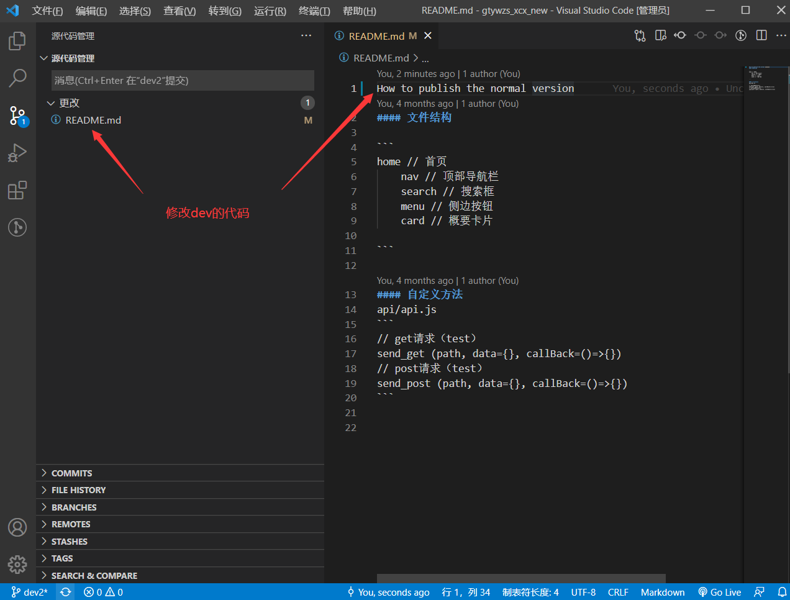

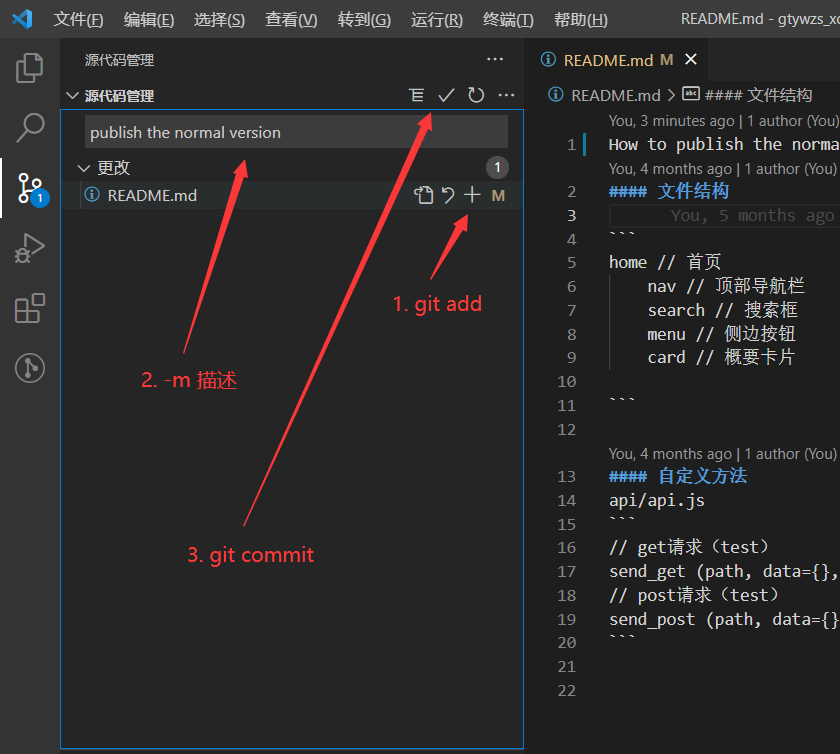

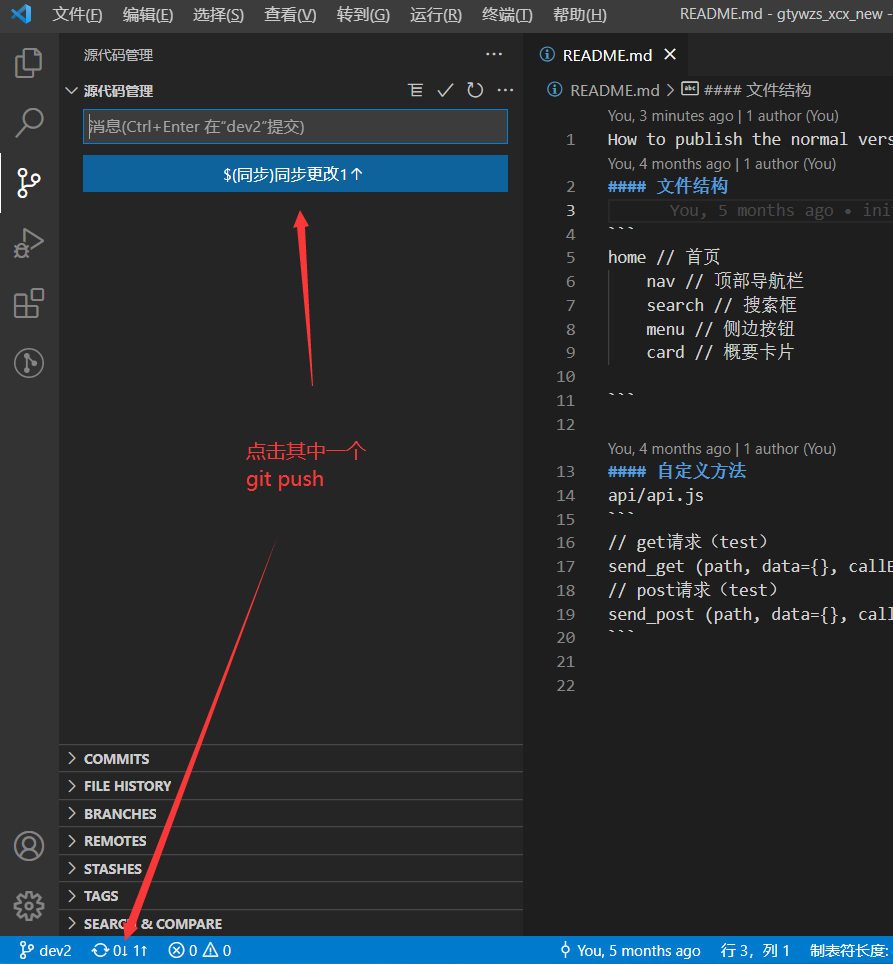

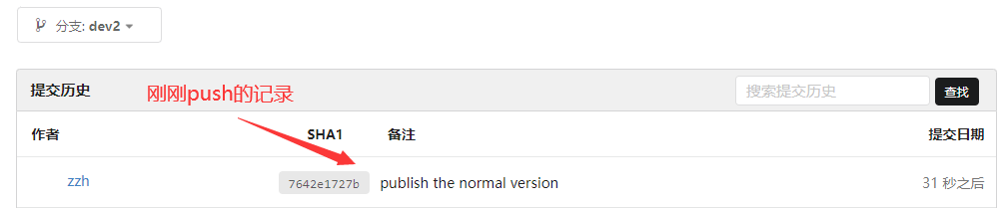


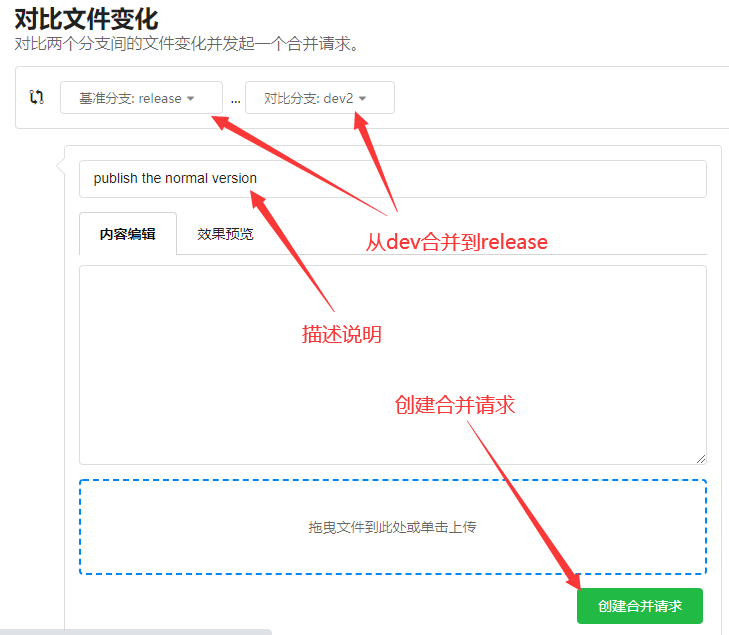

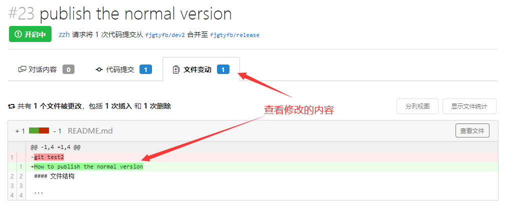

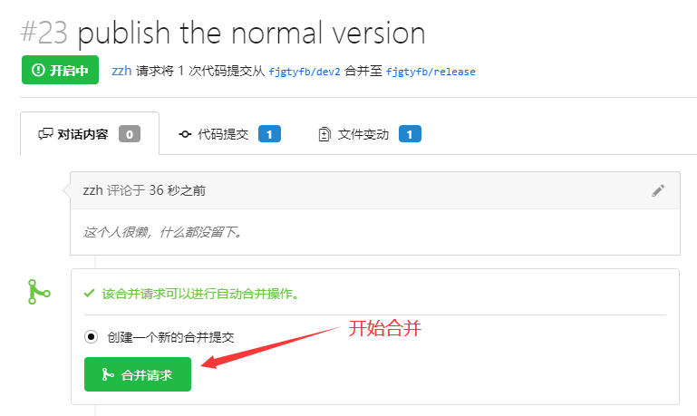

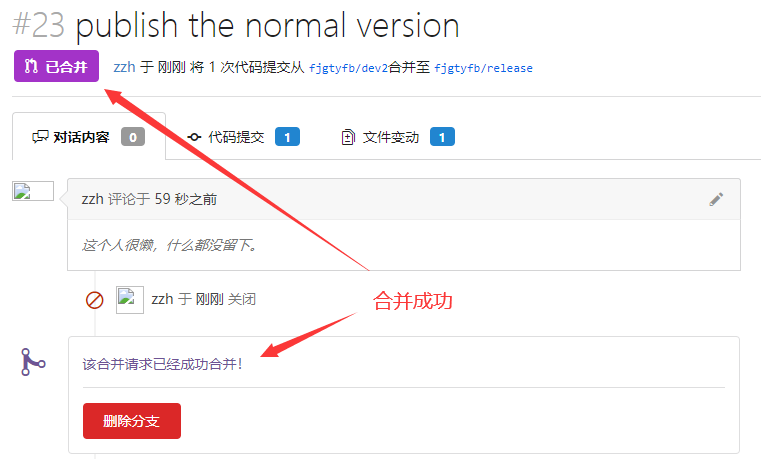

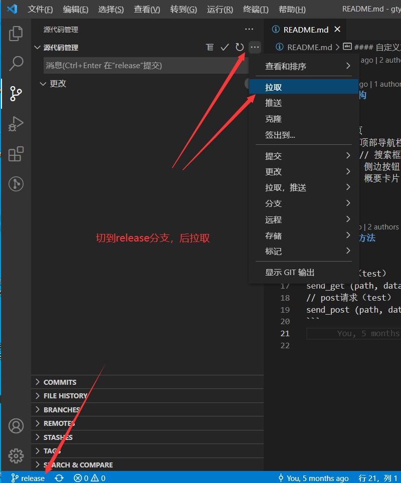

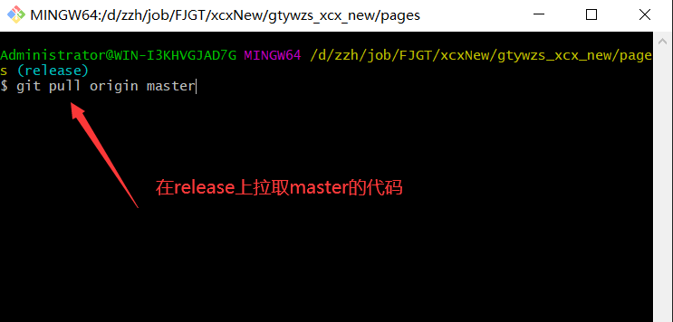

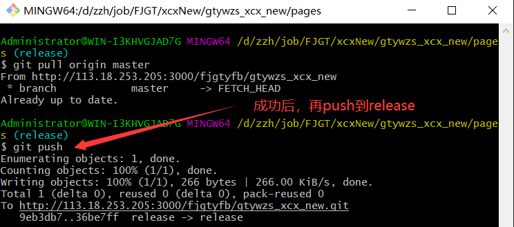

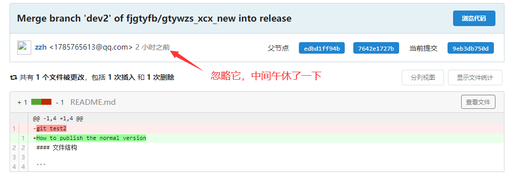

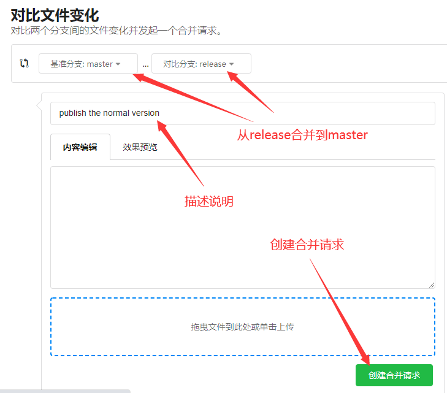

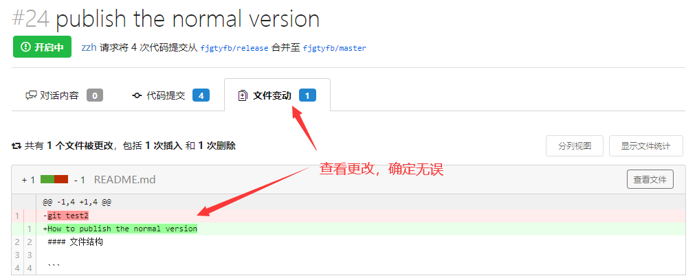

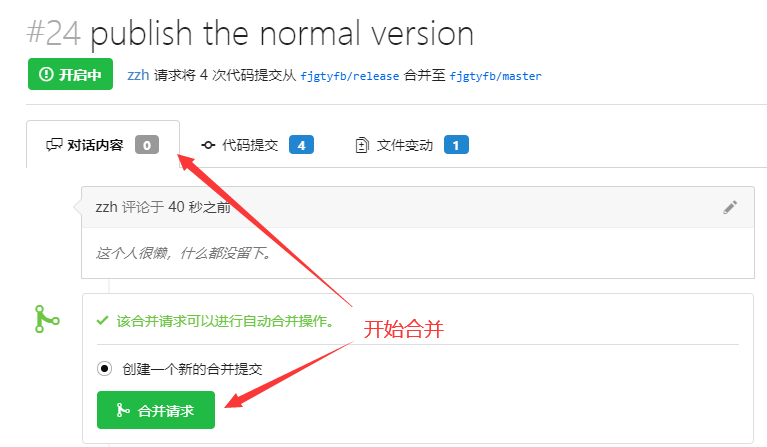

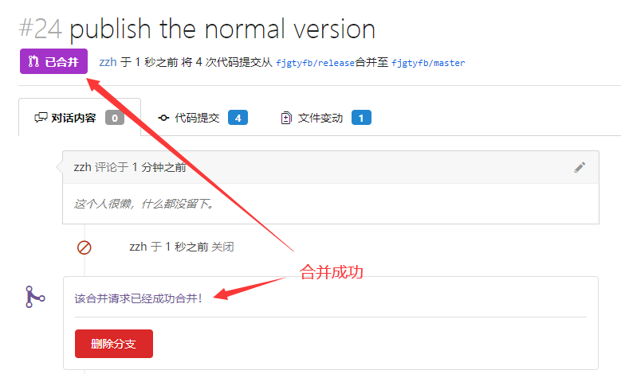

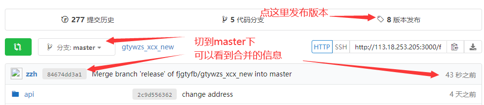


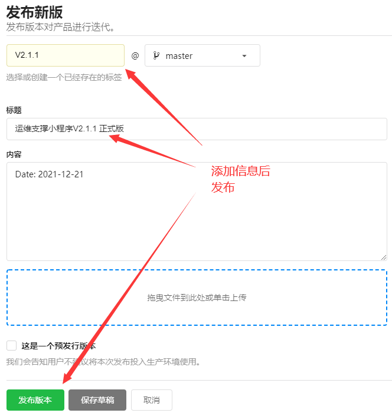